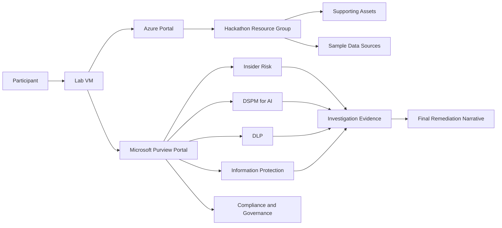

# Purview Data Security Hackathon

### Estimated Duration: 45 Minutes (Overview) | 7 Challenges Total

---

## Scenario

A regulated organization is responding to a recent data exposure event that revealed three connected problems: sensitive files were overshared, risky user behavior was not contained quickly enough, and Microsoft Purview protections were applied inconsistently across the tenant. You are part of the joint data security and compliance response team. Your job is not only to harden the environment, but also to investigate what happened, preserve evidence, and produce a remediation narrative that explains what was exposed, what controls were implemented, and how the organization should reduce future risk.

---

## What You Need to Do

This hackathon is organized as **7 challenges** that move you from initial assessment through protection, investigation, remediation, and final reporting:

1. Establish the response baseline and validate access
2. Implement Information Protection and Classification
3. Expand Data Loss Prevention (DLP) coverage
4. Investigate Insider Risk and escalate to formal cases
5. Apply DSPM and Information Barriers to reduce exposure
6. Validate Compliance and Data Governance foundations
7. Consolidate findings with Microsoft Security Copilot into a final incident report

The strongest hands-on emphasis is on Information Protection, DLP, Insider Risk investigations, DSPM exposure remediation, compliance/governance outcomes, and Security Copilot-assisted investigation in the final challenge.

---

## Architecture

The lab combines Azure-hosted support assets (lab VM, resource group, sample data) with tenant-bound Microsoft Purview configuration work.

---

## Task 1: Sign In and Access the Lab Environment

1. On the lab VM, open the **Azure Portal** icon, or browse to `https://portal.azure.com`.
2. Sign in with the lab credentials:
   - Username: <inject key="AzureAdUserEmail"></inject>
   - Password: <inject key="AzureAdUserPassword"></inject>
3. Dismiss any **Stay signed in?** or **Welcome to Microsoft Azure** prompts.
4. Confirm your subscription context:
   - Subscription: <inject key="SubscriptionID"></inject>
   - Tenant: <inject key="TenantID"></inject>
5. In a new tab, open the Microsoft Purview portal at `https://purview.microsoft.com`. If a welcome screen appears, select **Get started**.
6. Record your deployment reference for evidence notes and facilitator check-ins: **Deployment ID:** <inject key="DeploymentID" enableCopy="false"></inject>

> **Tip:** The Microsoft Purview unified portal exposes solution cards on its home page and a **View all solutions** entry point. Solution-specific navigation appears in the left menu after you open a solution.

---

## What Is Pre-Staged for You

To keep the hackathon focused on decision-making and hands-on implementation, the following are prepared before participant time begins.

**Tenant and solution readiness:**
- Required Purview licensing, feature enablement, and role assignments
- Audit and activity pipelines needed for investigation tasks
- Insider Risk prerequisites, scoped groups, and foundational settings
- Seeded users, groups, and business personas for DLP and investigation scenarios
- Sample sensitive files, overshared content, and policy-triggering artifacts
- Optional pre-created alerts, evidence, or case clues
- Security Copilot readiness and plugin availability for the final challenge

**Azure supporting assets:**
- A lab VM for browser access, bookmarks, evidence capture, and helper scripts
- A resource group containing supporting assets for the scenario
- Optional sample data sources for governance or discovery tasks
- Local folders or saved locations for exported evidence and screenshots

> **Important:** Do not spend challenge time trying to build missing tenant prerequisites from scratch unless explicitly instructed. If a required role, seeded alert, or signal is absent, note it as a scenario gap and continue with the closest available evidence.

---

## Evidence Capture Expectations

This is a response-oriented hackathon — evidence matters as much as configuration. During each challenge, capture:

- Screenshots of major configuration pages and saved policies
- Reports, dashboards, or analytics views that show impact
- Alert details, case details, activity traces, or timeline views
- Notes on what was pre-staged versus what you configured
- A running incident narrative explaining exposure, detection, and remediation

A strong submission shows both **technical hardening evidence** (labels, DLP policies, risk settings, barrier policies, posture improvements) and **investigation evidence** (overshared content findings, Insider Risk details, audit evidence, case escalation, remediation decisions, final recommendations).

> **Note:** Save evidence continuously rather than waiting until the end. Several Purview experiences are investigative by nature, so intermediate screenshots and notes become part of the final response story.

---

## Challenge Roadmap

| Challenge | Focus |
|---|---|
| 1 | Establish the response baseline — review incident context, validate portal access, confirm pre-staged readiness |
| 2 | Information Protection and Classification — label taxonomy, priority, policy publication, auto-labeling |
| 3 | Data Loss Prevention (DLP) — Exchange, SharePoint, OneDrive, Teams, and endpoint controls |
| 4 | Insider Risk Management and investigations — alert triage, timeline analysis, case escalation |
| 5 | DSPM for AI and exposure remediation — posture insights, oversharing remediation, Information Barriers |
| 6 | Compliance and governance foundations — retention, records, eDiscovery, data map/catalog |
| 7 | Final incident response with Security Copilot — consolidated investigation and remediation narrative |

---

## How to Navigate Microsoft Purview During the Hackathon

1. Start at `https://purview.microsoft.com`
2. From the home page, open a solution card directly, or select **View all solutions**
3. Use the **Data Security**, **Risk & Compliance**, or **Data Governance** areas to locate the service needed for the current challenge
4. After opening a solution, use the left navigation to move between its Home, policies, reports, explorers, settings, and related pages
5. Use global search at the top of the portal to locate a specific user, navigation item, or resource quickly

**Typical solution areas used in this hackathon:** Information Protection, Data Loss Prevention, Insider Risk Management, Data Security Posture Management, Information Barriers, Audit, eDiscovery, Records Management, and Unified Catalog/Data Map.

---

## Success Criteria

You are successful in this hackathon when you can demonstrate:

- The environment is more strongly protected than it was at the start
- Evidence of what data was exposed or at risk
- An explanation of what controls detected or reduced the risk
- A connection between technical findings and a practical remediation plan
- Conclusions supported by captured artifacts, screenshots, reports, or case details

---

## Tips Before You Begin

- Read each challenge fully before making changes
- Keep a running log of what you changed and why
- Prefer evidence-backed conclusions over assumptions
- If a signal is delayed or missing, use the nearest available pre-staged clue and document the limitation
- Distinguish clearly between **configured during the hackathon**, **pre-staged by the environment**, and **observed as evidence**

---

### Support Contact

The CloudLabs support team is available 24/7, 365 days a year, via email and live chat to ensure seamless assistance at any time. We offer dedicated support channels tailored specifically for both learners and instructors, ensuring that all your needs are promptly and efficiently addressed.

Learner Support Contacts:

- Email Support: cloudlabs-support@spektrasystems.com

- Live Chat Support: https://cloudlabs.ai/labs-support

### Happy hacking!