# Challenge 2: Data Loss Prevention (DLP)

### Estimated Duration: 1 Hour

## Scenario

Following the recent exposure event, your response team must reduce the ways sensitive business data can leave the organization. In this challenge, you will configure Microsoft Purview Data Loss Prevention controls to protect email, files, collaboration messages, and endpoint activity. Your goal is to create a practical DLP policy set that blocks risky sharing, notifies users, and produces evidence the team can use during investigation.

## Overview

In this challenge, you will sign in to the Microsoft Purview portal, review the existing data security context, and build DLP coverage for Exchange Online, SharePoint Online, OneDrive, Microsoft Teams, and endpoint devices where the tenant has already been prepared. You will also enable notifications and review reporting evidence so the team can confirm the controls are working.

## Objectives

- Task 1: Access the lab environment and review the DLP scope
- Task 2: Create DLP protection for Exchange, SharePoint, and OneDrive
- Task 3: Extend DLP controls to Microsoft Teams and endpoint devices
- Task 4: Review alerts, Activity explorer evidence, and policy outcomes

## Task 1: Access the lab environment and review the DLP scope

In this task, you will sign in to the lab environment and confirm the Microsoft Purview locations that will be included in this challenge.

1. On the lab VM, open Microsoft Edge.
2. Browse to the Microsoft Purview portal at 
`
https://purview.microsoft.com
`
3. Sign in with the following credentials:
   - Username: <inject key="AzureAdUserEmail"></inject>

      

   - Password: <inject key="AzureAdUserPassword"></inject>

      

4. When prompted, complete any first-run or multifactor prompts that are already pre-staged for the lab tenant.
5. In a separate browser tab, open the Azure portal at 
`
https://portal.azure.com
`
 and confirm that your subscription context is available for this deployment:
   - Subscription: <inject key="SubscriptionID"></inject>
   - Tenant: <inject key="TenantID"></inject>
6. Record your deployment reference for the challenge evidence package as **Deployment ID: <inject key="DeploymentID" enableCopy="false"></inject>**.

7. In Microsoft Purview, select **Solutions (1)** from the left navigation, and then open **Data loss prevention (2)**.

   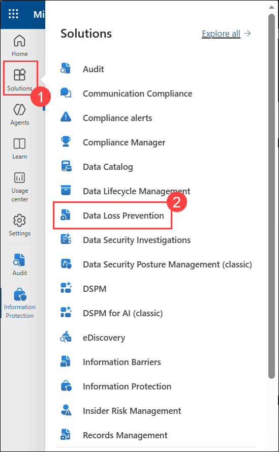

8. Review the **Overview** page and note any visible policy sync or device status indicators.

9. Select **Policies** and review whether any starter or previously created policies exist from Challenge 1 or tenant pre-staging.

10. Confirm that the locations relevant to this challenge are available in the environment:
    - Exchange email
    - SharePoint sites
    - OneDrive accounts
    - Teams chat and channel messages
    - Devices

> [!Note]
> Microsoft Learn documents that DLP policies in Microsoft Purview can target Exchange email, SharePoint sites, OneDrive accounts, Teams chat and channel messages, and devices when the tenant and licensing prerequisites are in place.

> [!Important]
> If **Devices** or **Teams chat and channel messages** does not appear as an available location, continue the challenge with the locations that are present and capture a note in your evidence folder that the feature is tenant-prerequisite dependent.

## Task 2: Create DLP protection for Exchange, SharePoint, and OneDrive

In this task, you will create a DLP policy that protects financial data in email and Microsoft 365 files, with special focus on external exposure.

1. In Microsoft Purview, select **Solutions (1)** from the left navigation, and then open **Data loss prevention (2)**.

   

1. In Microsoft Purview, stay in **Data loss prevention** > **Policies**.

2. Select **Create policy**.

   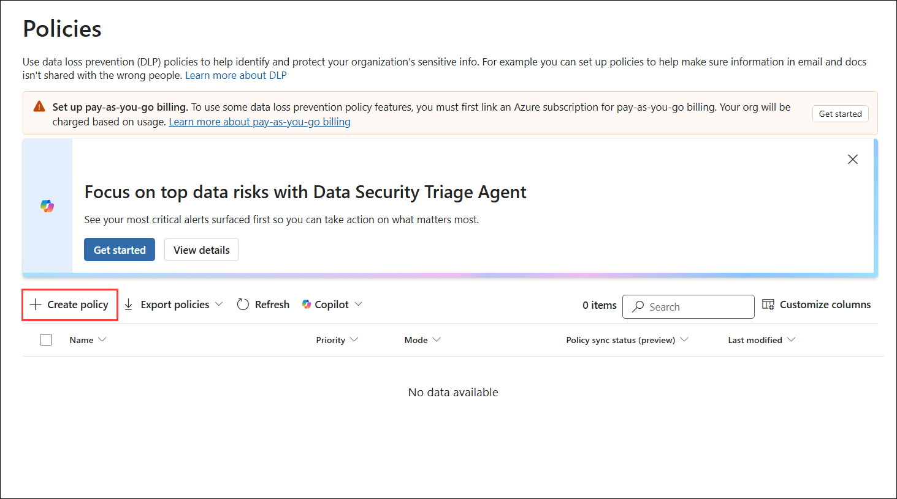

1. On the **What info do you want to protect?** page, select **Enterprise applications & devices (1)** to create a DLP policy that protects data across Microsoft 365 workloads and endpoint devices, and then continue to the next step of the policy creation wizard.

   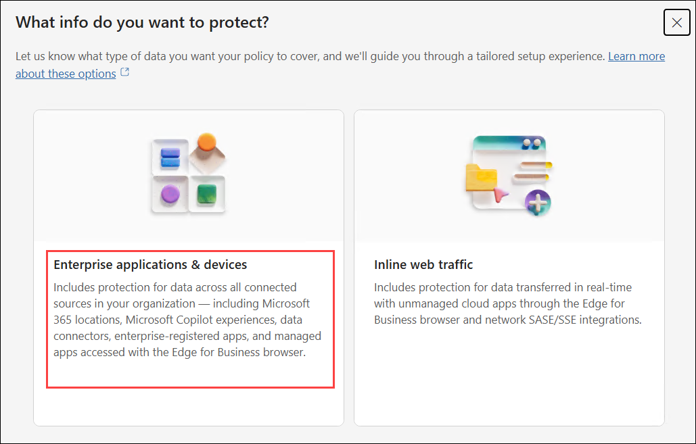

1. On the **Start with a template or create a custom policy** page, select **Custom (1)** under **Categories**, select **Custom policy (2)** under **Regulations**, and then click **Next**.

   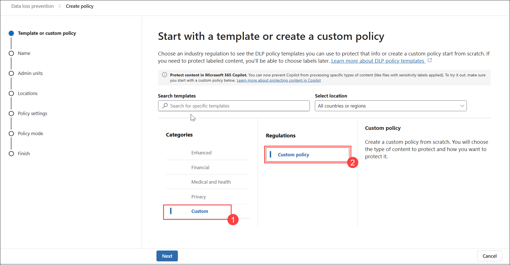

2. On the **Name your DLP policy** page, enter **Hackathon - Financial DLP (1)** in the **Name** field, In the **Description** field, enter **Protects sensitive financial data across Exchange, SharePoint, OneDrive, and Teams (2)**, Click **Next (3)** to continue.

   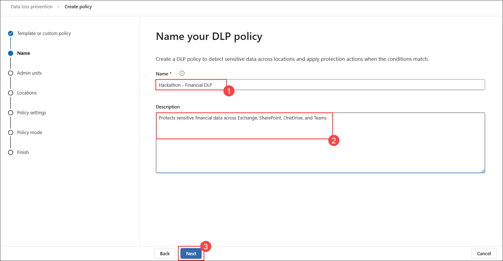

5. On the **Customize advanced DLP rules** page, click **+ Create rule** to create a new DLP rule that will detect and protect sensitive financial information.

   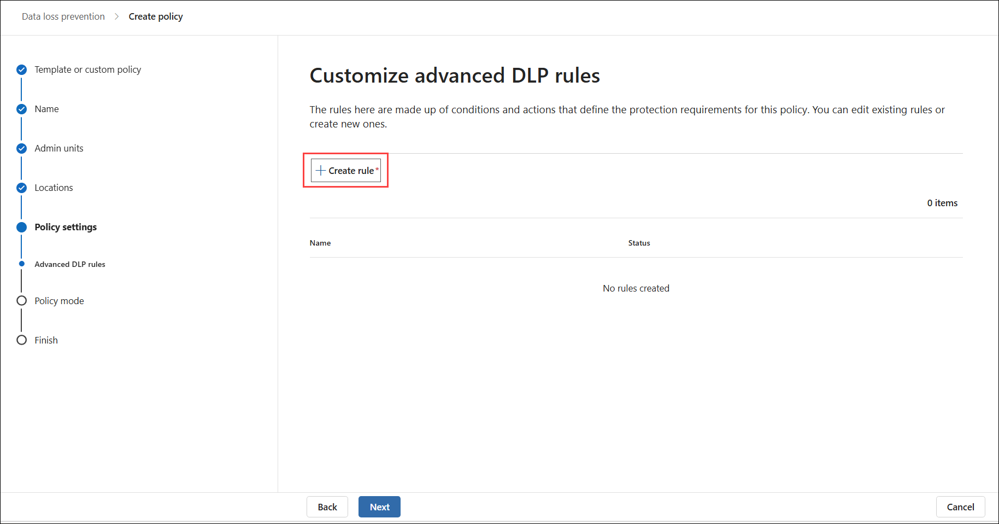

6. In the **Name** field, enter **Financial Data Detection (1)**. Under **Conditions**, click **Add condition (2)** and select **Content contains (3)** to create a condition that detects sensitive financial information.

   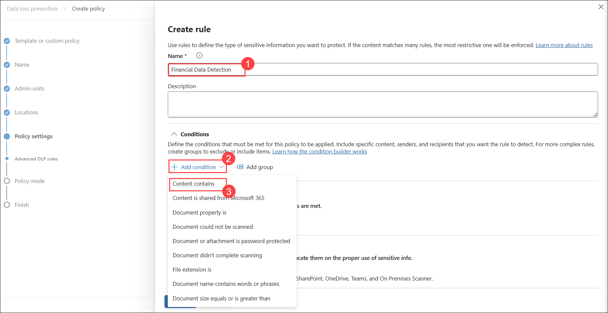

8. Under **Content contains**, click **Add (1)** and select **Sensitive info types (2)** to configure the rule to detect sensitive financial information such as credit card numbers.

   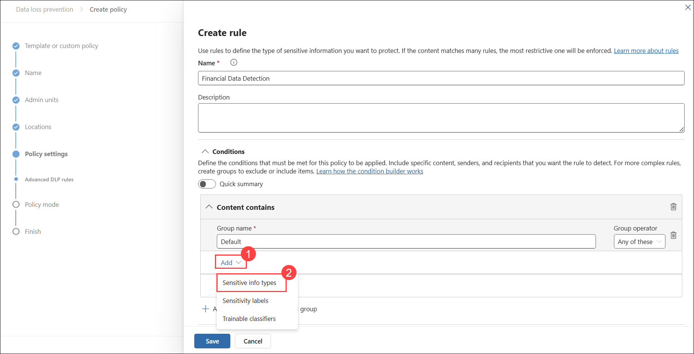

9. In the **Sensitive info types** pane, select **Credit Card Number (1)**, and then click **Add (2)**.

   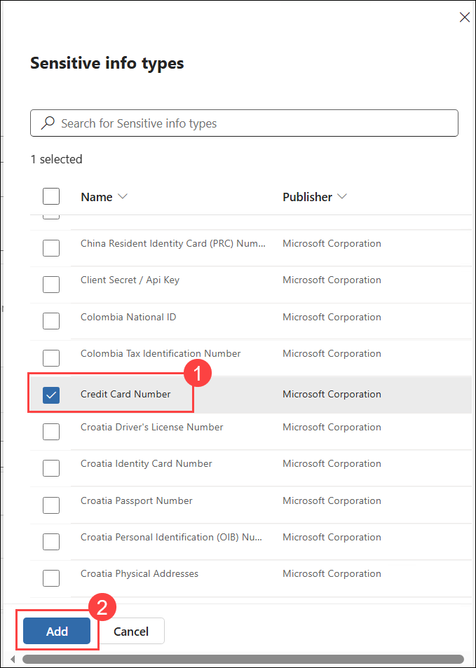

   > **Note:** If other financial sensitive information types are not available in your tenant, select **Credit Card Number** and continue with the policy configuration.

10. To add a condition for external sharing, click **Add condition (1)** and select **Content is shared from Microsoft 365 (2)**.

      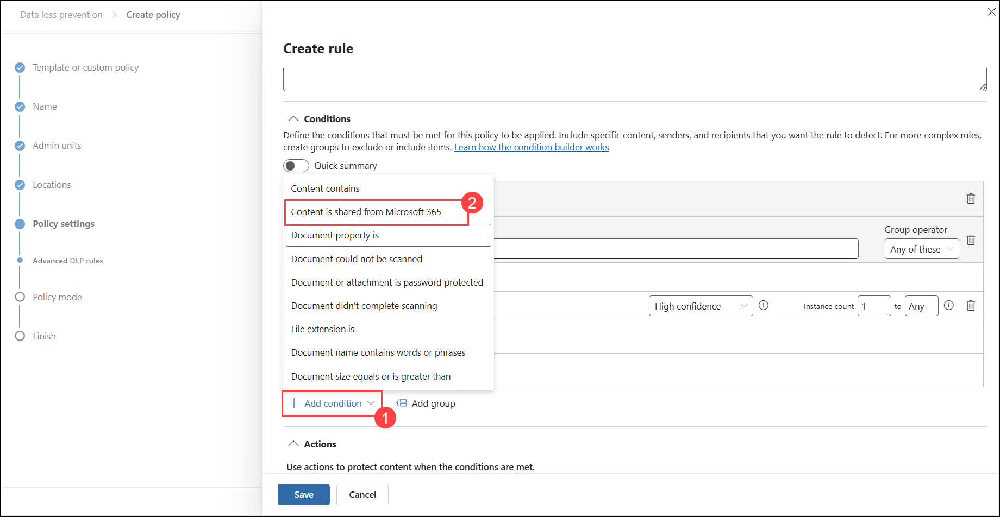

11. Under **Content is shared from Microsoft 365**, open the sharing scope dropdown, select **with people outside my organization (1)**, and verify that the rule will detect sensitive financial content shared externally.     

      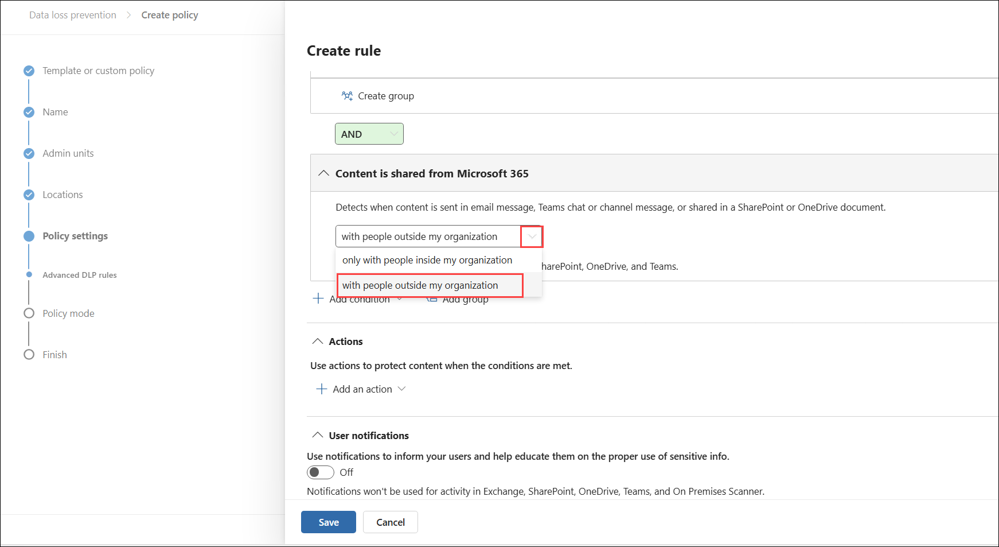

12. Under **Actions**, click **Add an action (1)** and select **Restrict access or encrypt the content in Microsoft 365 locations (2)** to prevent sensitive financial information from being shared externally.

      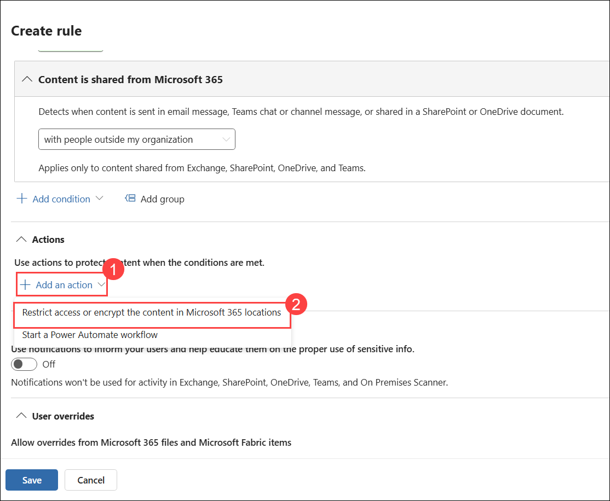

13. Under **Restrict access or encrypt the content in Microsoft 365 locations**, select **Block only people outside your organization (1)** to prevent external users from accessing sensitive financial information while allowing internal users to continue accessing the content.

      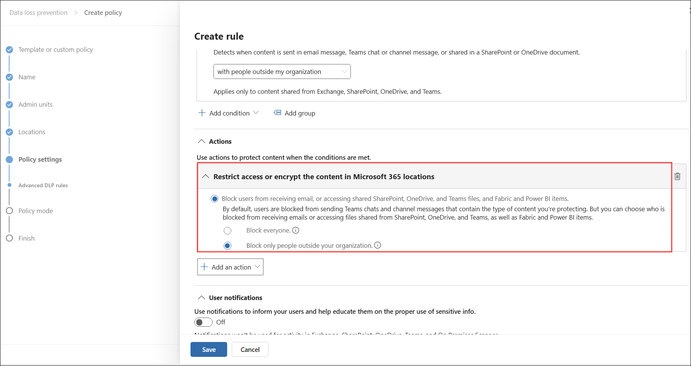

      Review the configured action, verify that content containing sensitive financial information will be restricted when shared externally, and then continue to configure user notifications.

15. Under **User notifications**, turn on **User notifications (1)**, select **Email notifications (2)** and **Policy tips (3)**, and then click **Save (4)** to apply the rule configuration.

      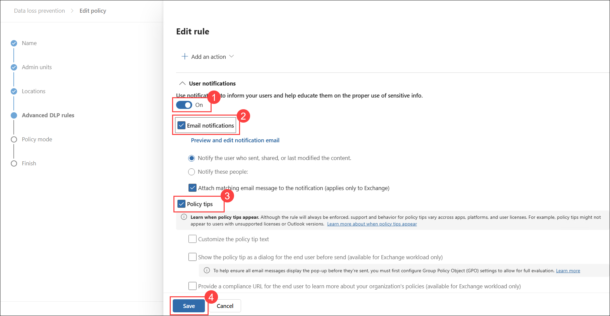

      > **Note:** Enabling **Policy tips** helps notify users when they attempt to share sensitive financial information and satisfies the challenge requirement for user awareness and policy enforcement guidance.

16. Review the **Financial Data Detection** rule and verify that the following configurations are displayed:

   - **Sensitive info type:** Credit Card Number
   - **Sharing condition:** Content is shared from Microsoft 365 with people outside my organization
   - **Action:** Restrict access to the content for external users
   - **User notifications:** Policy tips enabled

      Confirm that the rule status is **On**, and then click **Next** to continue to the **Policy mode** page. 

      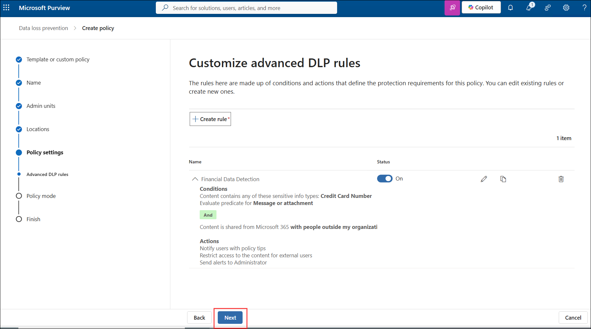

   18. On the **Policy mode** page, keep **Run the policy in simulation mode** selected and ensure **Show policy tips while in simulation mode** is enabled, Click **Next (2)** to review the policy configuration before creating the DLP policy.

         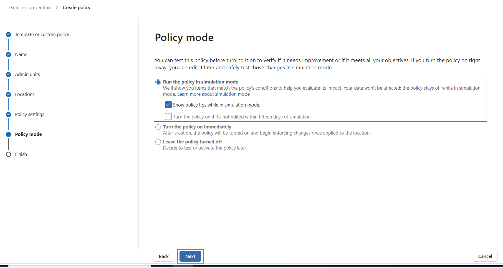

         > **Note:** Simulation mode allows you to evaluate policy matches and user notifications without enforcing restrictions immediately. This helps validate the policy configuration before enabling full enforcement.

   
20. Review the policy configuration and verify the following details:

   - **Policy name:** Hackathon - Financial DLP
   - **Locations:** Exchange email, SharePoint sites, and OneDrive accounts
   - **Mode:** Run the policy in simulation mode
   - **Rule:** Financial Data Detection

      Confirm that the configuration is correct, and then click **Submit** to create the DLP policy.

      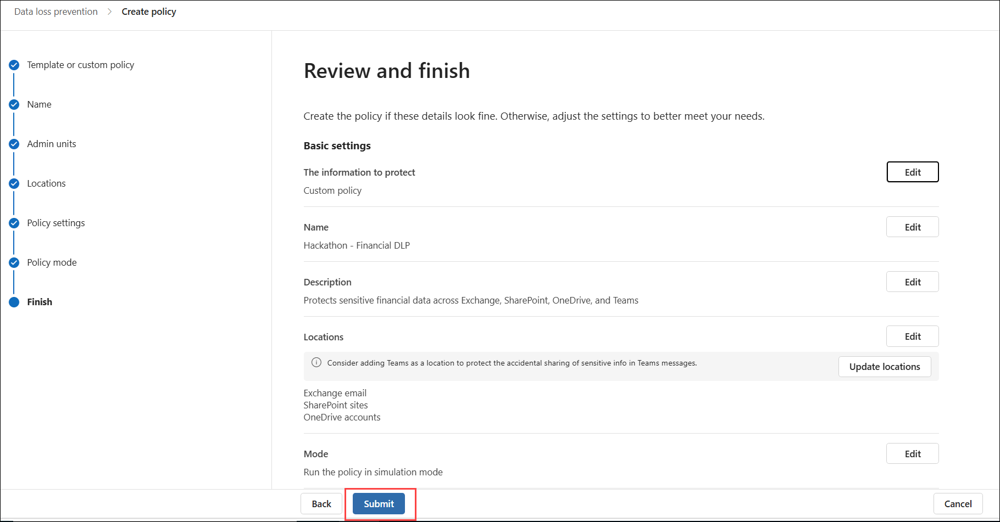

22. Verify that the **Hackathon - Financial DLP** policy was created successfully, review the confirmation message, and then click **Done** to return to the **Policies** page.

      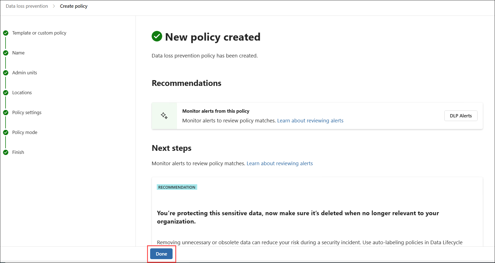

23. On the **Policies** page, select **Hackathon - Financial DLP (1)** and review the policy details pane.
   
      Verify that the policy includes the following locations:

      - **Exchange email - All accounts**
      - **SharePoint sites**
      - **OneDrive accounts - All accounts**

      Confirm that the **Financial Data Detection** rule is listed and that the policy is running in **Simulation mode**.

      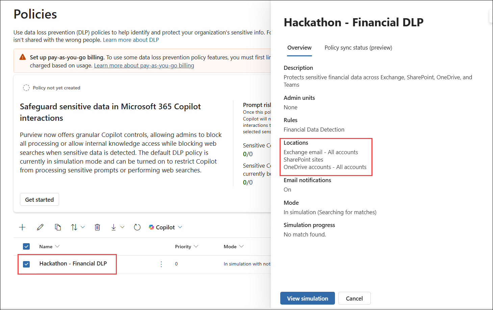

> [!Tip]
> Microsoft Learn recommends testing and tuning DLP policies in simulation mode before moving to restrictive enforcement, but for timed hackathon delivery you may be asked to use active enforcement if the tenant has already been prepared for rapid validation.

> [!Note]
> For SharePoint and OneDrive, DLP can block people outside your organization from accessing matching content. For Exchange, DLP can block or warn on messages that contain sensitive information and are being sent externally.

<validation step="DLP policy coverage and expected protective settings/evidence"/>

## Task 3: Extend DLP controls to Microsoft Teams and endpoint devices

In this task, you will expand the DLP configuration to protect collaboration messages and, where the environment is ready, sensitive data on endpoint devices.

1. Return to **Data loss prevention (1)** > **Policies (2)**.

   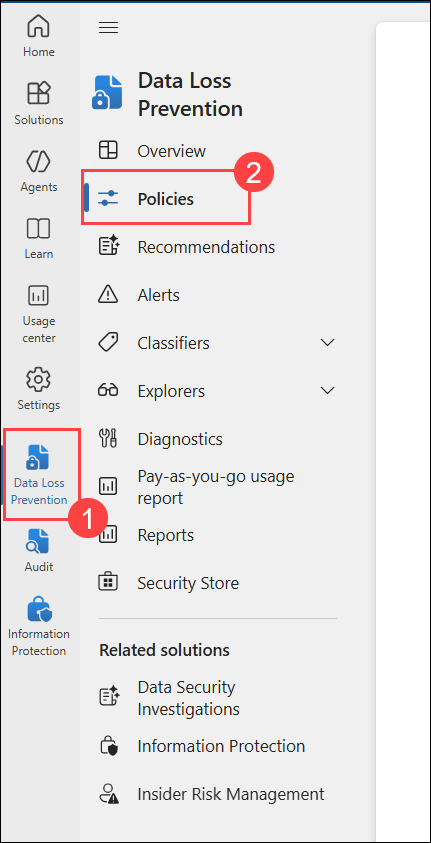

2. Select the `Hackathon - Financial DLP` policy you created, and choose **Edit policy**.

   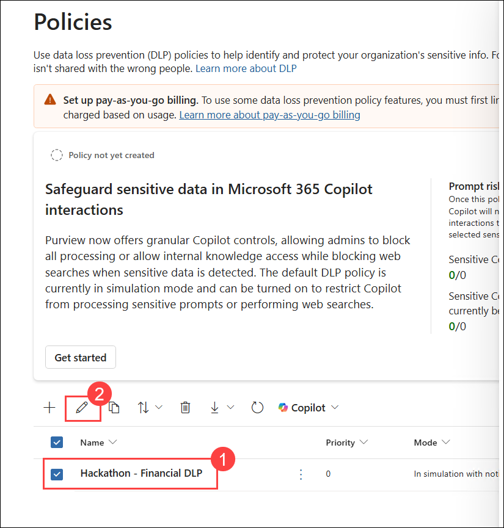

1.  On the **Choose where to apply the policy** page, select **Teams chat and channel messages (1)** to extend Data Loss Prevention protection to Microsoft Teams conversations and channel messages, Click **Next (2)** to continue to the **Advanced DLP rules** page.

      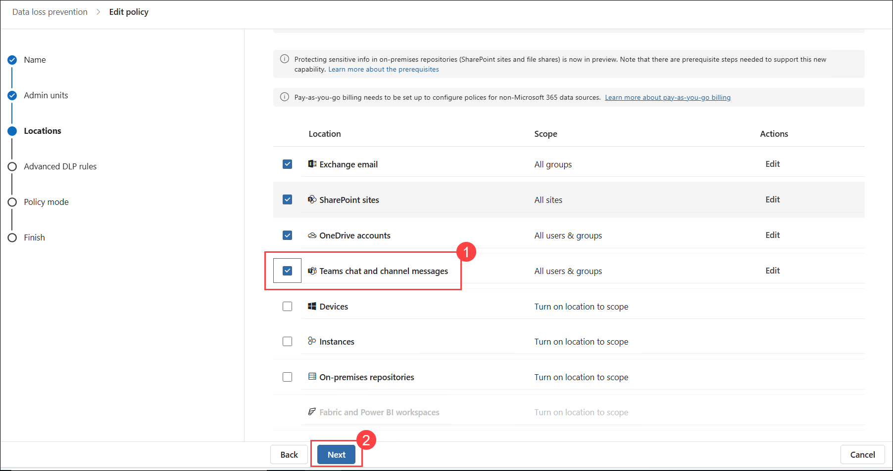

1. On the **Review and finish** page, verify the policy configuration, then click **Submit** to save the policy changes.

   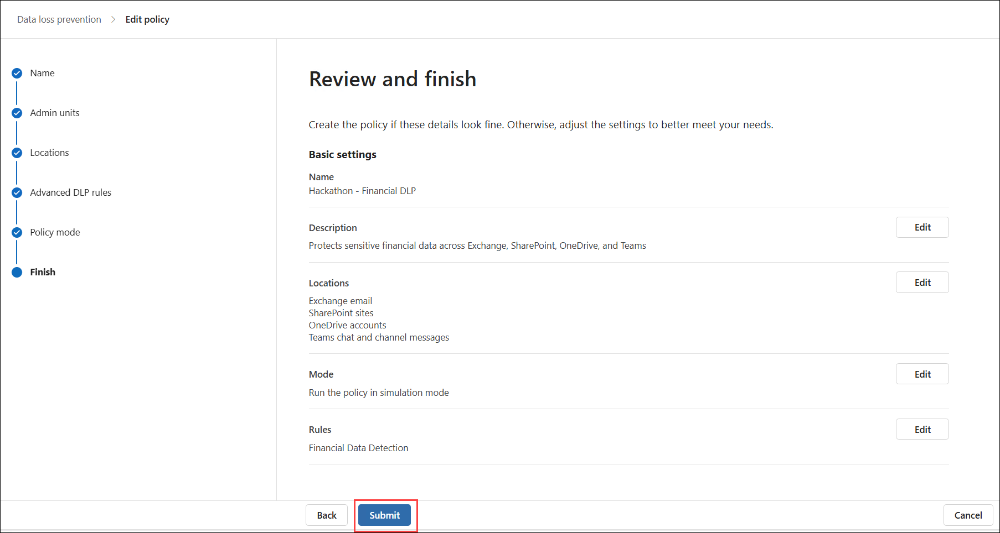

1. Wait for the policy update to complete and review the confirmation message, Click **Done** to return to the **Policies** page.

   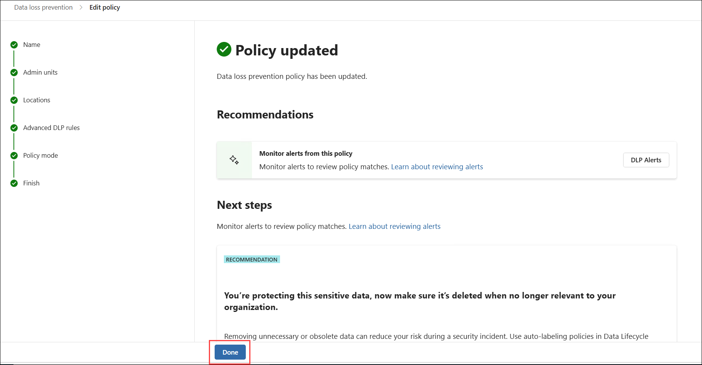

1. Verify that **Hackathon - Financial DLP** appears in the policy list and reflects the updated configuration.

1. In the Microsoft Purview portal, select **Data Loss Prevention (1)** from the left navigation pane, select **Policies (2)** to open the DLP policies page, click **Create policy (3)** to start creating a new Data Loss Prevention policy.

   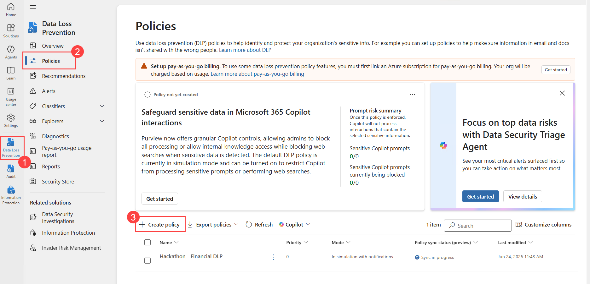

1. On the **What info do you want to protect?** page, select **Enterprise applications & devices**.

   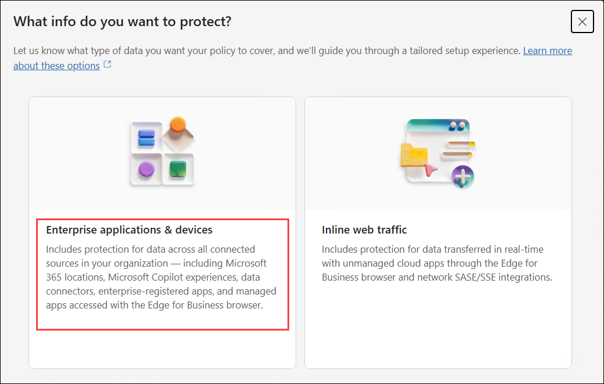

1. On the **Choose where to apply the policy** page, verify that **Devices (1)** is selected as one of the policy locations, Click **Next (2)** to continue with the policy configuration.

   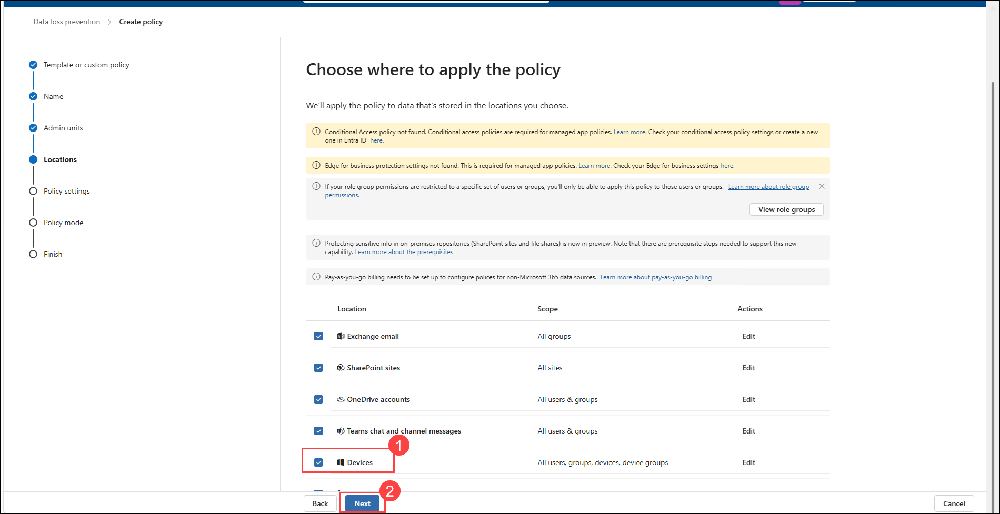

1. In the **Name** field, enter **Financial Data Detection - Devices (1)** as the rule name, Under **Conditions**, click **Add condition (2)**, From the list of available conditions, select **Content contains (3)**.

   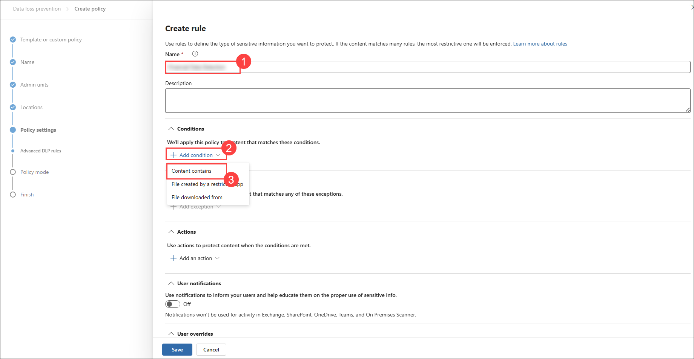

1. Under **Content contains**, click **Add (1)**, From the dropdown menu, select **Sensitive info types (2)** to define the sensitive information types that the rule will detect.

   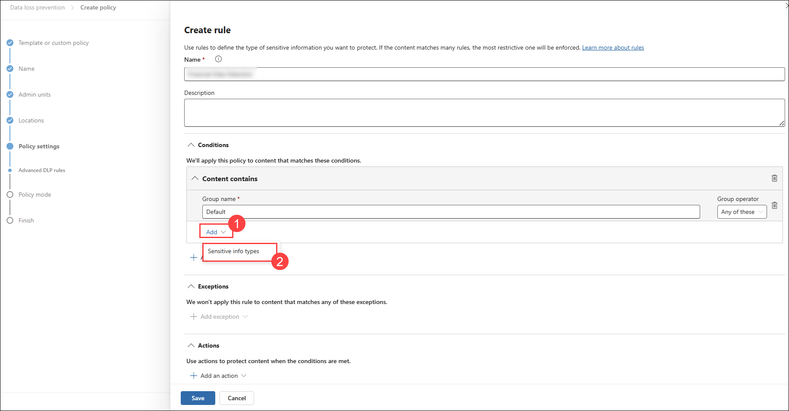

1. In the **Sensitive info types** pane, select **Credit Card Number (1)**, Click **Add (2)** to include the selected sensitive information type in the DLP rule.

   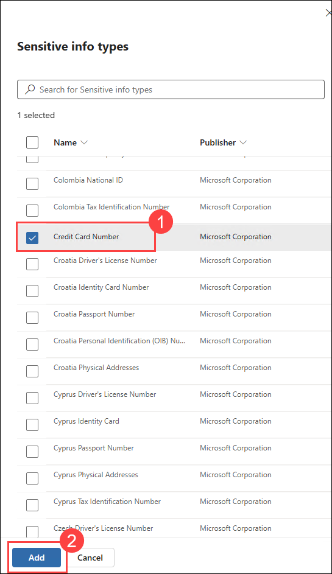

1. Under **Actions**, click **Add action (1)**, From the dropdown menu, select **Audit or restrict activities on devices (2)** to configure device-based protection actions for detected sensitive information.

   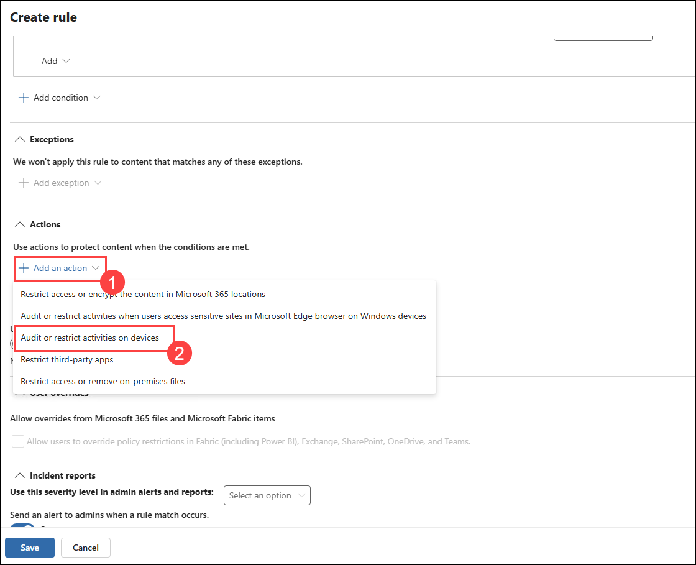

1. In the **File activities for all apps** section, configure the following restrictions:

    - **Copy to clipboard (1)** – Set the action to **Block**.
    - **Copy to a removable USB device (2)** – Set the action to **Block**.
    - **Copy to a network share (3)** – Set the action to **Audit only**.
    - **Print (4)** – Set the action to **Audit only**.

   After configuring the required device activity restrictions, click **Save (5)** to create the rule.

   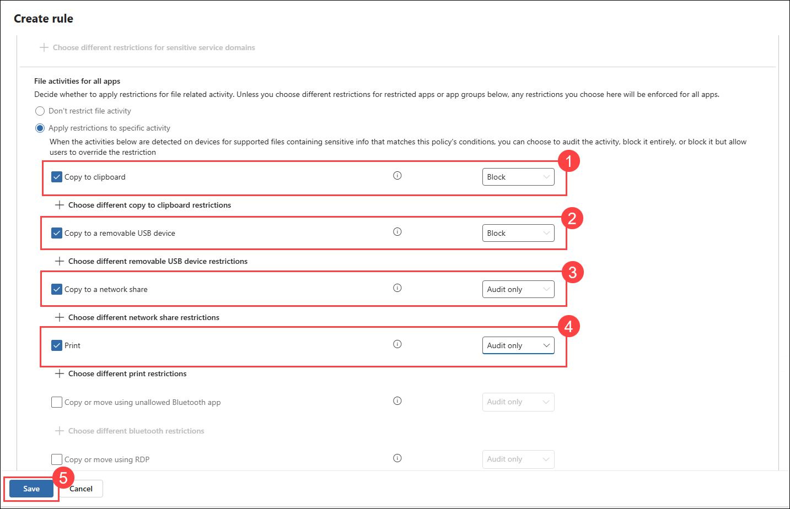

1. Review the configured rule to verify that **Financial Data Detection - Devices** is enabled and contains the expected conditions and actions, Click **Next** to proceed to the **Policy mode** configuration page.

   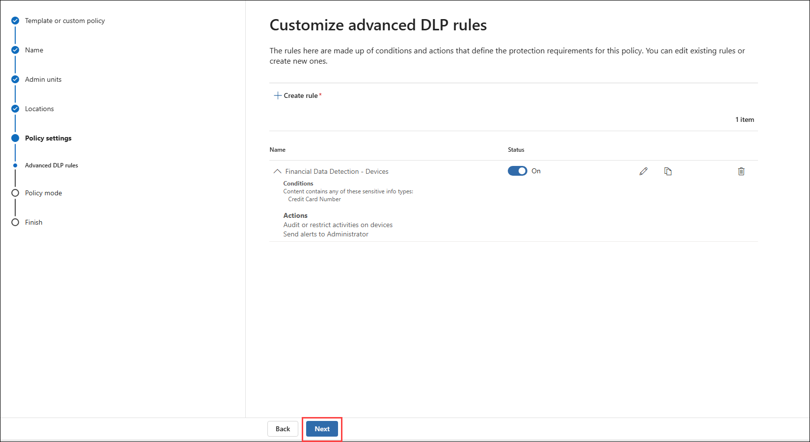

1. On the **Review and finish** page, review the policy configuration, including the selected locations, mode, and the **Financial Data Detection - Devices** rule, Click **Submit** to create and deploy the DLP policy.

   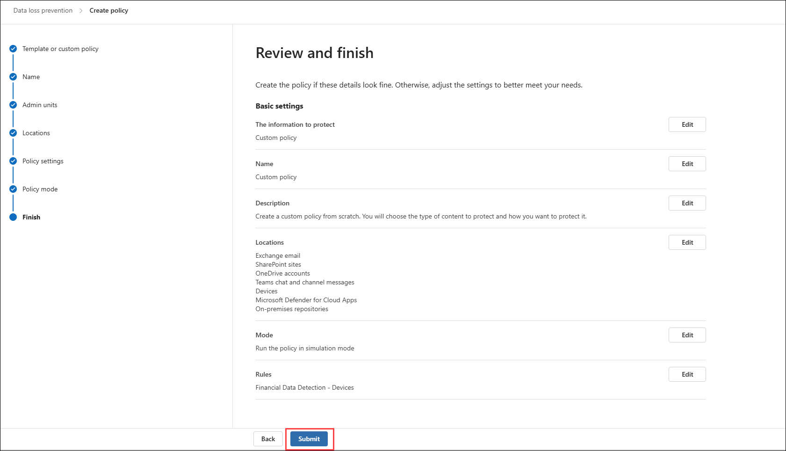

1. Verify that the **New policy created** confirmation message is displayed, indicating that the DLP policy was successfully created, Click **Done** to exit the policy creation wizard and return to the **Data loss prevention** dashboard.

   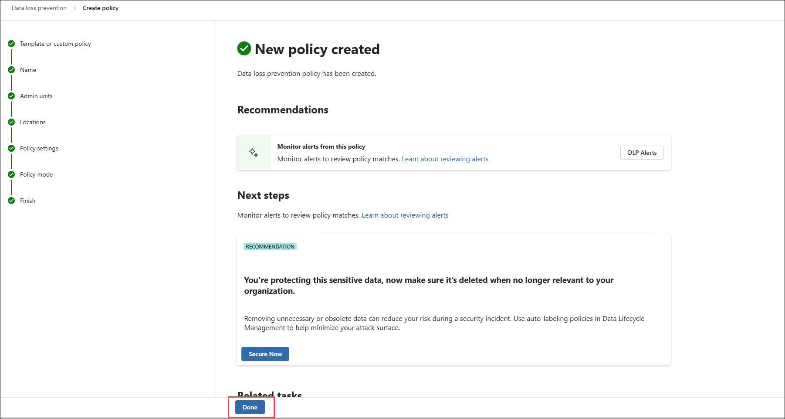

> [!Important]
> Microsoft Learn states that Teams message protection requires the **Teams chat and channel messages** location in the DLP policy. Protection for files shared through Teams depends on SharePoint and OneDrive because Teams stores shared files in those services.

> [!Note]
> Endpoint DLP enforcement depends on device onboarding and policy scoping. Microsoft Learn states that for endpoint enforcement, both the targeted user and the targeted device must be in scope.

<validation step="DLP policy coverage and expected protective settings/evidence"/>

## Task 4: Review alerts, Activity explorer evidence, and policy outcomes

In this task, you will review the telemetry and reporting views that show whether DLP is detecting and acting on risky activity.

1. In Microsoft Purview, return to **Data loss prevention**.

   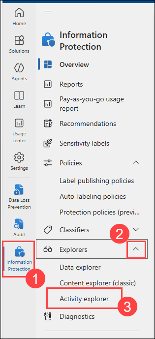

   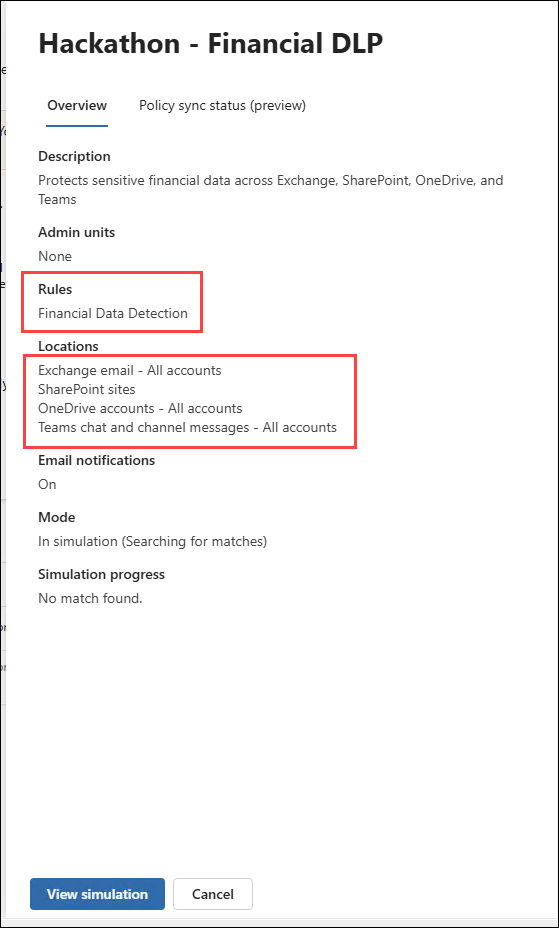
   
2. Open the **Overview** page and review summary tiles such as policy sync status, top activities, and device status if available.
3. Open **Activity explorer** from the DLP solution area or the related data classification reporting area.
4. Filter the view to DLP-related activities.
5. Look for events such as:
   - **DLP rule matched**
   - User override activity if enabled
   - Endpoint egress activity if endpoint DLP is configured
6. If seeded activity is available in the tenant, inspect one result and note the matched policy, rule, user, workload, and time.
7. Open the DLP alerts experience if alerts were enabled in your policy.
8. Review whether any incidents or alerts are present for the policy you created or updated.
9. If no live alerts are visible yet, record that Microsoft Learn notes DLP policies generally take about an hour to take effect after being turned on.
10. Save screenshots or notes that show:
    - Policy name and locations
    - Notification or tip configuration
    - Any alert, incident, or Activity explorer evidence
    - Any endpoint evidence or prerequisite gap you observed
11. Store this evidence in the lab VM folder designated by your facilitator for the final incident narrative.

> [!Tip]
> In SharePoint and OneDrive, DLP can evaluate existing and new items. In Exchange, DLP evaluates new email messages but does not retroactively scan older email already stored in a mailbox for alert generation.

> [!Note]
> Activity explorer is one of the primary places to review DLP rule matches and related user activity. For endpoint scenarios, it can show detailed activity such as copy to USB, copy to clipboard, print, or network share actions when devices are onboarded.

<validation step="DLP policy coverage and expected protective settings/evidence"/>

## Summary

In this challenge, you created or updated Microsoft Purview DLP protection for Exchange, SharePoint, OneDrive, Teams, and endpoint devices where applicable. You enabled user-facing notifications, added blocking or restriction logic for risky external sharing, and reviewed the reporting surfaces used to confirm whether the policy is working. These controls now form the operational DLP baseline that the team will rely on during the later investigation and remediation challenges.
