# Challenge 3 — Insider Risk Management & Data Security Investigations

### Estimated Duration: 1 Hour 15 Minutes

## Scenario

A member of the Titan Journey program team may have mishandled sensitive information after recent oversharing events and unusual collaboration behavior. Your response team must validate Microsoft Purview Insider Risk Management readiness, review exfiltration-related signals, triage a risky user alert, and escalate the matter into a formal investigation so the organization can document impact and remediation.

## Overview

In this challenge, you will work in Microsoft Purview to review Insider Risk Management configuration, create or validate a policy aligned to exfiltration risk, analyze an alert and user timeline, open a formal insider risk case, and launch a Data Security Investigation with AI-assisted scope. You will also create a notice template that can be used as part of the remediation workflow.

## Objectives

- Task 1: Sign in and review Insider Risk Management readiness
- Task 2: Create or validate an exfiltration-focused insider risk policy
- Task 3: Triage an alert and analyze the user activity timeline
- Task 4: Create a case and escalate to Data Security Investigations
- Task 5: Create a notice template and capture investigation evidence

## Task 1: Sign in and review Insider Risk Management readiness

In this task, you will sign in to the lab environment, open Microsoft Purview, and verify that the Insider Risk Management solution is available and ready for investigation work.

1. On the lab VM, open Microsoft Edge.
2. Browse to the Microsoft Purview portal at 
`
https://purview.microsoft.com
`
3. Sign in with the following credentials:
   - Username: <inject key="AzureAdUserEmail"></inject>

      

   - Password: <inject key="AzureAdUserPassword"></inject>

      

6. In the Microsoft Purview portal, select **Solutions (1)** and open **Insider Risk Management (2)**.

   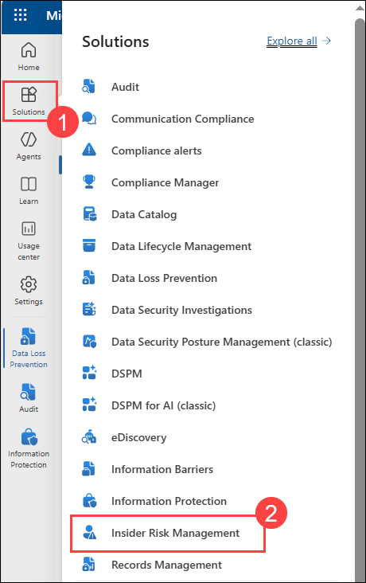

7. Review the landing experience and confirm the following areas are available in the left navigation:
   - **Policies (1)**
   - **Reports (2)**
   - **Reports > Alerts (3)**
   - **Reports > Cases (4)**

      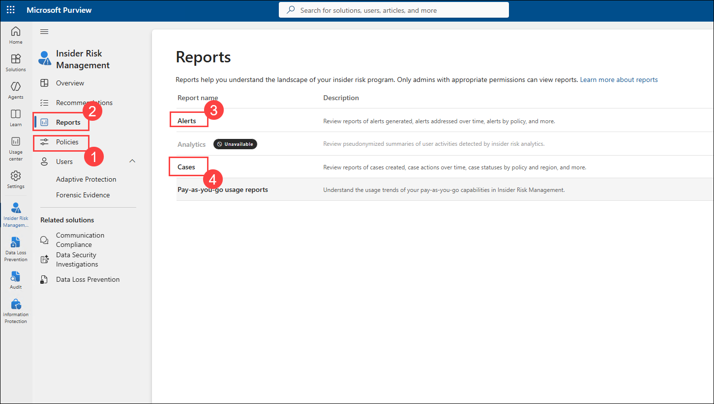

9. Open **Policies** and review whether any existing Insider Risk Management policies are present. If no policies exist, continue to Task 2 and create a new policy.

10. Open **Alerts** and review whether any alerts are available for triage. If no alerts are present, document that no pre-staged alerts were available in the tenant and continue with the challenge.

> [!Important]
> Insider Risk Management depends on tenant-side prerequisites such as roles, indicators, privacy settings, and signal sources. If a specific alert or policy is pre-staged in your environment, use it rather than waiting for new telemetry to propagate.

> [!Tip]
> Capture a screenshot of the Insider Risk Management dashboard and save it to your evidence folder on the lab VM. Include the deployment ID **<inject key="DeploymentID" enableCopy="false"></inject>** in the filename or notes.

## Task 2: Create or validate an exfiltration-focused insider risk policy

In this task, you will validate an existing exfiltration-focused policy or create one that can detect data leak behavior.

1. In **Insider Risk Management**, select **Policies**.

1. On the **Policies** page, click **+ Create policy (1)**, From the dropdown menu, select **Custom policy (2)** to create a new Insider Risk Management policy from scratch.

   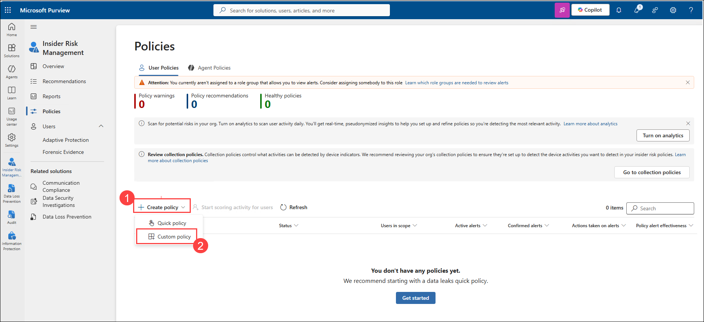

1. On the **Choose a policy template** page, select **Data leaks (1)** and then choose the **Data leaks (2)** template, Review the template details and prerequisites, and then click **Next (3)** to continue

   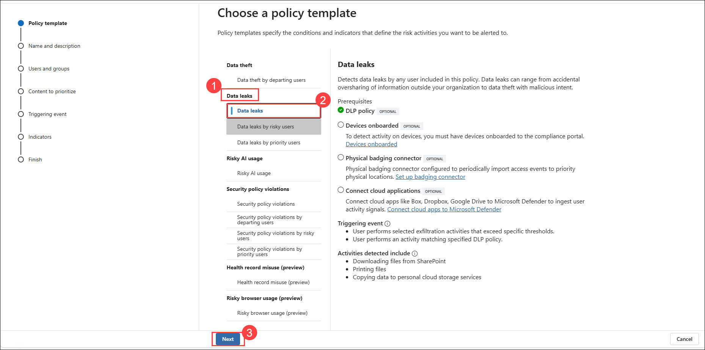

1. On the **Name your policy** page, enter **Titan Journey Exfiltration Review (1)** as the policy name, In the **Description (2)** field, enter a description such as: **Detects risky data exfiltration and oversharing behavior for the Titan Journey hackathon scenario.**, Click **Next (3)** to continue to the **Users and groups** configuration page.

   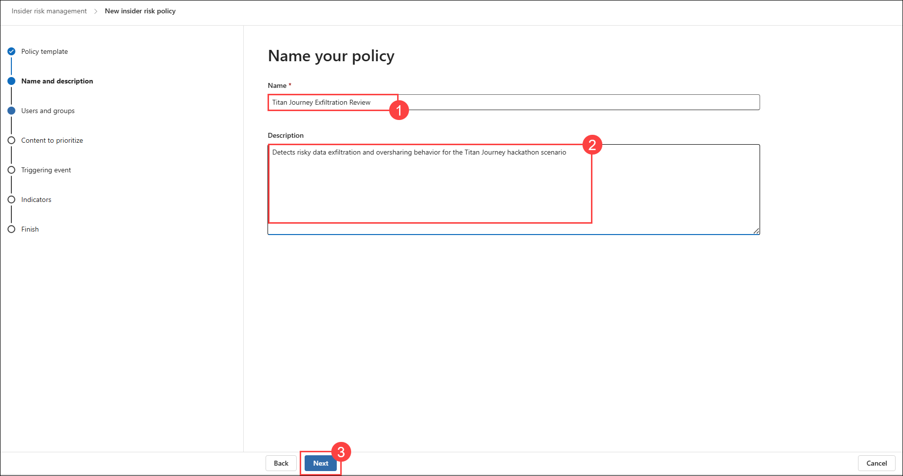

1. On the **Choose users, groups, & adaptive scopes** page, ensure **All users, groups, and adaptive scopes (1)** is selected so that the policy applies across the organization, Click **Next (2)** to continue to the **Content to prioritize** page.

   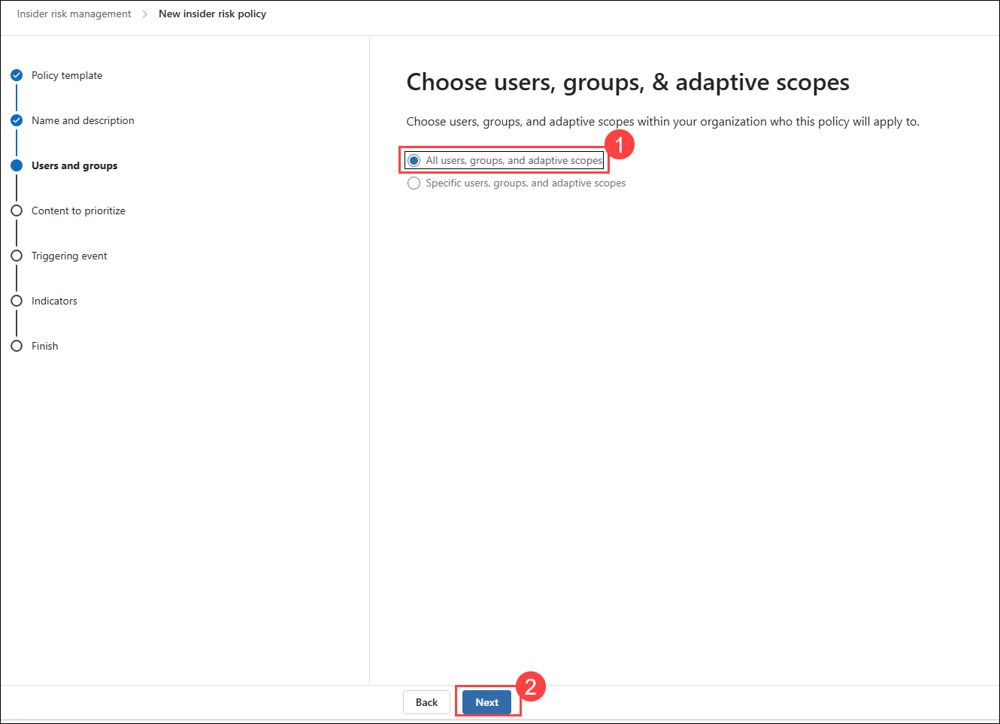

1. On the **Decide whether to prioritize content** page, select **I want to prioritize content (1)**, and ensure the available content types remain selected, Click **Next (2)** to continue to the **Triggering event** configuration page.

   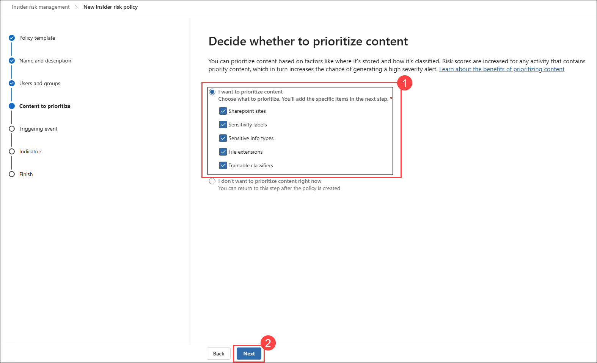

1. On the **Trainable classifiers to prioritize** page, click **+ Add or edit trainable classifiers (1)**, In the **Add or edit trainable classifiers** pane, select **Finance (2)**,  Click **Add (3)** to add the selected trainable classifier to the policy.

   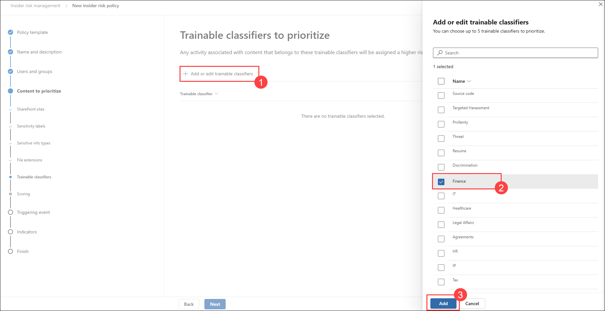

1. Review the selected **Finance** trainable classifier to confirm it has been added to the policy, Click **Next** to continue to the **Scoring** configuration page.

   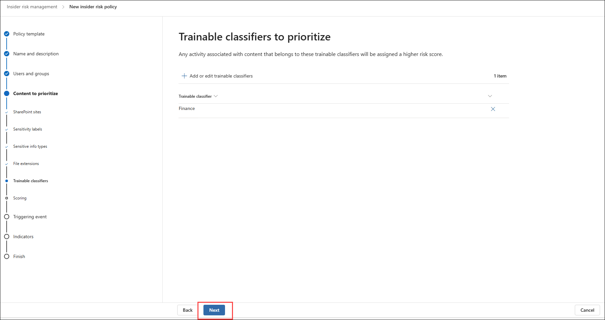

1. On the **Choose triggering event for this policy** page, select **User matches a data loss prevention (DLP) policy (1)** as the triggering event, From the list of available DLP policies, select **Hackathon - Financial DLP (2)**, Click **Next (3)** to continue to the **Indicators** configuration page.

   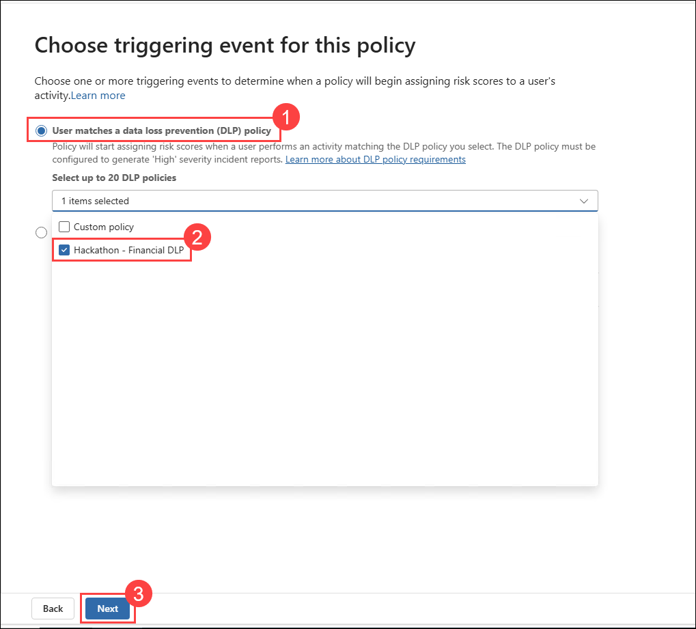

1. On the **Indicators** page, note the warning that the required indicators are currently turned off for the organization, Click **Turn on indicators** to enable the indicators required for the Insider Risk Management policy.

   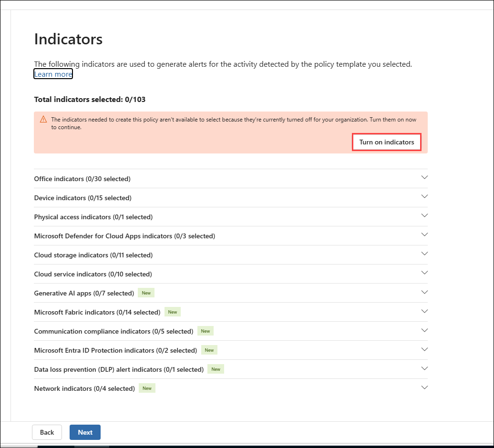

1. In the **Turn on indicators for your organization** pane, click **Choose indicators to turn on** to review and select the indicators required for the policy.

   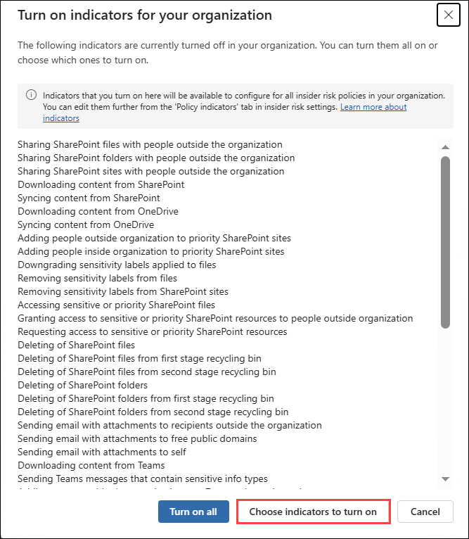

1. In the **Choose indicators to turn on** pane, review the available indicator categories and confirm the required indicators are selected, Click **Save** to enable the selected indicators for Insider Risk Management.

   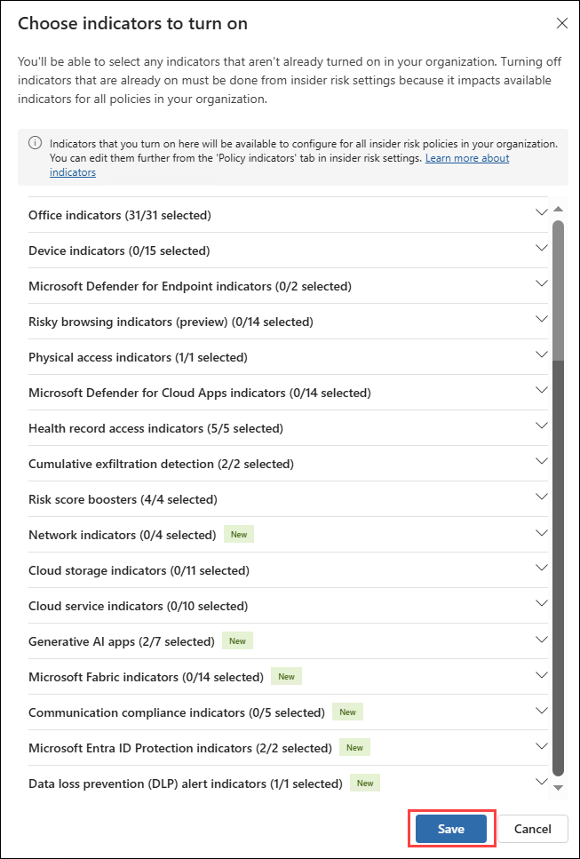

   > **Note:** The indicators may take some time to become available after they are enabled. If the indicators are not immediately available, wait for the configuration to complete and then return to the policy wizard.

1. On the **Indicators** page, review the selected indicators and confirm that the required indicator categories are now enabled for the policy, Click **Next** to continue to the **Finish** page.

   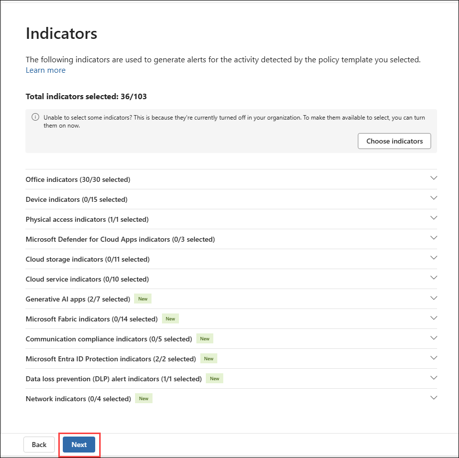

1. On the **Review settings and finish** page, review the policy configuration, including the policy name, content priorities, triggering event, and selected policy indicators.

1. Confirm that the **Hackathon - Financial DLP** policy is configured as the triggering event and that the **Finance** trainable classifier is selected for content prioritization, Click **Submit** to create and activate the Insider Risk Management policy.

   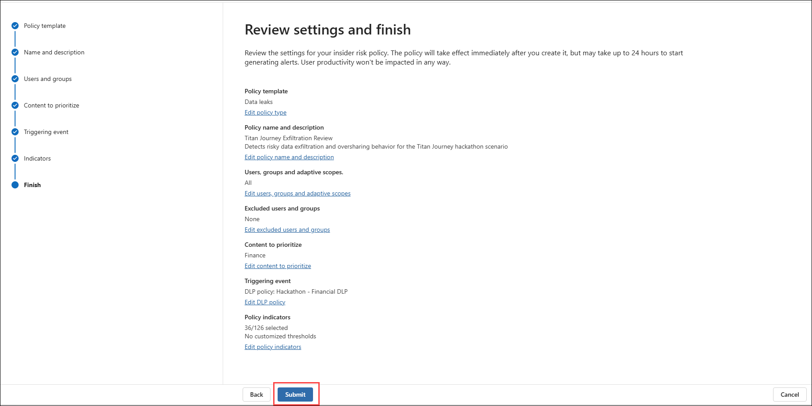

1. Verify that the **Your policy was created** confirmation message is displayed, indicating that the Insider Risk Management policy was successfully created, Click **Done** to close the wizard and return to the **Insider Risk Management** dashboard.

   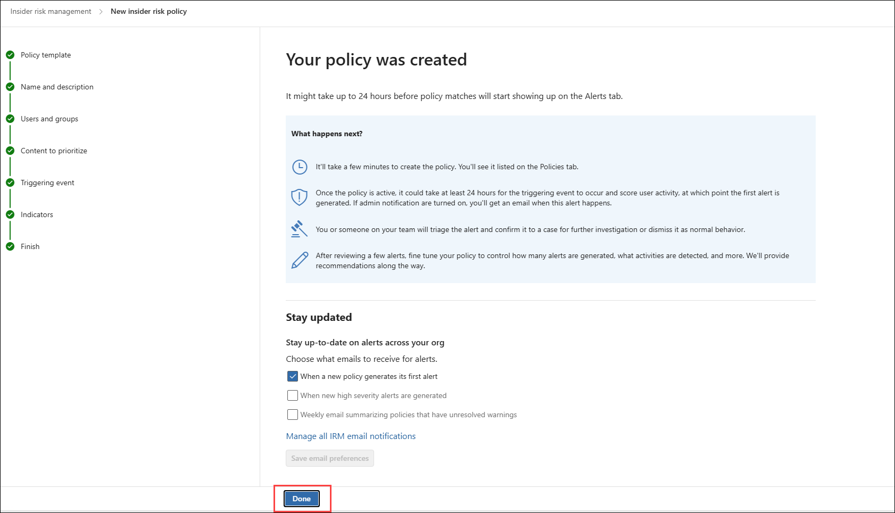

1. Verify that the **Titan Journey Exfiltration Review** policy is listed on the **Policies** page, Confirm that the policy status is displayed as **Healthy**, indicating that the Insider Risk Management policy was created successfully and is active.

   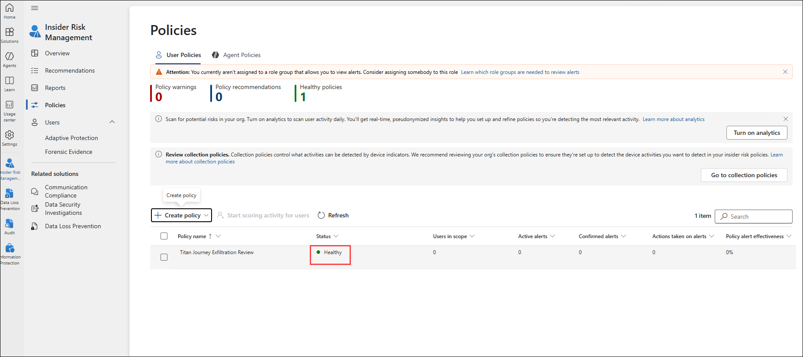

> [!Note]
> Microsoft Learn documents that Insider Risk Management policies require selected indicators and that policy health warnings can appear when indicators, triggers, devices, or related dependencies are incomplete. In the hackathon tenant, use what is already prepared rather than trying to remediate every backend dependency.

> [!Tip]
> If your tenant already includes a pre-created policy with active alerts, you can use that policy for the rest of this challenge even if you also created a new one.

## Task 3: Triage an alert and analyze the user activity timeline

In this task, you will review an Insider Risk Management alert, analyze its severity and signals, and inspect the user timeline to understand the pattern of risky behavior.

1. In **Insider Risk Management**, select **Alerts**.
2. On the alerts dashboard, filter for alerts with **Needs review** status if necessary.
3. Start with the highest-severity alert available in the queue.
4. Select the alert to open its details.
5. Review the header or summary information and capture the following details in your notes:
   - User involved
   - Policy associated with the alert
   - Triggering event
   - Alert severity
   - Activity that generated the alert
6. If the tenant offers **Summarize** or **Summarize with Copilot** in the alert experience, use it to generate a summary and record the result in your evidence notes.
7. Review the risk factors or alert detail panes to identify why the user was prioritized.
8. Open the **Activity explorer** tab if available and inspect the timeline of risky actions.
9. Use available filters to focus on exfiltration-related or sequence-related events.
10. Open the **User activity** tab and review the historical risk timeline for the user.
11. Look for patterns such as repeated downloads, external sharing, unusual behavior, sequence activities, or cumulative exfiltration indicators.
12. If the environment includes content preview, review enough detail to determine whether the activity appears benign, accidental, or suspicious.
13. Record your preliminary conclusion in your notes:
    - What data or content appears to be involved?
    - What actions increased the risk score?
    - Does the activity justify escalation to a formal case?

> [!Important]
> Insider Risk Management generates a single aggregated alert per user and can add new insights over time. Your goal is to understand the alert narrative, not just the first event in isolation.

> [!Tip]
> Save at least one screenshot showing the alert details or user activity timeline for your final evidence package.

<validation step="Insider Risk / investigation artifacts"/>

## Task 4: Create a case and escalate to Data Security Investigations

In this task, you will confirm the alert, create an insider risk case, and escalate it into Data Security Investigations for deeper analysis.

1. Return to the alert details or alerts dashboard.
2. Select the alert you investigated.
3. Choose **Actions** and then select **Confirm alerts & create case**.
4. In the case creation dialog, enter a case name such as `Titan Journey Insider Risk Case - Challenge 3`.
5. Add comments summarizing why the alert is being confirmed. Include references to suspicious behaviors you observed during triage.
6. If the tenant allows content download and the option is available, leave it enabled only if directed by the facilitator; otherwise proceed with the default selection.
7. Select **Create case**.
8. Open **Cases** from the left navigation and select the case you just created.
9. Review the case overview, then inspect the following tabs if available:
   - **Alerts**
   - **User activity**
   - **Activity explorer**
   - **Case notes**
10. Add a case note that summarizes your current investigation finding.
11. On the case action toolbar, select **Case actions** or the equivalent case action menu.
12. Select **Investigate data security with AI**.
13. In the **Create a data security investigation** dialog, enter a unique name such as `TitanJourney-DSI-Challenge3-<inject key="DeploymentID"></inject>`.
14. Add a description explaining that the investigation is intended to evaluate potential data exfiltration and content exposure associated with the insider risk case.
15. In the **Investigation scope** area, keep the relevant items from the case selected.
16. In **Additional context for AI**, enter a focused prompt such as: `Investigate whether the scoped files or messages contain regulated, financial, personal, or confidential project data that would increase breach impact.`
17. Select **Create investigation**.
18. If Data Security Investigations opens successfully, review the investigation dashboard and verify that the new investigation appears.
19. Record the investigation name, scope, and any initial AI or categorization context in your notes.

> [!Note]
> Microsoft Learn states that investigations created from Insider Risk Management cases automatically include case items as data sources. Depending on licensing and timing, some analysis results may take time to appear.

> [!Tip]
> Use the deployment identifier in the investigation name to make your evidence easy to trace later: **<inject key="DeploymentID" enableCopy="false"></inject>**.

<validation step="Insider Risk / investigation artifacts"/>

## Task 5: Create a notice template and capture investigation evidence

In this task, you will create a reusable notification template for remediation and document the evidence gathered during the challenge.

1. In **Insider Risk Management**, select **Notification templates**.
2. Select **Create notification template**.
3. Configure the template with values similar to the following:
   - **Template name**: `Titan Journey Reminder Notice`
   - **Send from**: Use an appropriate administrative or compliance sender address available in the tenant.
   - **Subject**: `Action required: review data handling guidance`
   - **Message body**: Explain that recent activity triggered a compliance review and direct the user to handling guidance or refresher training.
4. Select **Create**.
5. Confirm that the new template appears in the notification template list.
6. Return to your insider risk case and verify that a notice could be selected from the case workflow if needed.
7. On the lab VM, open your evidence folder and create a short incident summary document that includes:
   - The policy reviewed or created
   - The alert investigated
   - The user risk indicators you observed
   - The case name
   - The Data Security Investigation name
   - The notice template name
   - Your recommended next action
8. Save screenshots or notes for the following items:
   - Insider Risk policy dashboard or policy details
   - Alert details or user activity timeline
   - Case overview or case notes
   - Data Security Investigation creation confirmation
   - Notification template list or template details
9. Keep the evidence package available for use in later challenges and the final remediation narrative.

> [!Important]
> Sending a notice to a user does not automatically resolve a case. Notice templates support workflow and user communication, but investigators must still determine whether to continue monitoring, escalate further, or resolve the case.

<validation step="Insider Risk / investigation artifacts"/>

## Summary

In this challenge, you reviewed Insider Risk Management readiness, validated or created an exfiltration-focused policy, triaged an alert, analyzed user activity, created a formal case, opened a Data Security Investigation, and prepared a reusable notice template. You now have the investigation artifacts needed to support later remediation, compliance reporting, and the final incident narrative for the Titan Journey scenario.
