# Exercise 05: Challenge 5 — Compliance Foundations

### Estimated Duration: 1 Hour

## Scenario

After implementing labels, DLP controls, and initial investigative workflows, the response team now needs to establish durable compliance foundations for the tenant. In this challenge, you validate audit readiness, configure supervision controls for risky communications, apply retention and records controls for critical business data, and create an eDiscovery workspace that preserves evidence for follow-up investigation.

## Overview

In this challenge, you will work in Microsoft Purview to confirm the organization can retain, search, supervise, and investigate regulated content. You will use Audit, Communication Compliance, Data Lifecycle Management, Records Management, eDiscovery, and Compliance Manager experiences to create a defensible compliance baseline that supports both day-to-day governance and post-incident response.

## Objectives

- Task 1: Sign in and validate audit readiness
- Task 2: Run an audit search for recent compliance activity
- Task 3: Create a Communication Compliance policy
- Task 4: Create retention and records coverage
- Task 5: Create an eDiscovery case with custodian, hold, and content search
- Task 6: Review the file plan and Compliance Manager improvement actions

## Task 1: Sign in and validate audit readiness

In this task, you will sign in to the tenant and confirm that the core compliance investigation surfaces are available.

1. On the lab VM, open Microsoft Edge.
2. Browse to the Microsoft Purview portal at 
`
https://purview.microsoft.com
`
3. Sign in with the following credentials:
   - Username: <inject key="AzureAdUserEmail"></inject>

      

   - Password: <inject key="AzureAdUserPassword"></inject>

      

4. When prompted, complete any first-run or multifactor prompts that are already pre-staged for the lab tenant.
5. In a separate browser tab, open the Azure portal at 
`
https://portal.azure.com
`
 and confirm that your subscription context is available for this deployment:
   - Subscription: <inject key="SubscriptionID"></inject>
   - Tenant: <inject key="TenantID"></inject>
   
6. In the Microsoft Purview portal, click **Solutions (1)** to view the available compliance and governance solutions.

1. Review the available solutions, including:
   - **Audit (2)**
   - **Communication Compliance (3)**
   - **Data Lifecycle Management (4)**
   - **Records Management (5)**
   - **eDiscovery (6)**
   - **Compliance Manager (7)**

      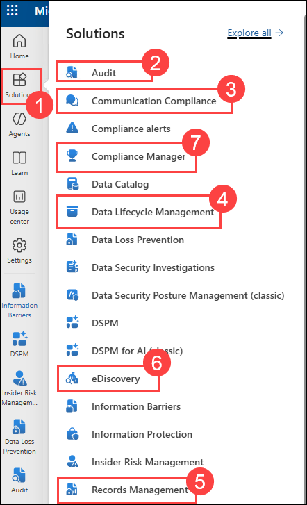
7. Record the deployment reference for your notes as **Deployment ID: <inject key="DeploymentID" enableCopy="false"></inject>**.
8. Create a plain-text evidence note on the desktop or in your challenge notes listing which Purview solutions are visible and which appear pre-staged by the tenant team.

> [!Important]
> Some Purview experiences depend on licensing, role groups, and pre-enabled prerequisites. If a feature is visible but opens in read-only mode, continue with observation and evidence capture rather than blocking your progress.

## Task 2: Run an audit search for recent compliance activity

In this task, you will use Microsoft Purview Audit to confirm that searchable activity exists for the tenant.
 
1. In Microsoft Purview, open **Solutions (1)** > **Audit (2)**.

   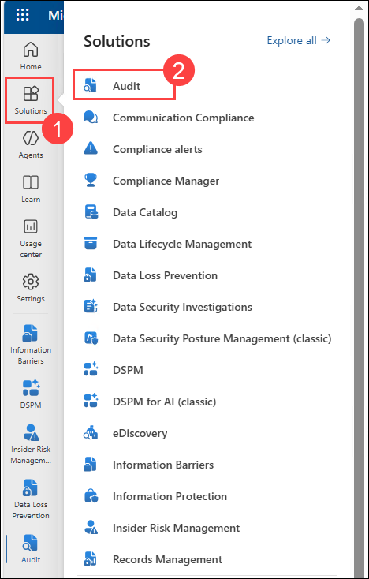

2. If the page prompts you to start recording user and admin activity, note the prompt for your evidence and continue only if the tenant is already configured for the challenge.

3. In **Audit**, Click **Search (1)** to run an audit log search using the specified criteria and retrieve matching audit events.

   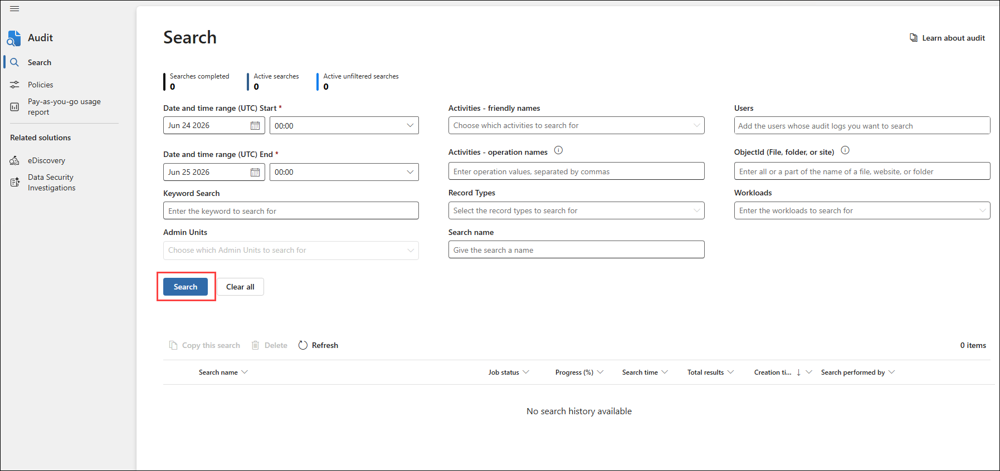

4. On the **Audit > Search** page, configure the audit search as follows:

   - **Date and time range (UTC) Start (1):** Select the required start date and time. (Last 7 days)
   - **Date and time range (UTC) End (2):** Select the required end date and time.
   - **Activities - friendly names (3):** Select relevant activities such as **Accessed file**, **Modified file**, and **DLP-related activities**.
   - **Search name (4):** Enter a name such as **Audit Search**.

   Click **Search (5)** to run the audit log search.

   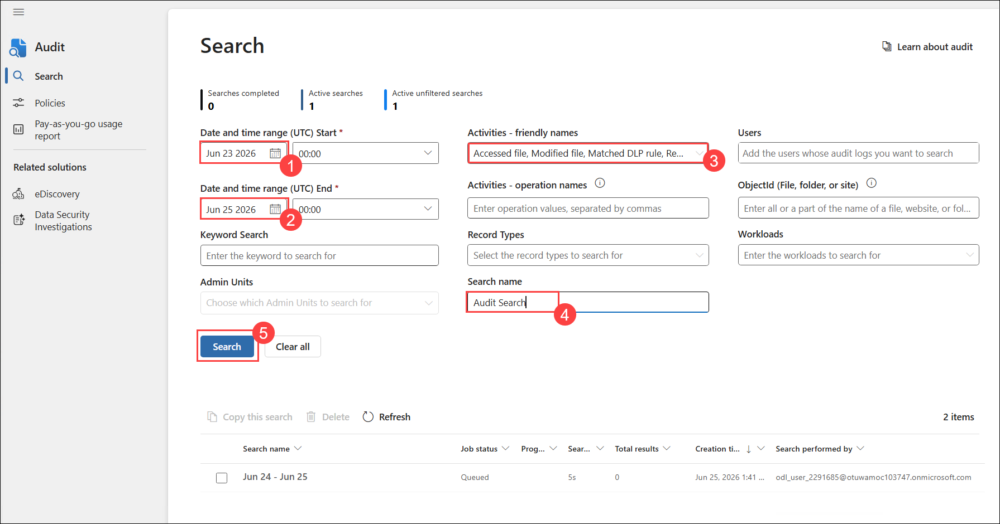

6. On the **Audit > Search** page, review the submitted audit search jobs in the results section.

1. Verify that the **Jun 24 - Jun 25** search shows a **Completed** status with audit records returned, confirming that the search executed successfully.

1. Review the **Audit Search** job and monitor its status until processing is complete.

   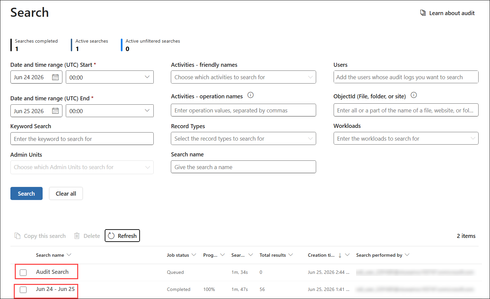

> [!Tip]
> Audit results can take time to appear. If the tenant has pre-seeded evidence, prioritize reviewing existing entries rather than waiting for new activity to ingest.

## Task 3: Create a Communication Compliance policy

In this task, you will create a policy that helps detect inappropriate or risky communications relevant to the post-incident environment.

1. In the Microsoft Purview portal, click **Solutions (1)** to open the list of available compliance solutions, Select **Communication Compliance (2)** to open the Communication Compliance solution and begin reviewing or configuring communication monitoring policies.

   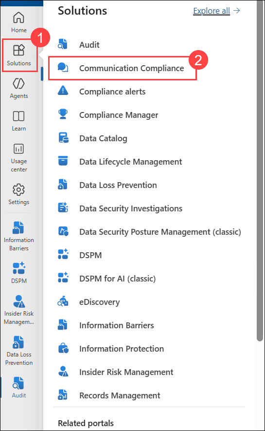

2. Review any prerequisite or onboarding banner. If the tenant is already configured, continue to policy creation.

3. In **Communication Compliance**, select **Policies (1)** from the left navigation pane, Click **Create policy (2)** to start creating a new Communication Compliance policy, From the policy templates list, select **Detect inappropriate content (3)** to create a policy that monitors and flags inappropriate communications for review.

   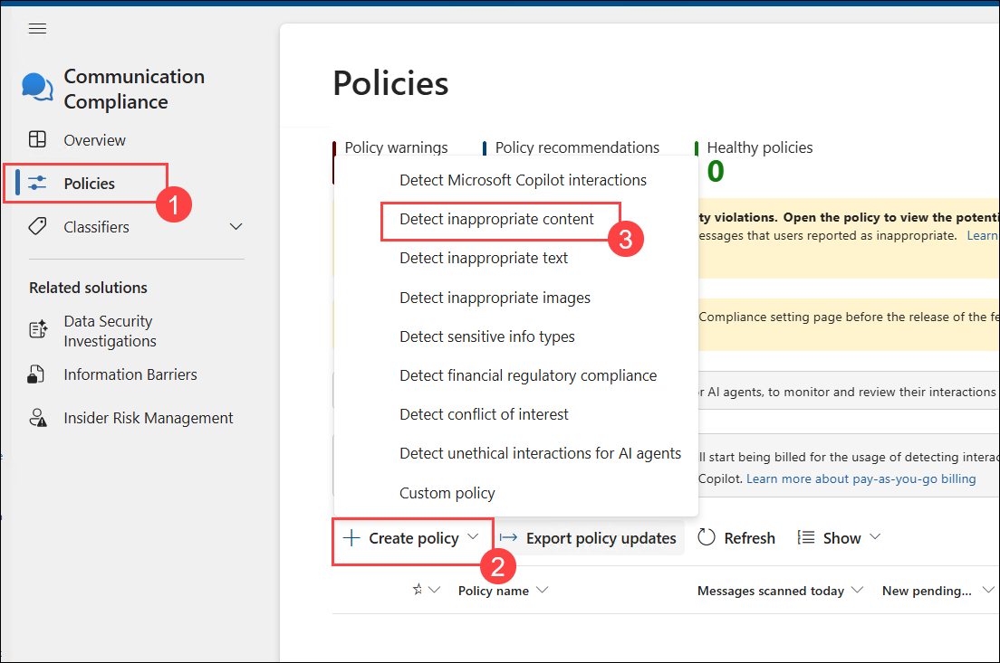

1. On the **Monitor communications for inappropriate content** page, enter **Hackathon-CommPolicy-<inject key="DeploymentID"></inject> (1)** as the policy name.

1. In the **Reviewers (2)** field, search for **ODL_User**, and then select the **ODL_User (2)** account from the search results to assign it as the policy reviewer.

1. Verify that **Preserve policy matches (3)** is set to **Global Setting** before proceeding with the policy creation, 
Review the preconfigured monitoring settings, including the scoped locations such as **Teams and Viva Engage (4)**.

1. Click **Create policy (5)** to create the Communication Compliance policy using the default template settings.

   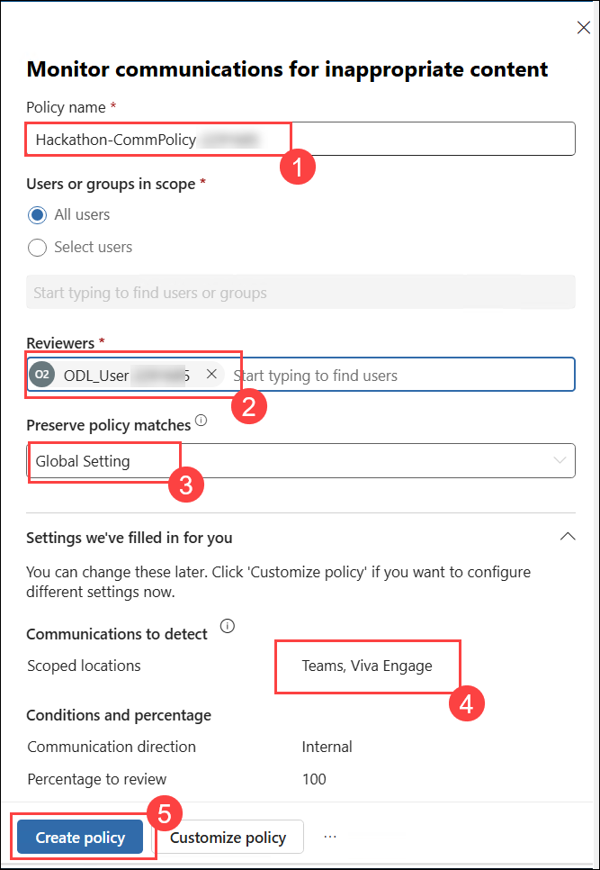

1. Verify that the **Your policy was created** confirmation message is displayed, indicating that the Communication Compliance policy was created successfully, Click **Close** to exit the confirmation page and return to the **Communication Compliance** portal.

   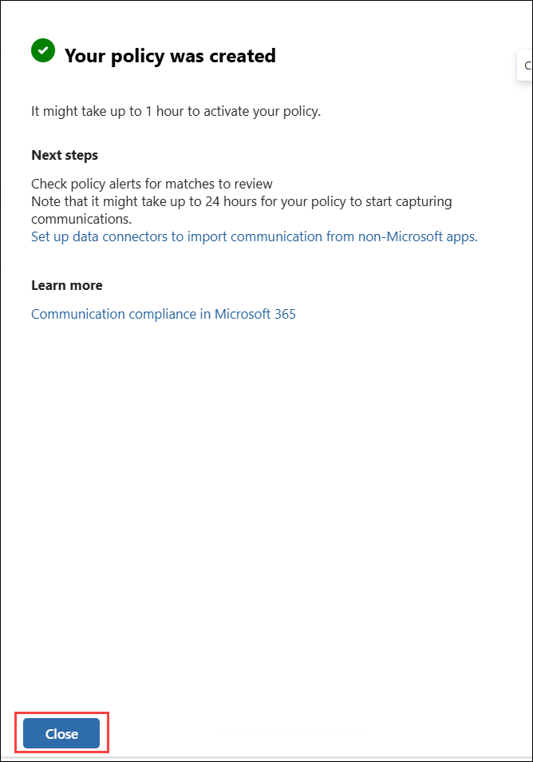

1. On the **Communication Compliance > Policies** page, verify that the **Hackathon-CommPolicy-<inject key="DeploymentID"></inject>** policy is listed, 
Confirm that the **Policy health** status is **Healthy**, indicating that the policy was created successfully and is functioning correctly.

   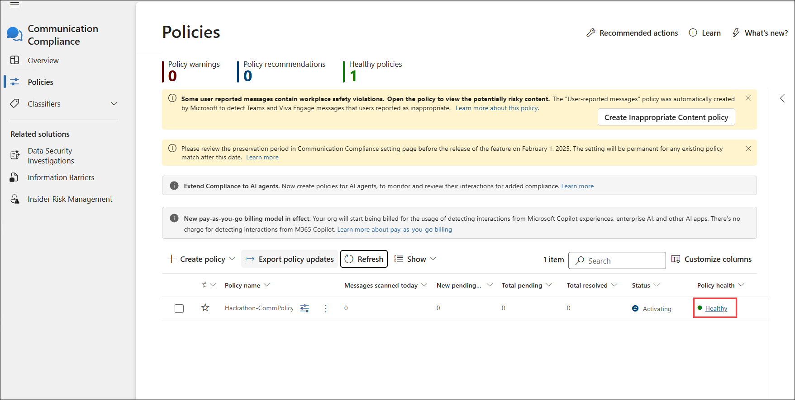

> [!Note]
> Communication Compliance templates and exact wizard pages can vary by tenant features and licensing. The important outcome for this challenge is to create or review a policy configuration that supervises regulated or risky communications.

## Task 4: Create retention and records coverage

In this task, you will create baseline retention protection and a records-oriented label for important business content.

1. In the Microsoft Purview portal, click **Solutions (1)** to open the list of compliance and governance solutions, select **Data Lifecycle Management (2)** to open the Data Lifecycle Management solution and begin configuring retention and records management policies.

   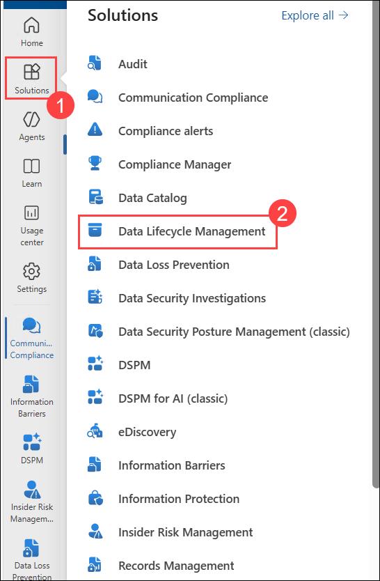

2. Go to **Policies(1)** and select **Retention policies (2)**.

   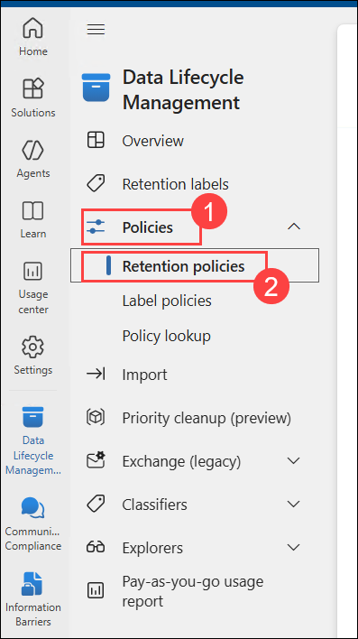

3. Select **+ New retention policy**.

   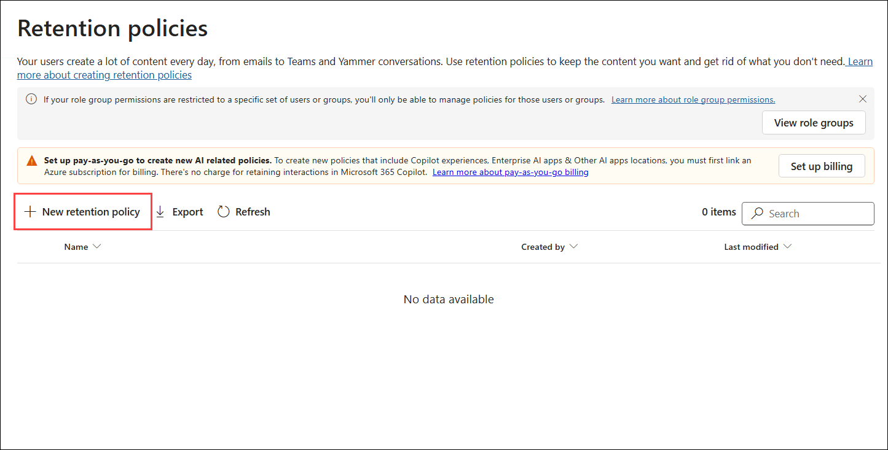

4. On the **Name your retention policy** page, enter **Hackathon-BaselineRetention-<inject key="DeploymentID"></inject> (1)** in the **Name** field, Click **Next (2)** to continue to the **Administrative Units** configuration step of the retention policy wizard.

   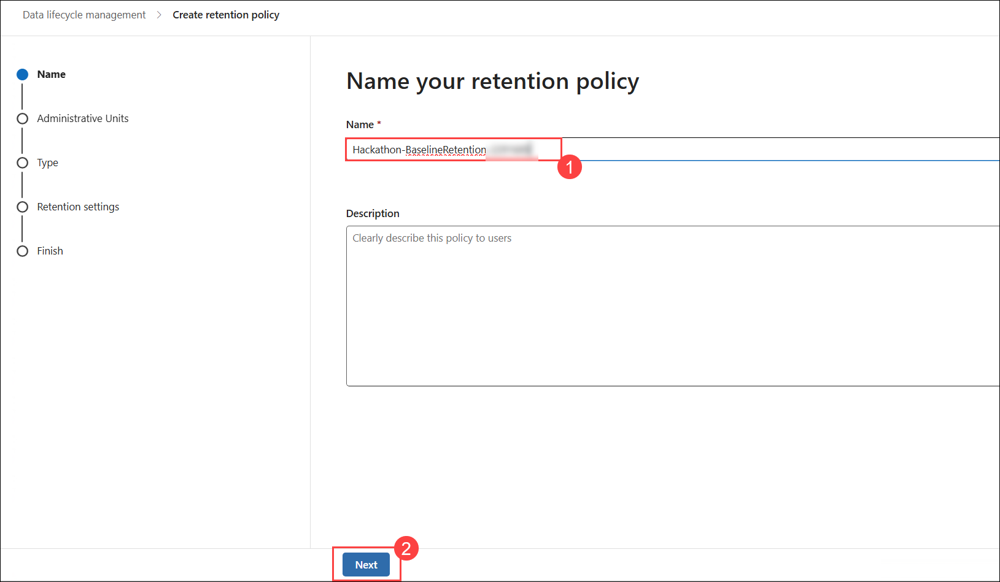

1. On the **Choose the type of retention policy to create** page, select **Static (1)** to manually choose the locations where the retention policy will be applied, Click **Next (2)** to continue to the **Retention settings** configuration step.

   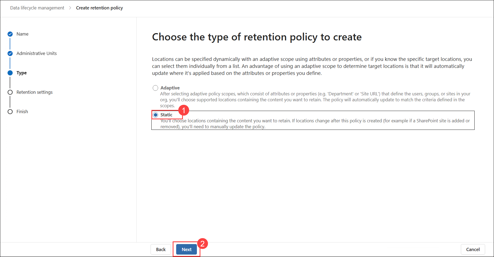

1. On the **Choose where to apply this policy** page, verify that the following locations are enabled:

   - **Exchange mailboxes (1)**
   - **SharePoint classic and communication sites (2)**
   - **OneDrive accounts (3)**

   Review the selected locations to ensure the retention policy will apply to organizational email, SharePoint, and OneDrive content.

1. Click **Next (4)** to continue to the **Retention settings** configuration page.

   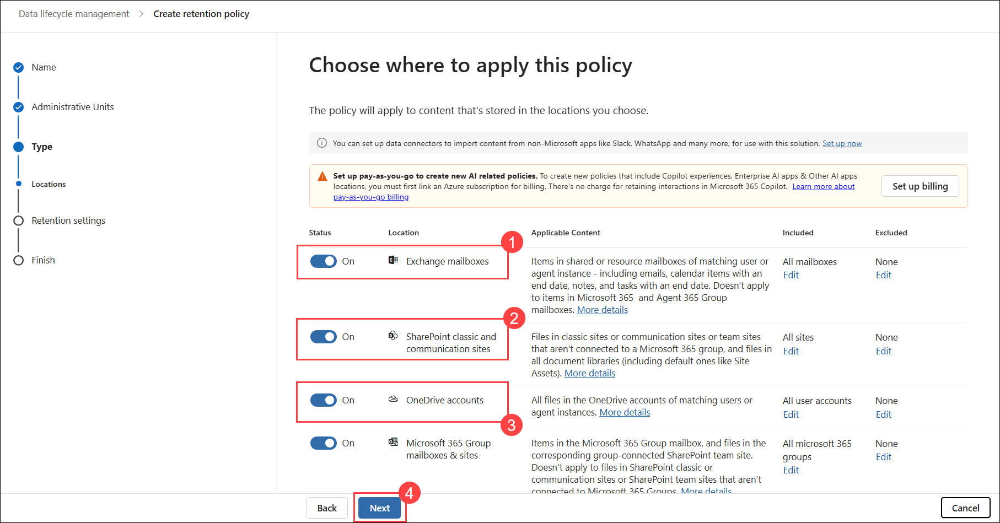

1. On the **Retention settings** page, select **Retain items for a specific period** and verify that the retention period is set to **7 years**, Click **Next** to continue to the **Finish** page and review the retention policy configuration.

   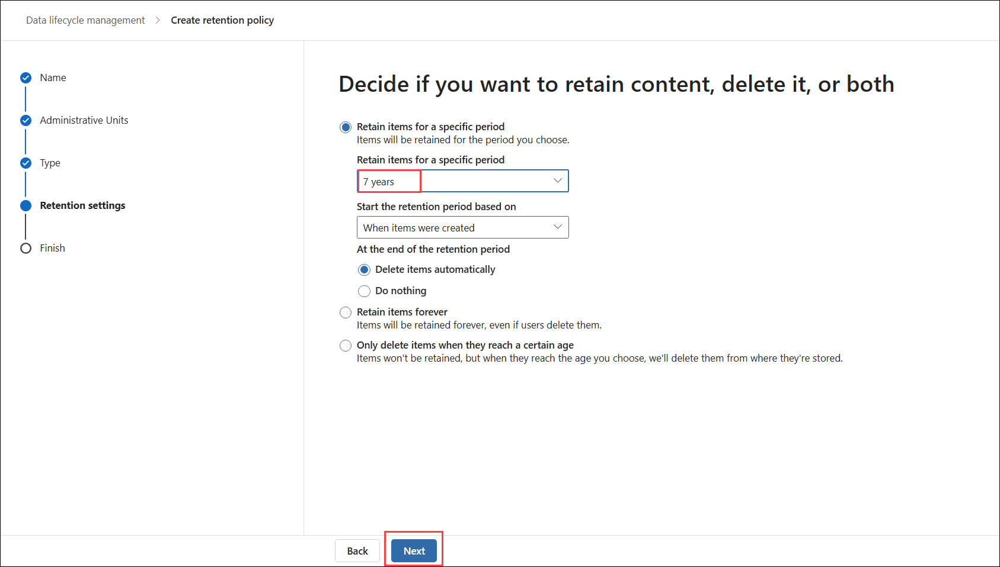

1. Verify that the **You successfully created a retention policy** confirmation message is displayed, indicating that the **Hackathon-BaselineRetention-<inject key="DeploymentID"></inject>** policy was created successfully, Click **Done** to finish the retention policy creation process and return to the **Data Lifecycle Management** portal.

   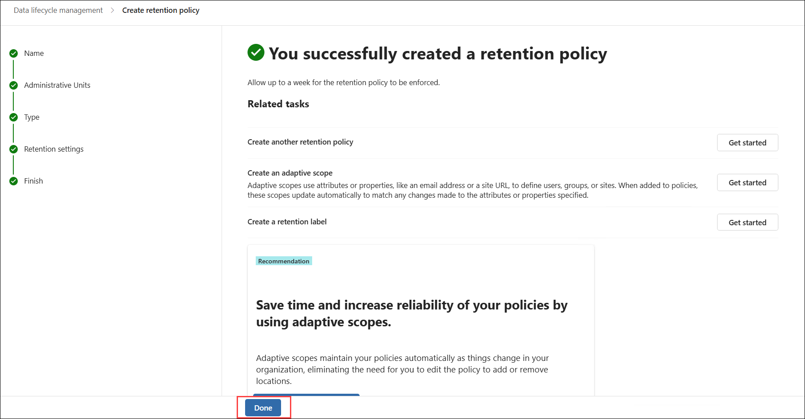

6. Next, open **Solutions (1)** > **Records management (2)**.

   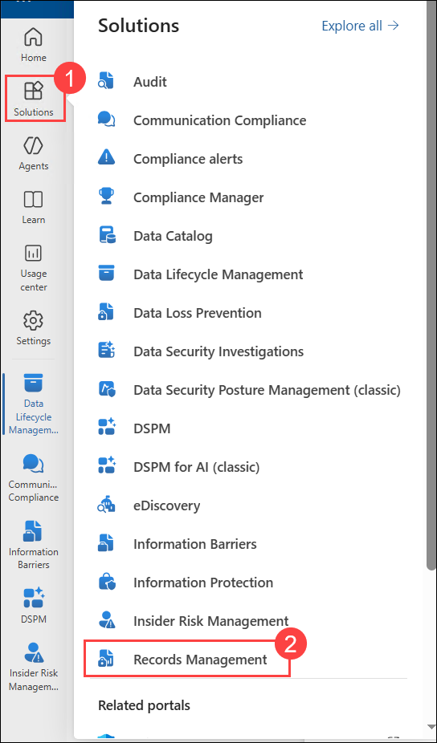

7. In **Records Management**, select **File plan (1)** from the left navigation pane, click **Create a label (2)** to start creating a new retention label for managing records and retention settings.

   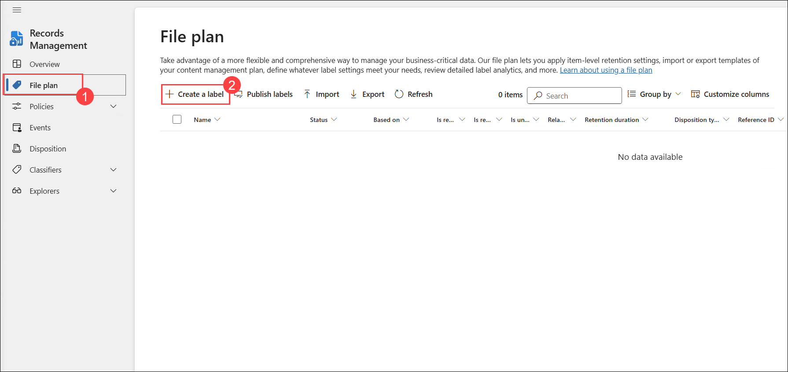

1. On the **Name your retention label** page, enter **Investigation Record - 7 Years - <inject key="DeploymentID"></inject> (1)** in the **Name** field, Click **Next (2)** to continue to the **File plan descriptors** configuration step.

   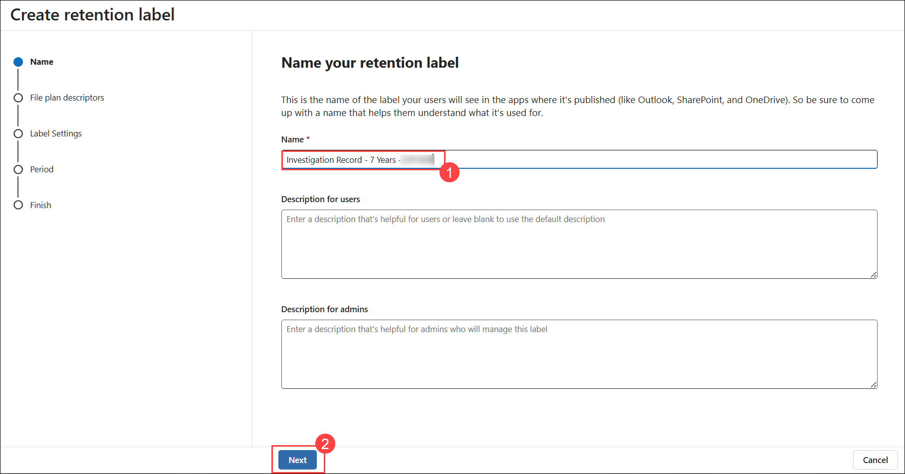

1. On the **Define the retention period** page, verify that **Retain items for** is set to **7 years (1)**, Click **Next (2)** to proceed to the **Finish** page and review the retention label configuration.

   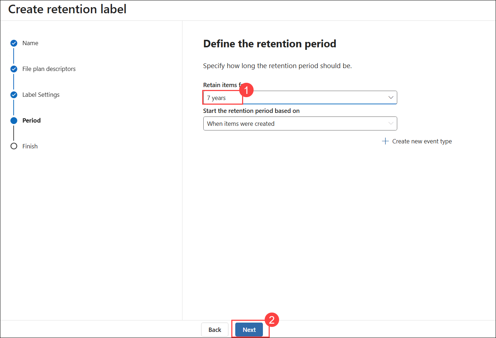

1. On the **Choose what happens after the retention period** page, select **Start a disposition review (1)** to require manual review of retained content before it can be deleted, Click **Next (2)** to continue to the **Finish** page and review the retention label configuration.

   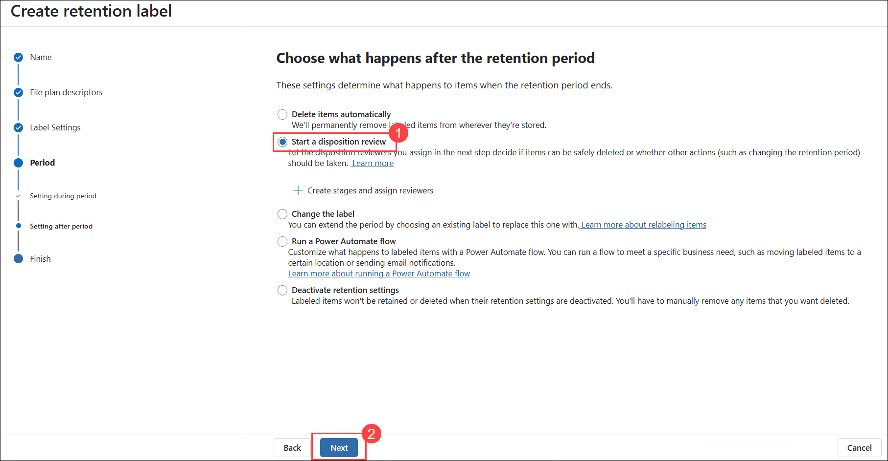

1. In the **Add a stage** pane, enter **Disposition Review Stage (1)** as the stage name, Click **OK (2)** to create the disposition review stage and continue configuring reviewers for the retention label.

   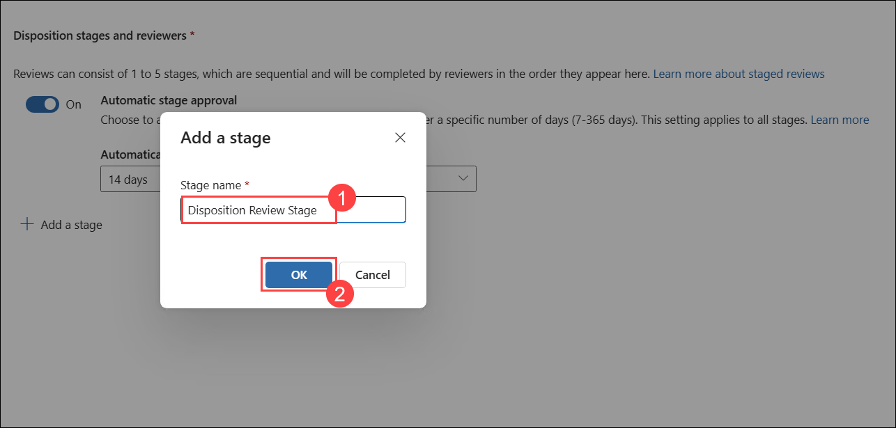

1. In the **Reviewers for this stage** field, search for **ODL_User** and select the **ODL_User (1)** account as the disposition reviewer for the retention label, Click **OK (2)** to save the disposition review stage and continue with the retention label configuration.

   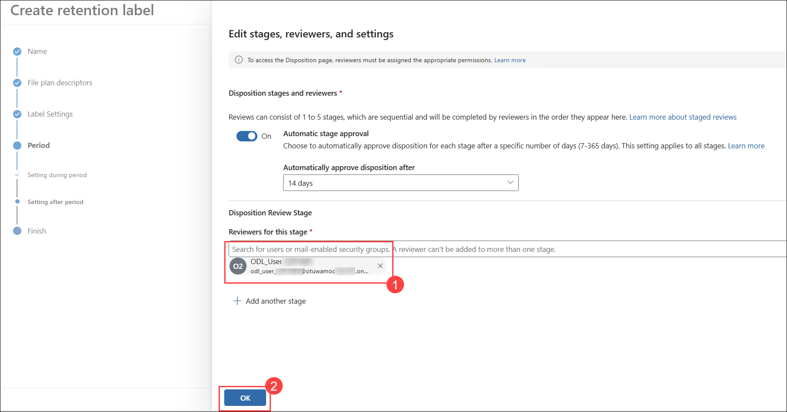

1. Review the **Disposition Review Stage** section and verify that **ODL_User** is listed as the assigned reviewer for the disposition review process, Click **Next** to proceed to the **Finish** page and review the retention label configuration before creating the label.

   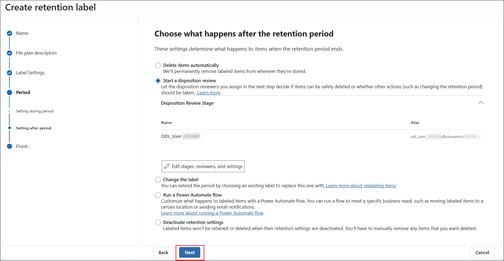

1. On the **Review and finish** page, review the retention label configuration, including the label name, **7-year retention period**, disposition review settings, and assigned reviewer.

1. Verify that the **Disposition Review Stage** is configured and that **ODL_User** is assigned as the reviewer for disposition actions, Click **Create label (1)** to create the **Investigation Record - 7 Years - <inject key="DeploymentID"></inject>** retention label.

   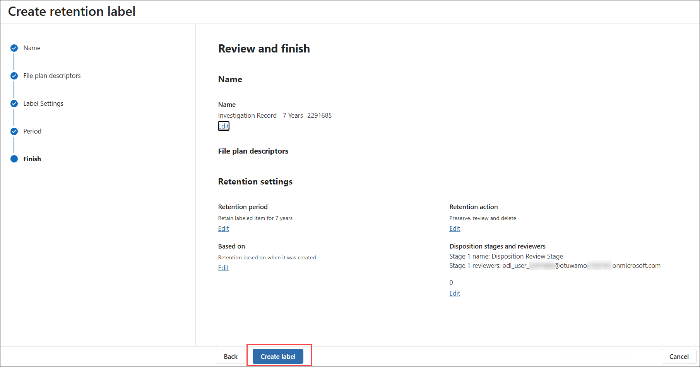

1. Verify that the **Your retention label is created** confirmation message is displayed, indicating that the **Investigation Record - 7 Years - <inject key="DeploymentID"></inject>** retention label was created successfully, 
Click **Done** to complete the retention label creation process and return to the **File plan** page.

   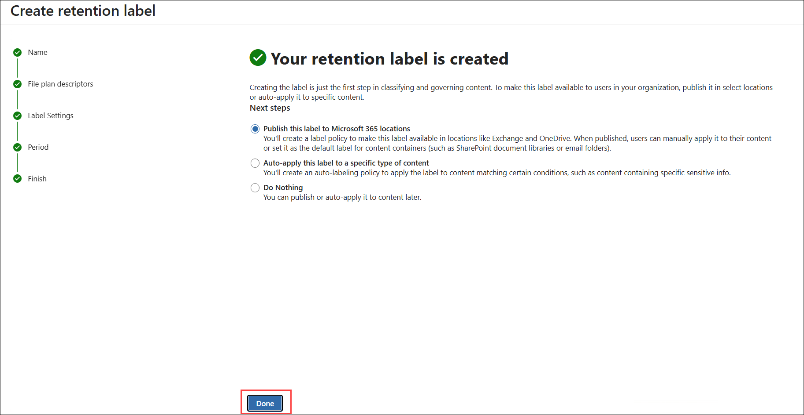

1. On the **File plan** page, verify that the **Investigation Record - 7 Years - <inject key="DeploymentID"></inject>** retention label is listed.

   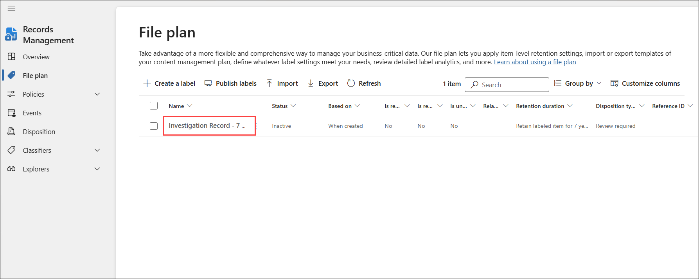

> [!Important]
> Retention policies provide broad lifecycle coverage, while retention labels provide item-level control and can support records declaration and disposition review. Use both concepts intentionally in your narrative.

## Task 5: Create an eDiscovery case with custodian, hold, and content search

In this task, you will create an investigation workspace that can preserve and search for incident-related content.

1. In Microsoft Purview, open **Solutions (1)** > **eDiscovery (2)**.

   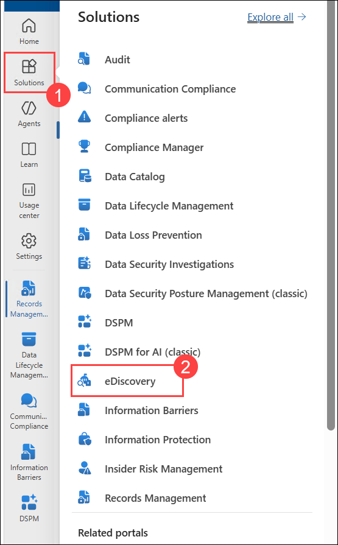

2. In **eDiscovery**, select **Cases (1)** from the left navigation pane to view and manage investigation cases, click **Create case (2)** to start creating a new eDiscovery case for investigation and content review activities.

   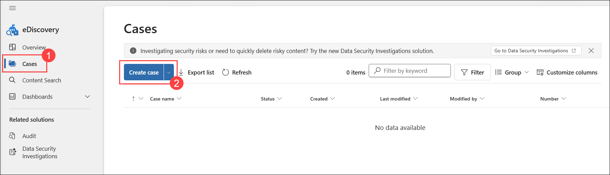

1. In the **New case** pane, enter **Hackathon-Exposure-Investigation-<inject key="DeploymentID"></inject> (1)** in the **Case name** field.

1. In the **Case description (2)** field, enter: **Challenge 5 compliance foundation case for post-incident evidence preservation and review**.

1. Click **Create (3)** to create the eDiscovery case and begin the investigation workflow.

   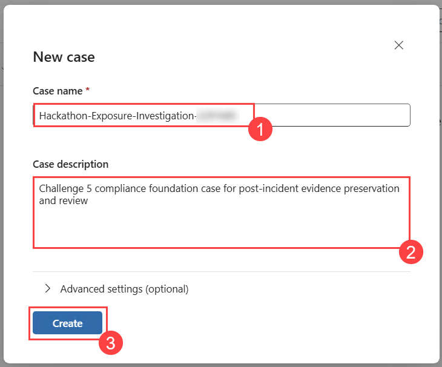

1. On the **Hackathon-Exposure-Investigation-<inject key="DeploymentID"></inject>** case page, verify that the **Searches** tab is selected, Click **Create a search** to create a new content search for identifying and reviewing data relevant to the investigation.

   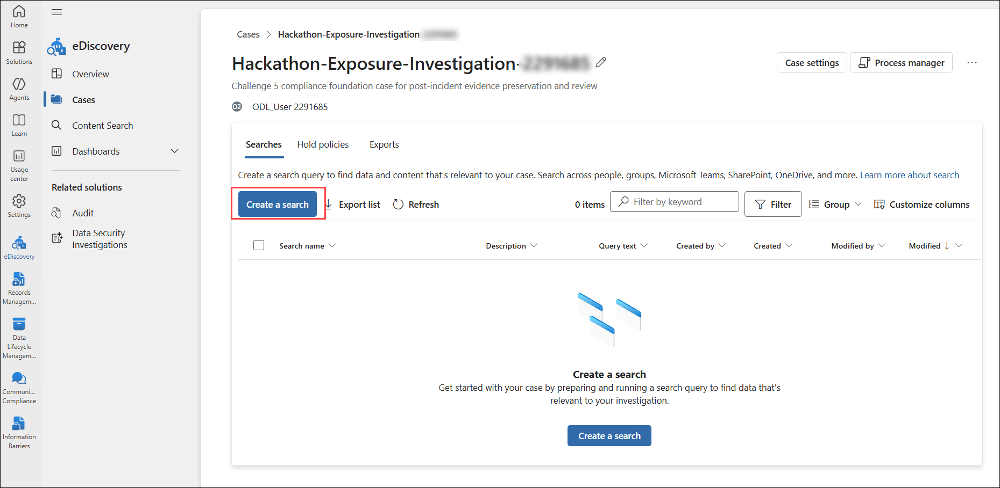

1. In the **New search** pane, enter **Incident Content Search (1)** in the **Search name** field, Click **Create (2)** to create the search and proceed with configuring search locations, keywords, and conditions.

   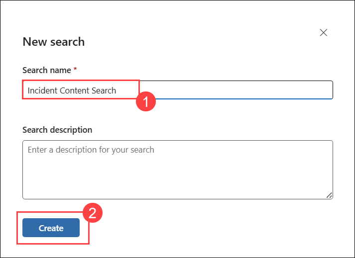

1. On the **Incident Content Search** page, review the configured keyword conditions in the **Condition builder** section:

   - **confidential (1)**
   - **finance (2)**
   - **project (3)**

      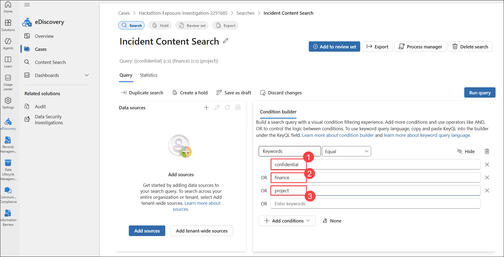

1. In the **Data sources** section, click **Add tenant-wide sources (1)** to include content from across the Microsoft 365 tenant in the investigation search.

   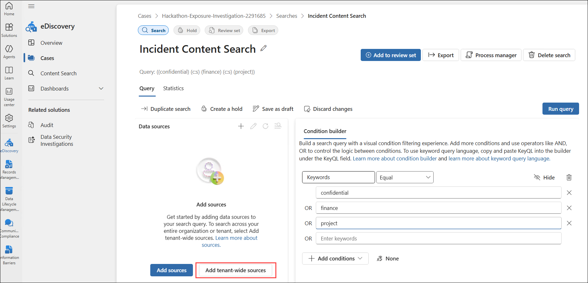

1. In the **Manage sources** pane, verify that **All people and groups** and **All public folders** are selected, with **Mailboxes** and **Sites** enabled for both sources,
Click **Save** to apply the selected data sources to the **Incident Content Search** query and return to the search configuration page.

   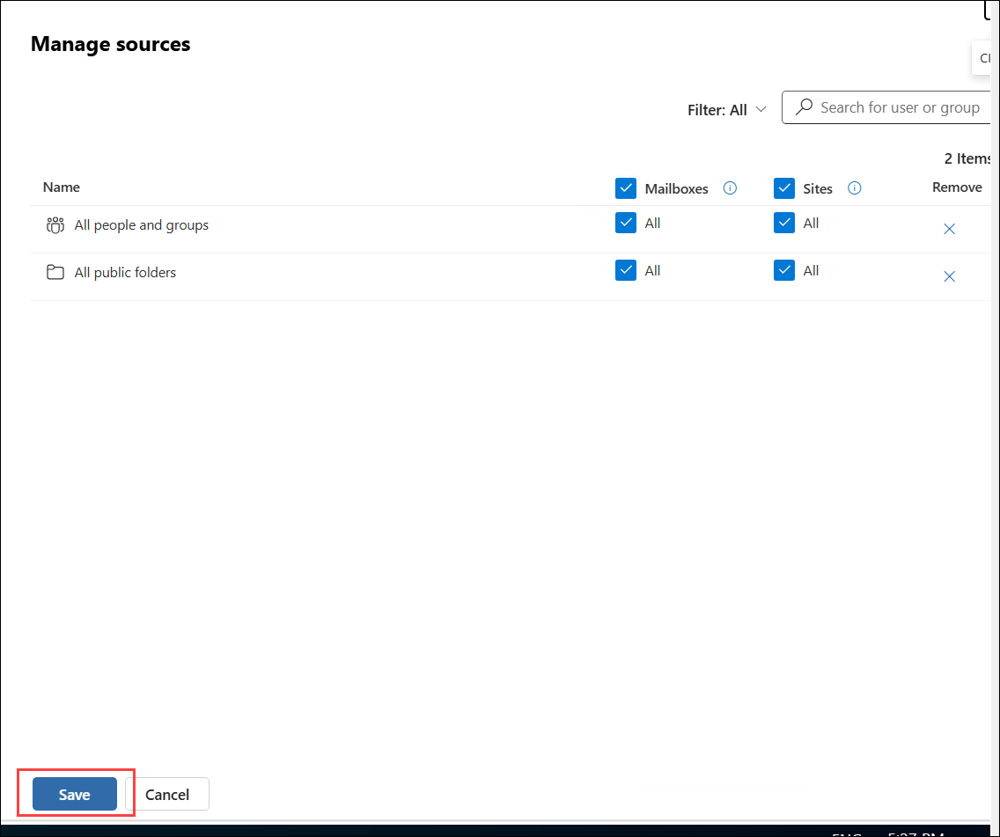

1. Review the **Data sources** section and verify that **All people and groups** and **All public folders** are listed as search sources for the investigation.

1. Confirm that the keyword query contains **confidential**, **finance**, and **project** in the **Condition builder** section.

1. Click **Run query (1)** to execute the **Incident Content Search** across the selected tenant-wide data sources.

   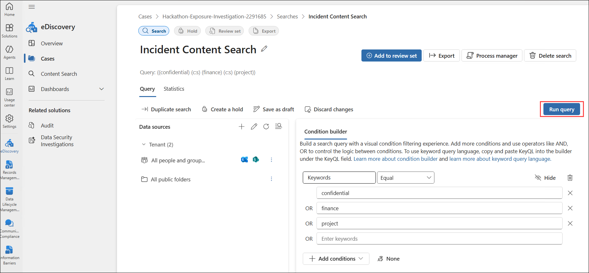

1. In the **Choose search results** pane, keep **Statistics** selected to generate a summary of the search results and matching content, Click **Run query (2)** to execute the **Incident Content Search** and generate search statistics across all selected tenant-wide sources.

   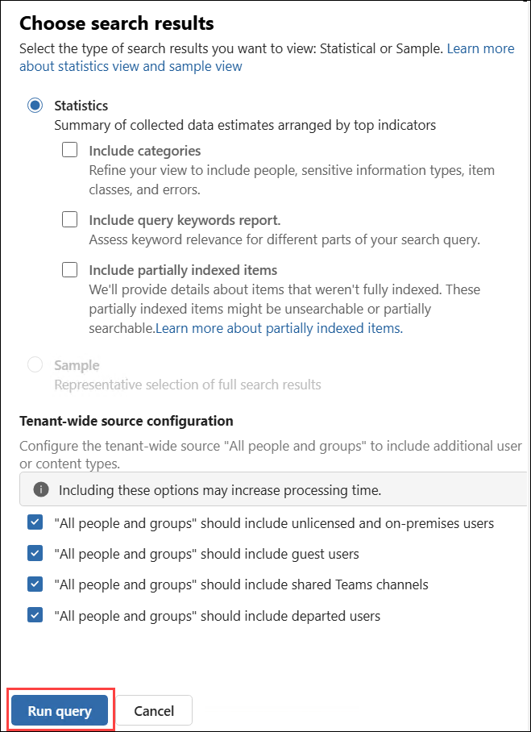

1. In the **Hackathon-Exposure-Investigation-<inject key="DeploymentID"></inject>** case, select the **Hold policies (1)** tab to manage content preservation settings for the investigation, Click **New policy (2)** to create a hold policy that preserves relevant content and prevents it from being modified or deleted during the investigation.

   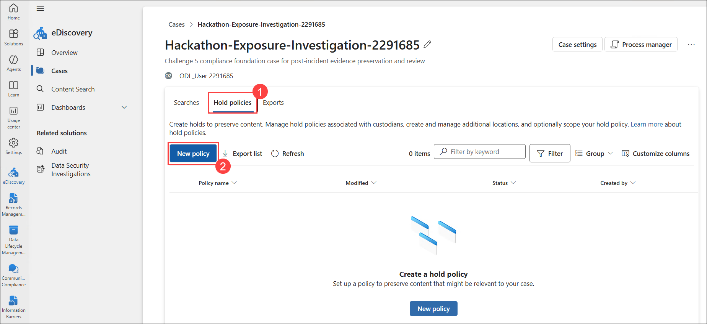

1. In the **Enter details to get started** pane, enter **Incident Evidence Hold (1)** in the **Policy name** field, Click **Create (2)** to create the hold policy and continue configuring the hold locations and preservation settings.

   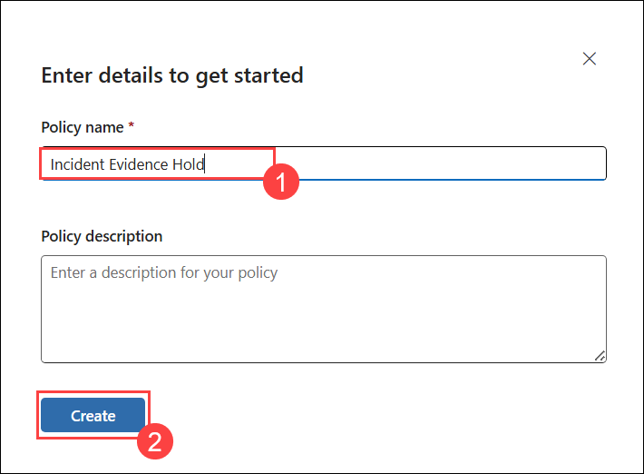

1. On the **Incident Evidence Hold** page, click **Add sources (1)** to select the Microsoft 365 locations whose content must be preserved as part of the investigation hold.

   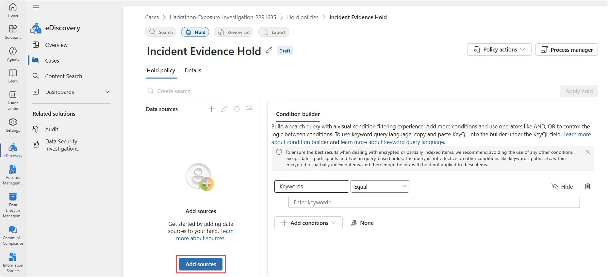

1. In the **Search for sources** pane, enter **odl (1)** in the search box and click **Search (2)** to locate the lab user account, select **ODL_User (3)** to add the user as a hold policy source, Click **Manage (4)** to add the selected user source and continue configuring the hold policy.

   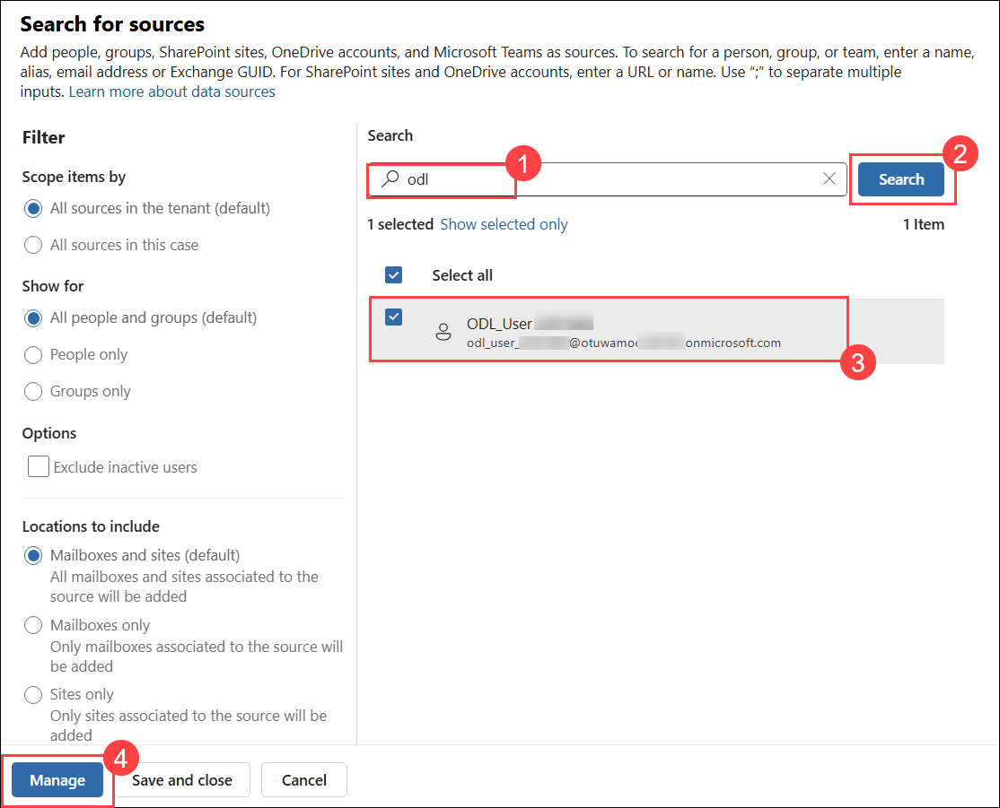

1. In the **Manage sources** pane, verify that **ODL_User <inject key="DeploymentID"></inject>** has been added as a hold policy source, Click **Save** to apply the selected source and return to the **Incident Evidence Hold** policy configuration page.

   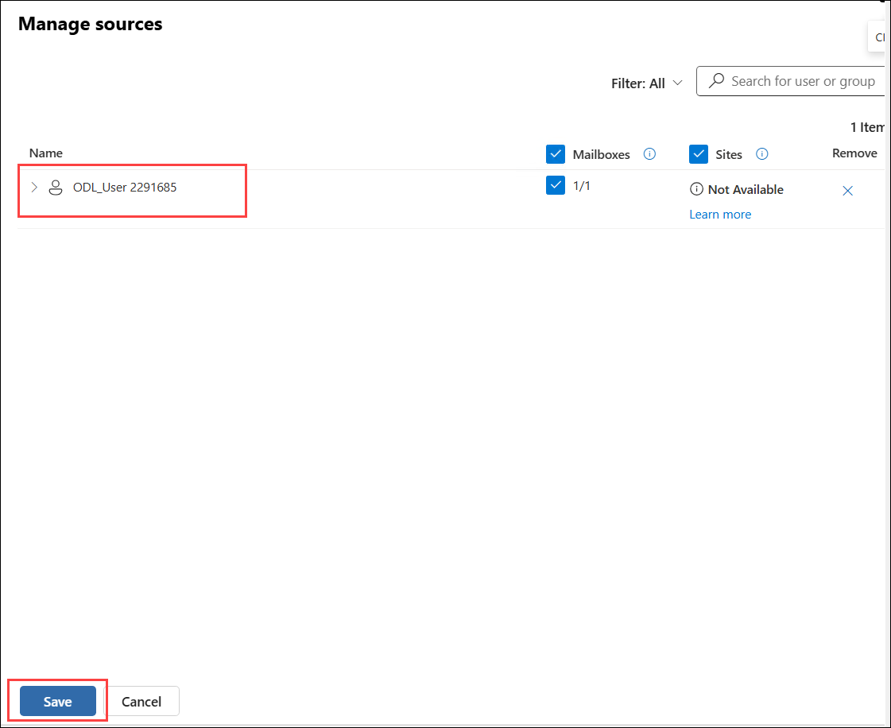

1. Click **Apply hold** to activate the **Incident Evidence Hold** policy and preserve content associated with the selected source.

   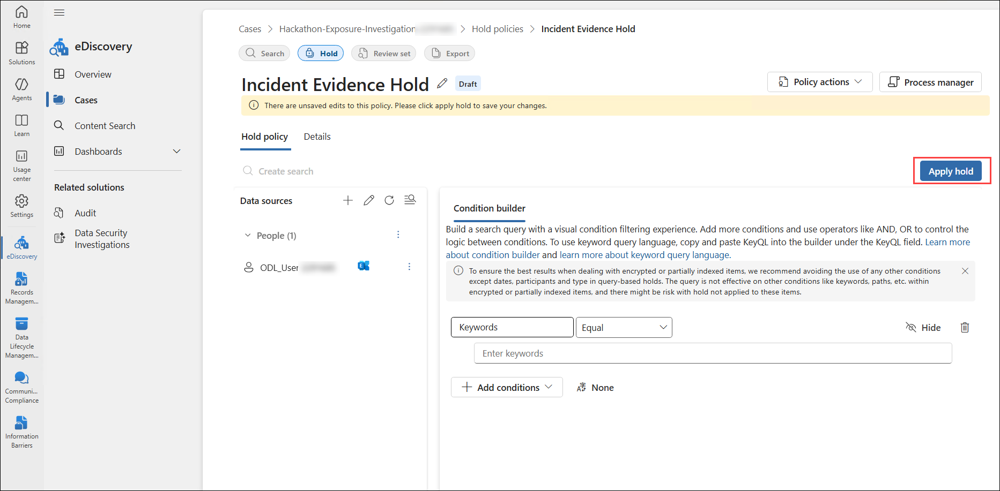

1. Review the source list and confirm that the **ODL_User** mailbox is displayed with the **Hold status** shown as **On hold**.

   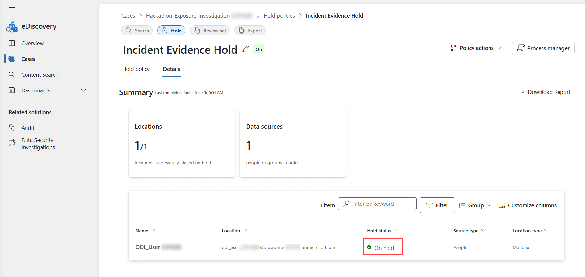

## Task 6: Review the file plan and Compliance Manager improvement actions

In this task, you will connect your tactical controls to broader compliance operations.

1. In the Microsoft Purview portal, click **Solutions (1)** from the left navigation pane to open the list of available compliance and governance solutions, select **Records Management (2)** to open the Records Management solution and manage retention labels, file plans, disposition reviews, and records governance configurations.

   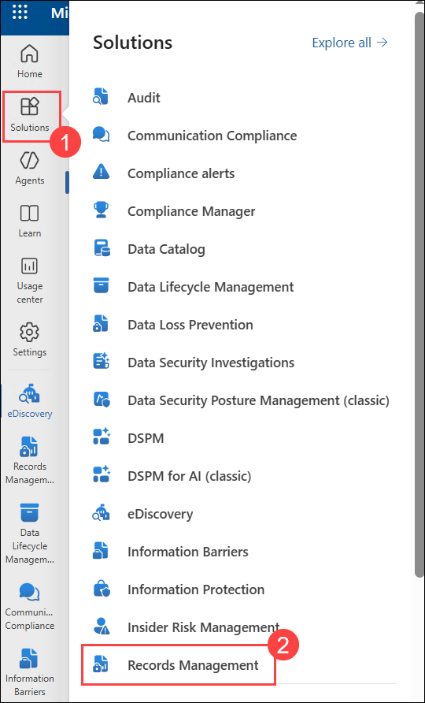

1. In **Records Management**, verify that **File plan (1)** is selected from the left navigation pane, 
Review the list of retention labels and confirm that **Investigation Record - 7 Years (2)** is displayed in the file plan.

   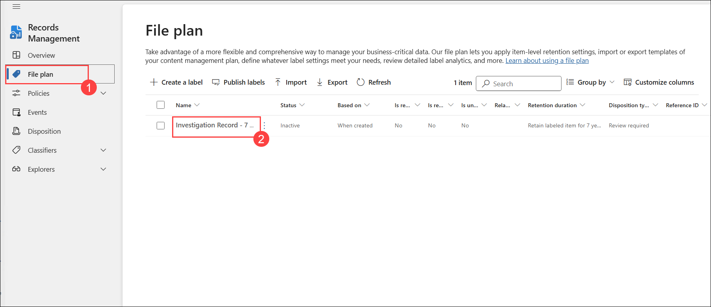

1. Verify that the **Retention duration** is set to **Retain labeled item for 7 year** and that the **Action** is configured as **Review required**.

   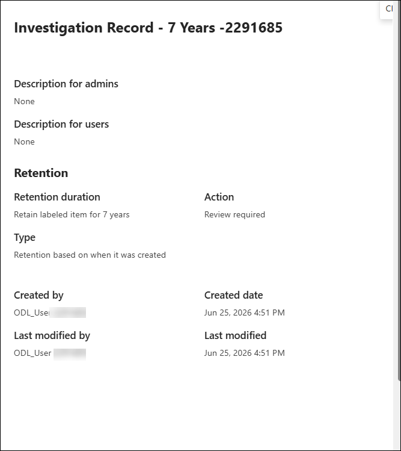

1. In the Microsoft Purview portal, click **Solutions (1)** from the left navigation pane to open the list of available compliance solutions, select **Compliance Manager (2)** to open Compliance Manager and review compliance assessments, improvement actions, and organizational compliance posture.

   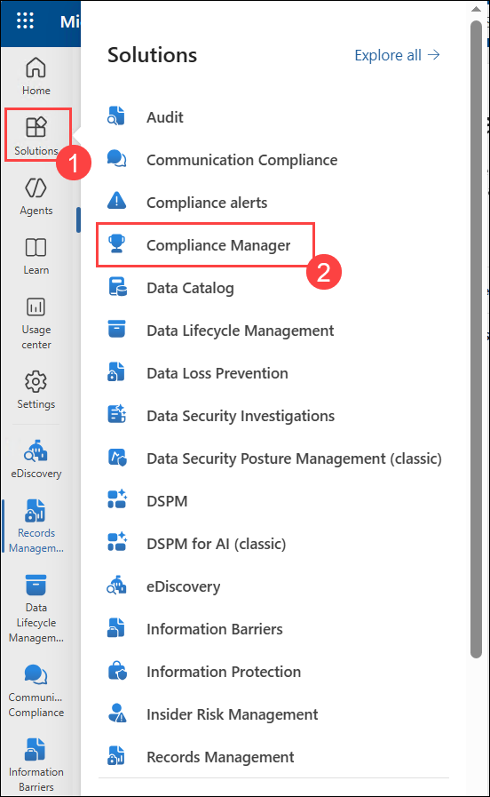

1. In **Compliance Manager**, select **Improvement actions (1)** from the left navigation pane to review recommended compliance and security improvement activities, 
Locate and select **Perform real-time threat detection (2)** from the list of improvement actions to review the control objective, implementation guidance, and compliance recommendations.

   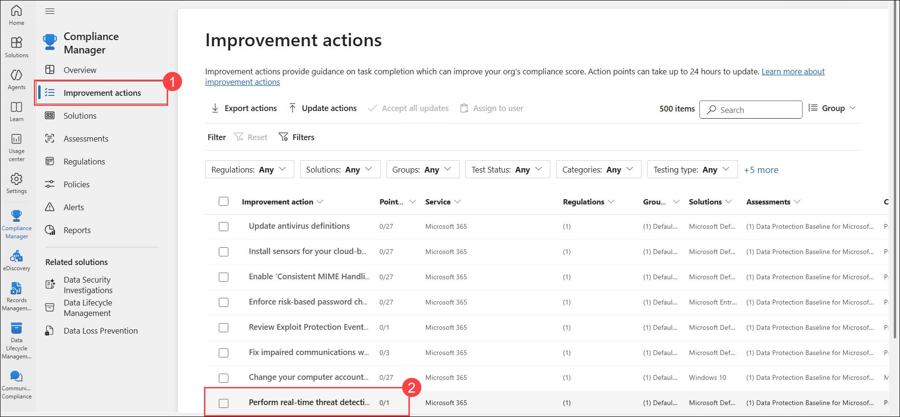

1. On the **Perform real-time threat detection** page, review the improvement action details and implementation guidance for monitoring information systems and identifying threats in real time.

   Review the visible implementation details, including:
   - **Service:** Microsoft 365
   - **Testing type:** Manual
   - **Testing source:** User verified

      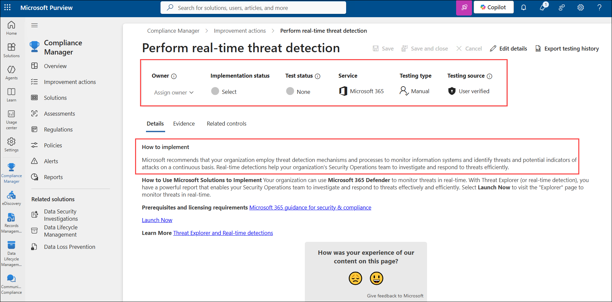

<validation step="final investigation/remediation deliverables"/>

## Summary

In this challenge, you established the compliance foundation needed to support defensible investigations and long-term governance. You validated audit visibility, created a supervised communications policy, configured retention and records controls, opened an eDiscovery case with preservation and search, and reviewed operational follow-up through the file plan and Compliance Manager. These outcomes prepare the team to move from isolated control changes to a sustained compliance operating model that supports the final incident and remediation narrative.
