# Challenge 6: Data Governance with Microsoft Purview

### Estimated Duration: 1 Hour

## Scenario

After addressing immediate exposure risks, the response team now needs stronger governance visibility. In this challenge, you will use Microsoft Purview Data Map and Unified Catalog to organize discovered assets, confirm metadata and sensitive classifications, create a business-aligned collection hierarchy, publish a glossary term, and review governance health so the organization can move from reactive response to governed stewardship.

## Overview

In this challenge, you will work in Microsoft Purview to validate governance readiness and curate a small but meaningful governance structure around discovered data. You will register and review a scanned data source, inspect assets in Unified Catalog, scope governance access through collections, define a business-aligned collection model, publish a glossary term, connect that term to discovered assets, and review governance health signals for next-step remediation.

## Objectives

- Task 1: Sign in and review the governance environment
- Task 2: Review Data Map sources, scans, and discovered assets
- Task 3: Create and organize a collection hierarchy
- Task 4: Assign collection-scoped governance roles
- Task 5: Create and publish a glossary term
- Task 6: Link glossary context to assets and review governance health

## Task 1: Sign in and review the governance environment

In this task, you will sign in to the lab environment and confirm that Microsoft Purview governance components needed for the challenge are available.

1. On the lab VM, open Microsoft Edge.
2. Browse to the Microsoft Purview portal at 
`
https://purview.microsoft.com
`
3. Sign in with the following credentials:
   - Username: <inject key="AzureAdUserEmail"></inject>

      

   - Password: <inject key="AzureAdUserPassword"></inject>

      

4. When prompted, complete any first-run or multifactor prompts that are already pre-staged for the lab tenant.
5. In a separate browser tab, open the Azure portal at 
`
https://portal.azure.com
`
 and confirm that your subscription context is available for this deployment:
   - Subscription: <inject key="SubscriptionID"></inject>
   - Tenant: <inject key="TenantID"></inject>
   
5. In the Microsoft Purview portal, click **Solutions (1)** from the left navigation pane to open the list of available data governance and compliance solutions, Select **Data Map (2)** to access the organization's data estate and governance resources, select **Unified Catalog (3)** to open the centralized catalog experience and review available data assets, business concepts, glossary terms, and governance information.

   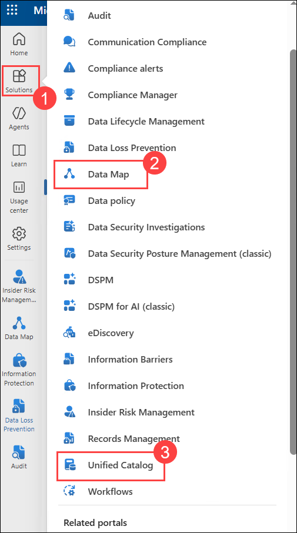

> [!Important]
> This challenge assumes the tenant includes pre-staged governance readiness. If a live scan source, governance role, or Unified Catalog feature is missing, document the gap in your notes and continue with the available portal experience.

## Task 2: Review Data Map sources, scans, and discovered assets

In this task, you will inspect the Microsoft Purview Data Map and confirm that data source metadata is available for governance work.

1. In **Data Map (1)**, select **Data sources (2)** from the left navigation pane to review registered data sources in the Microsoft Purview Data Map.

1. Review the **Data sources** page and verify whether any data sources are registered and available for scanning and governance.

   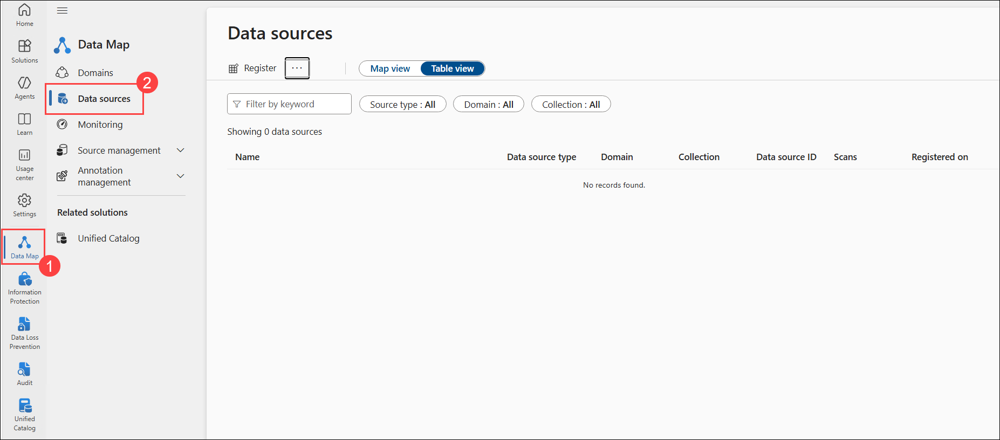

1. In the Microsoft Purview portal, click **Solutions (1)** to open the list of available governance and compliance solutions, Select **Unified Catalog (2)** to open the centralized catalog experience and review available data assets, glossary terms, domains, and governance resources across the organization.

   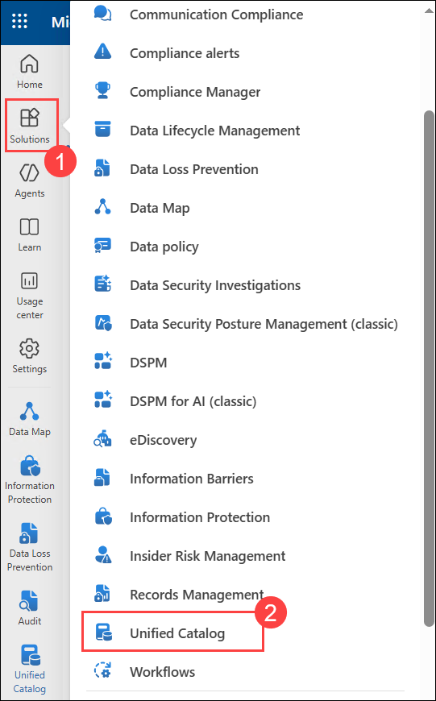

1. In **Unified Catalog**, review the **Overview** page to understand the available data governance capabilities, including data estate modeling, federated governance, and data discovery features.

1. Review the available sections, including:
   - **Model your data estate for your business**
   - **Federate your Data Governance**
   - **Empower your users to innovate with your data**

      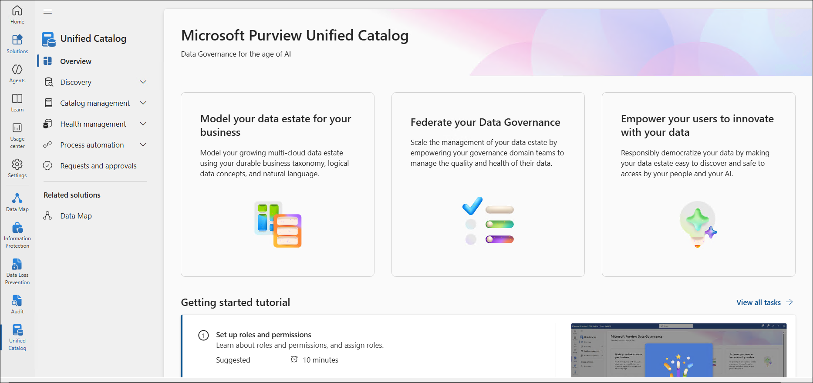

> [!Note]
> Microsoft Learn describes Data Map as the metadata foundation for governance and Unified Catalog as the searchable experience used to discover and curate scanned assets. You are validating metadata visibility rather than accessing the underlying business data itself.

<validation step="DSPM / governance progress"/>

## Task 3: Create and organize a collection hierarchy

In this task, you will build a collection hierarchy that aligns to a business domain so governance responsibilities can be scoped more clearly.

1. In **Data Map (1)**, select **Domains (2)** from the left navigation pane to review the available governance domains and collections, Click **New collection (3)** to create a new collection within the selected domain and organize governance assets by business function or department.

   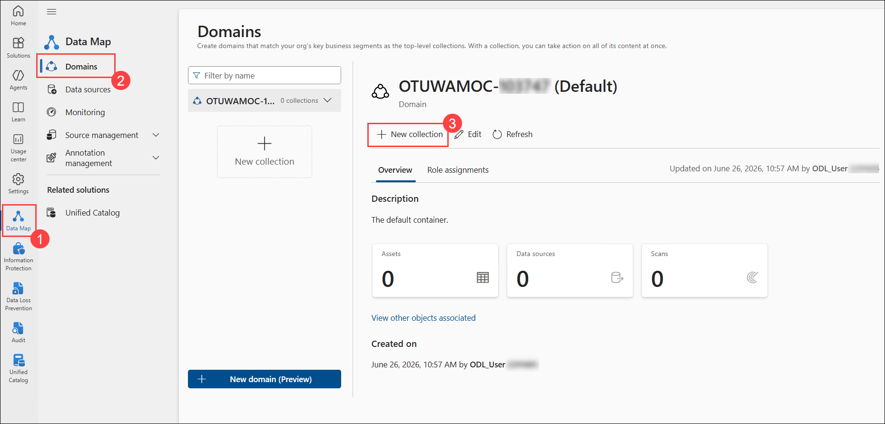

1. In the **New collection** pane, enter **Finance (1)** in the **Display name** field to create a collection for Finance-related governance assets, In the **Collection admins** field, search for **OTUWAMOC** and select the **OTUWAMOC** account with the **Service principal (2)** type to assign it as the collection administrator, and then click **Create (3)** to create the **Finance** collection.

   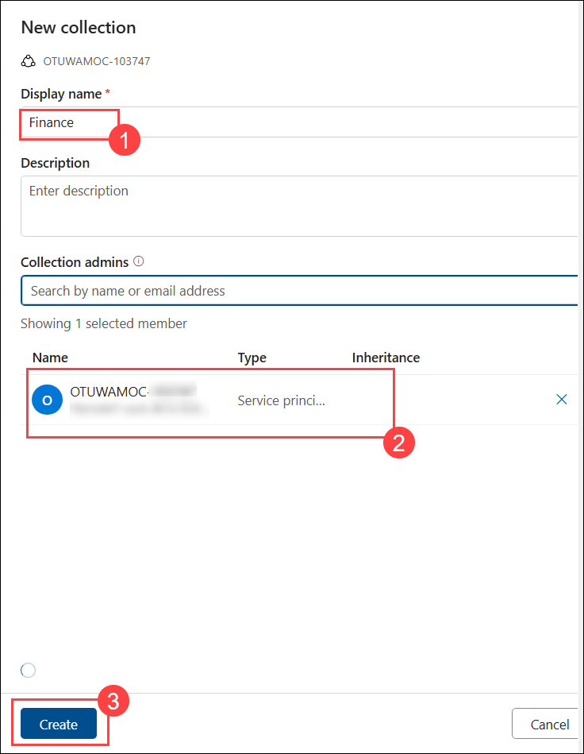

1. On the **Domains** page, verify that the **Finance (1)** collection is listed under the selected domain, confirming that the collection was created successfully, Click **New collection (2)** to create a new child collection

   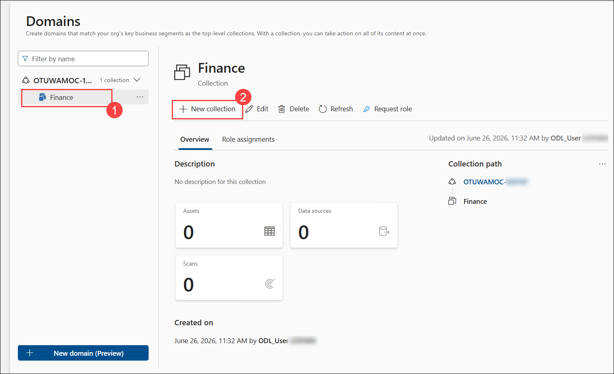

1. In the **Display name** field, enter **Finance-Sensitive (1)** to create a child collection under the **Finance** collection, In the **Collection admins** field, search for and select **ODL_User (2)** to assign the user as the collection administrator for the **Finance-Sensitive** collection, Click **Create (3)** to create the **Finance-Sensitive** collection.

   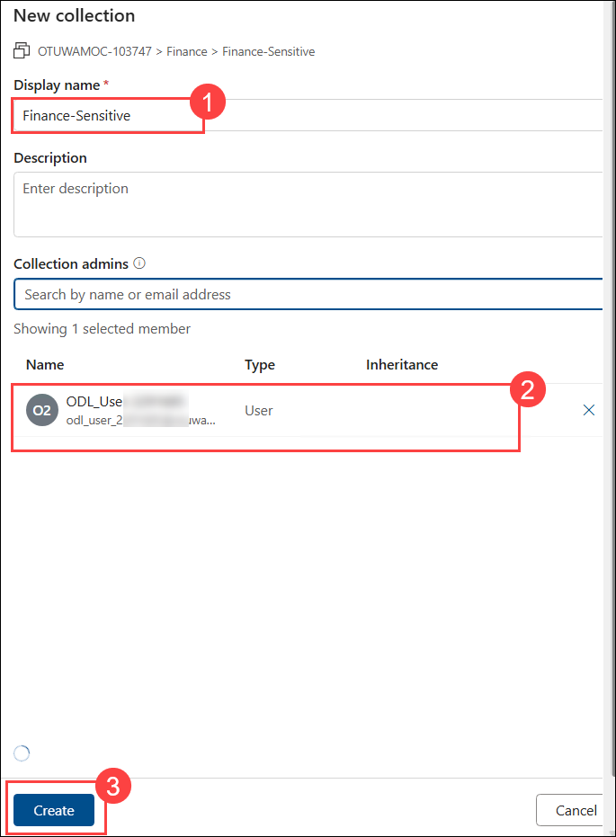

1. On the **Domains** page, verify that the **Finance-Sensitive (1)** collection is listed under the **Finance** collection, confirming that the child collection was created successfully, 
Review the **Collection path** and confirm that the hierarchy displays **Finance → Finance-Sensitive**, indicating that the collection structure is configured correctly.

   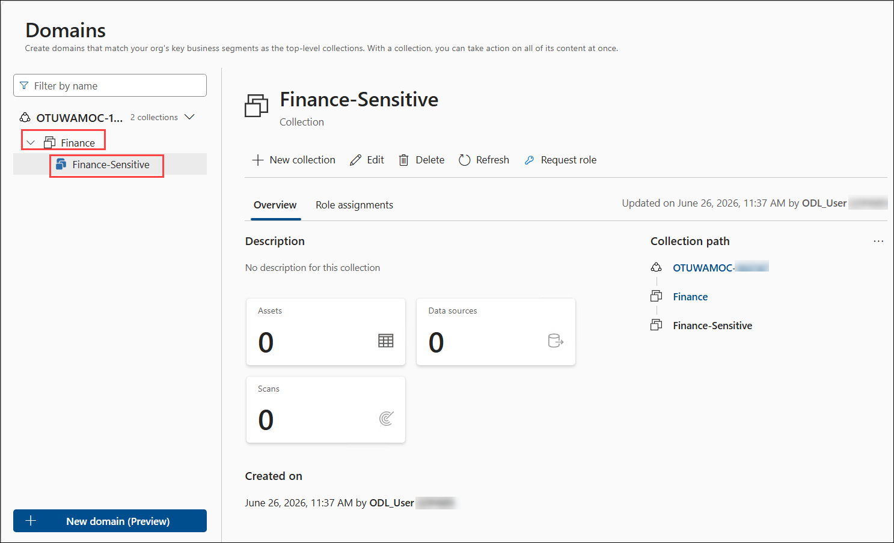

> [!Tip]
> Collections control organization and delegated access in Data Map. Keep the hierarchy small and easy to explain for hackathon timing; you only need enough structure to show business alignment and scoped stewardship.

## Task 4: Assign collection-scoped governance roles

In this task, you will review and assign governance roles at the collection level so stewardship can be delegated appropriately.

1. Open the collection you created in the previous task.

2.  Select the **Role assignments (1)** tab to review the roles and permissions assigned to the **Finance-Sensitive** collection.

1. Review the configured role groups and verify that users are assigned to the appropriate governance roles, including:
   - **Collection admins (2)**
   - **Data curators (3)**
   - **Data readers (4)**
   - **Data source admins (5)**

      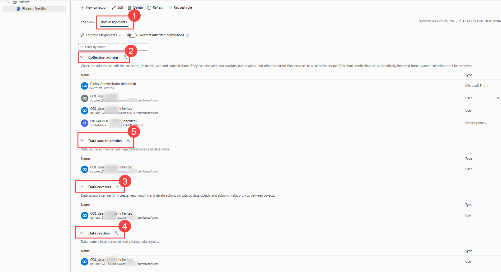

1. On the **Role assignments** tab, click **Edit role assignments (1)** and select **Data curators (2)** from the dropdown menu to manage users who can create, read, modify, and delete catalog objects within the collection.

   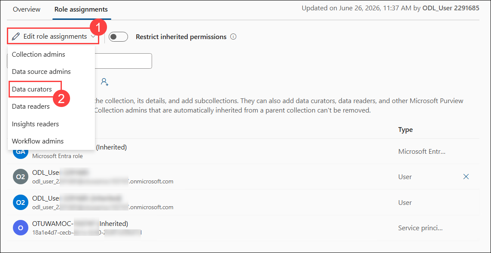

1. In the **Add or remove data curators** pane, verify that **ODL_User (1)** is listed under **Inherited data curators**, indicating that the required user already has Data Curator permissions through inheritance, Click **OK (2)** to close the pane and retain the inherited Data Curator role assignment for the **Finance-Sensitive** collection.

   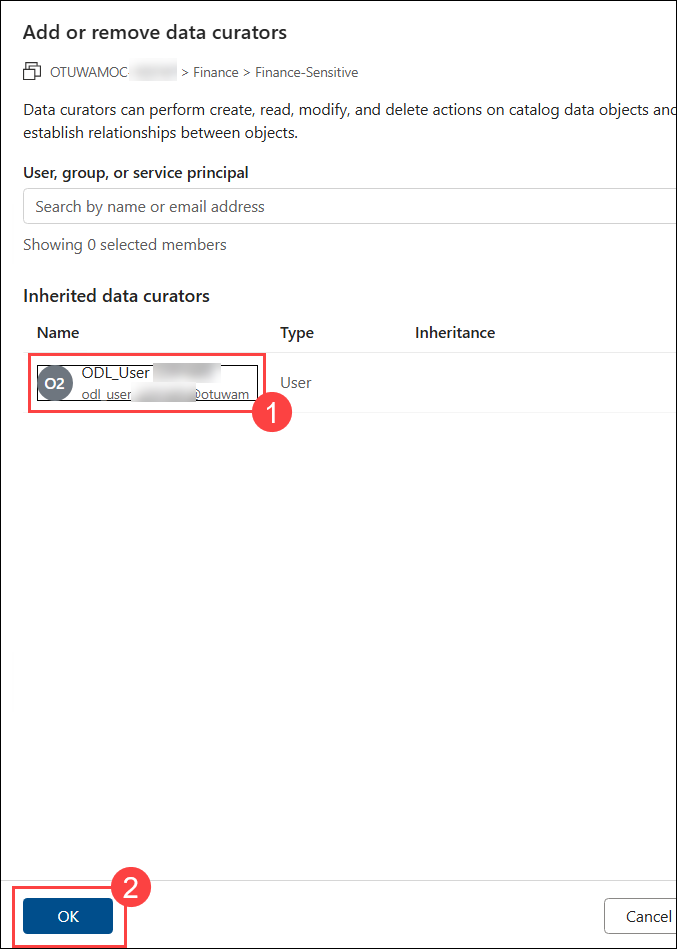

1. On the **Role assignments** tab, review the **Collection admins** section and verify that **ODL_User** is listed, confirming that the required user has Collection Administrator permissions for the **Finance-Sensitive** collection.

   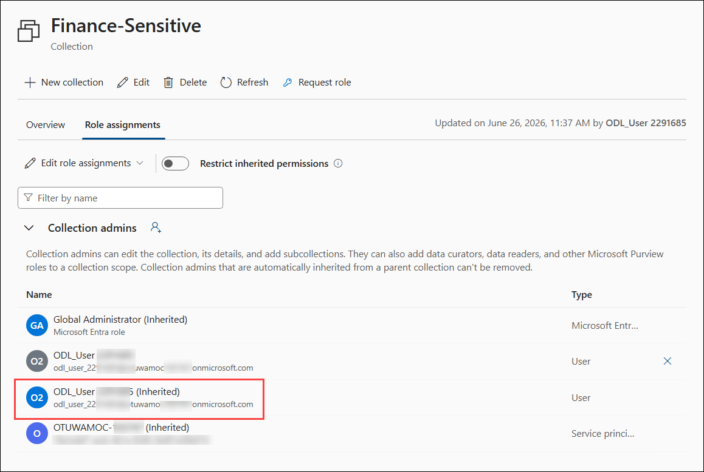

1. On the **Role assignments** page, review the assigned governance roles and verify that **ODL_User** is listed under the following inherited roles:

   - **Collection admins**
   - **Data source admins**
   - **Data curators**
   - **Data readers**

1. Confirm that the required permissions have been inherited successfully for the **Finance-Sensitive** collection and that no additional role assignments are required.

   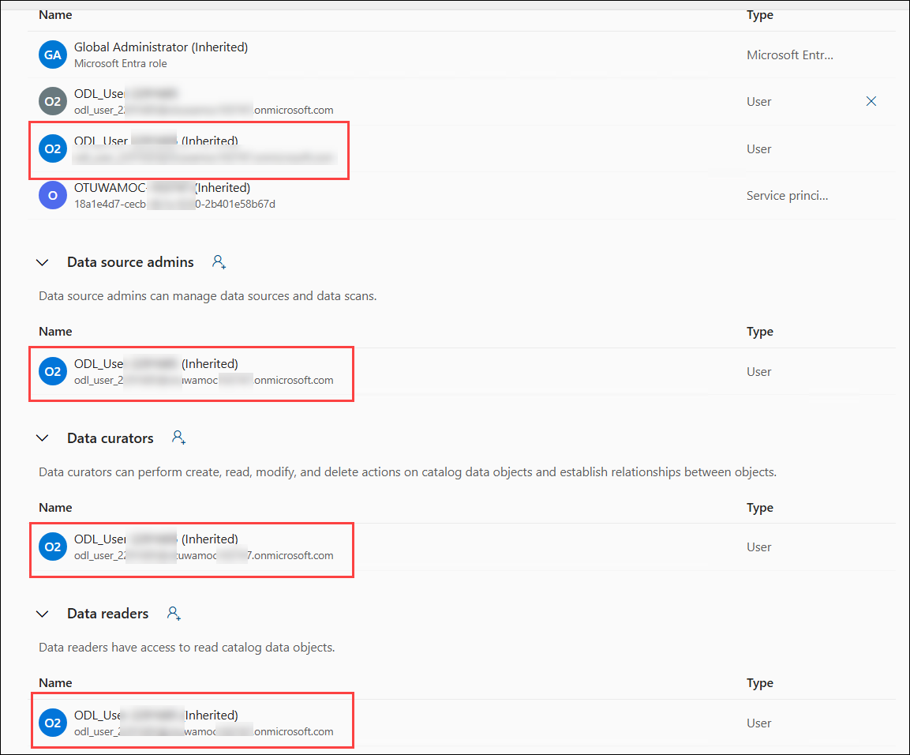

> [!Important]
> Use the least-privilege role that still enables the required governance action. Overusing collection administrator permissions weakens the stewardship model you are trying to demonstrate.

## Task 5: Create and publish a glossary term

In this task, you will create a governance glossary term that gives business meaning to discovered data.

1. In the Microsoft Purview portal, click **Solutions (1)** from the left navigation pane to open the list of available solutions, select **Unified Catalog (2)** to access the Microsoft Purview Unified Catalog experience and continue with data governance and catalog management tasks.

   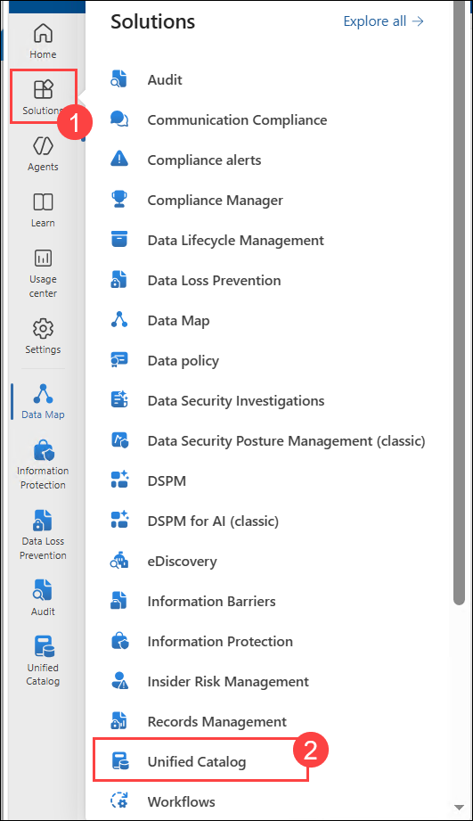

1. In **Unified Catalog**, expand **Catalog management** and select **Governance domains (1)** from the left navigation pane, On the **Governance domains** page, review the introduction to governance domains and how they can be used to organize data products by business area, department, or topic, 
Click **Create governance domain (2)** to start creating a new governance domain.

   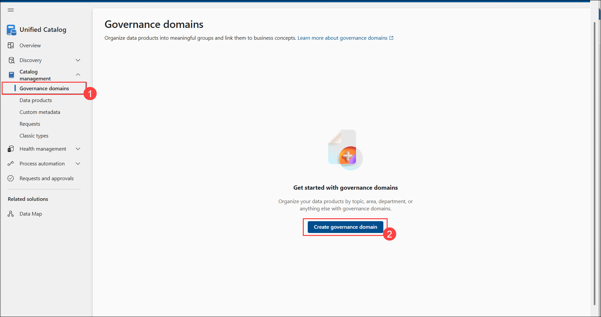

1. On the **New governance domain** page, enter **Finance (1)** in the **Name** field, In the **Description (2)** field, enter a description such as **Governance domain for financial and sensitive business data**, Under **Type**, select **Functional unit (3)** to classify the governance domain by business function, Click **Next (4)** to continue to the **Custom attributes** configuration step.

   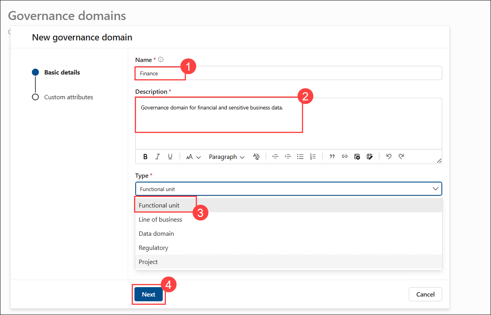

1. On the **Custom attributes** page, review the available attributes and verify that no custom attributes are currently configured for the governance domain, Leave the default configuration unchanged and click **Create** to create the **Finance** governance domain.

   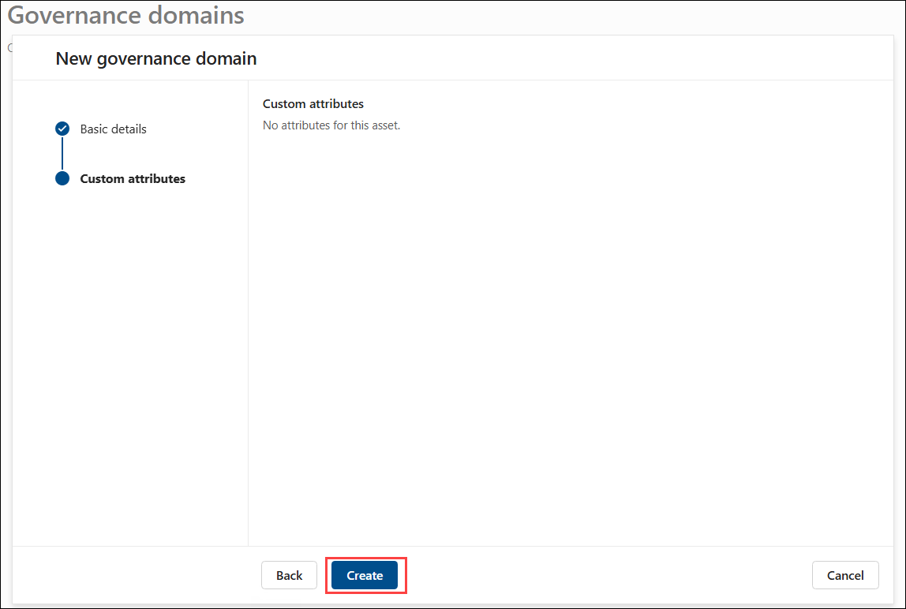

1. On the **Governance domains** page, verify that the **Finance** governance domain is listed and selected, Click **Publish** to make the **Finance** governance domain available for use across the Unified Catalog.

   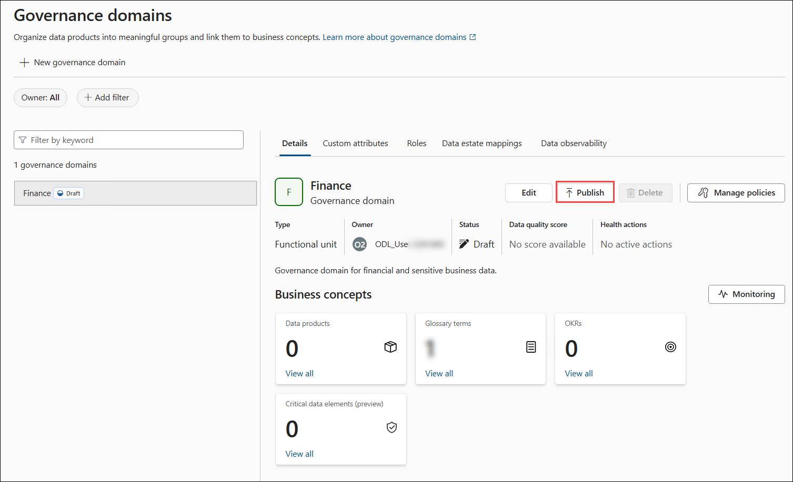

1. On the **Governance domains** page, verify that the **Finance** governance domain is selected and review its configuration details, 
Confirm that the **Status** is displayed as **Published**, indicating that the governance domain has been successfully published and is available for use in Unified Catalog.

   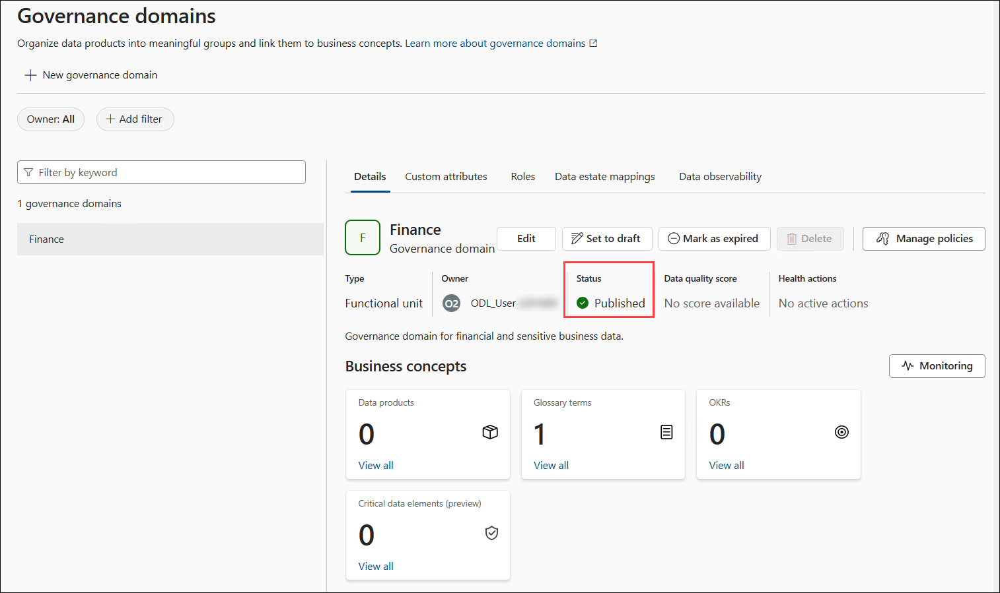

1. On the **Finance** governance domain details page, review the **Business concepts** section, In the **Glossary terms** tile, verify the current number of glossary terms associated with the governance domain, Click **View all** under **Glossary terms** to review the glossary terms linked to the **Finance** governance domain and manage business terminology.

   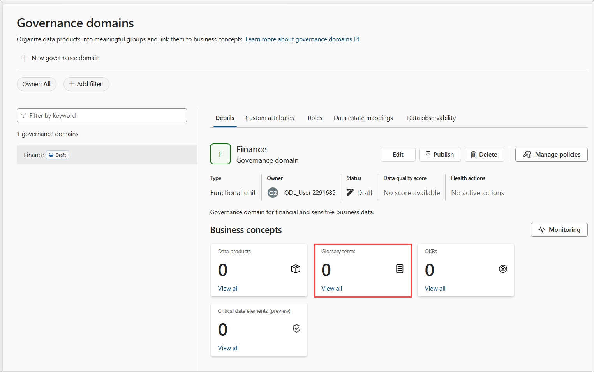

1. On the **Glossary terms** page for the **Finance** governance domain, click **New term** to create a new business glossary term.

   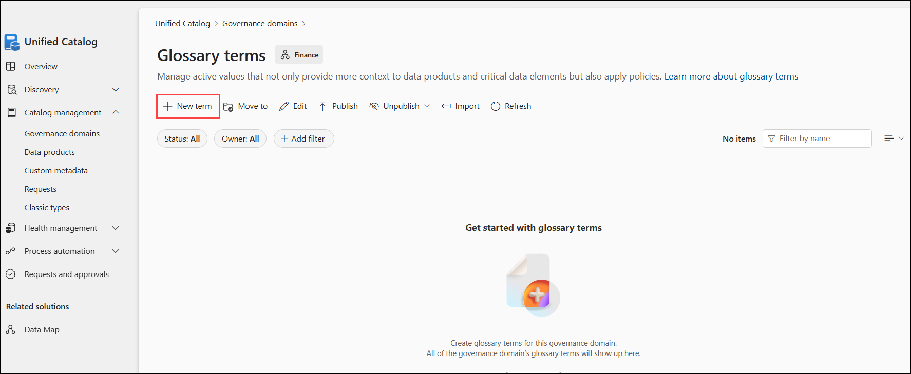

1. On the **New glossary term** page, verify that **Finance** is selected as the **Governance domain**, In the **Name** field, enter **Regulated Financial Record (1)**, 
In the **Description (2)** field, enter a description explaining that the term represents `Business records containing regulated financial information that must be protected, retained, and governed according to compliance requirements.`

1. In the **Owner (3)** field, search for **ODL_User**, and then select the **ODL_User** account from the search results to assign it as the owner of the glossary term, Click **Next (4)** to continue to the **Acronyms** configuration step

   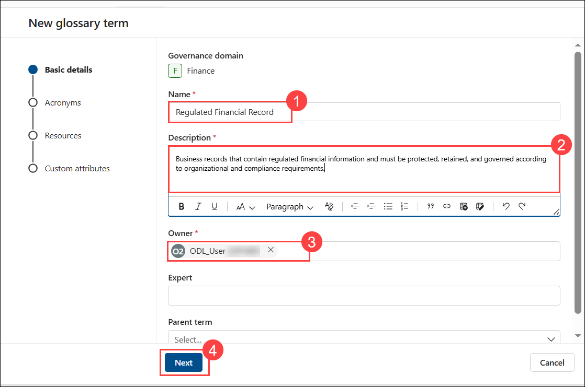

1. Leave the default settings unchanged and click **Create** to create the **Regulated Financial Record** glossary term in the **Finance** governance domain.

   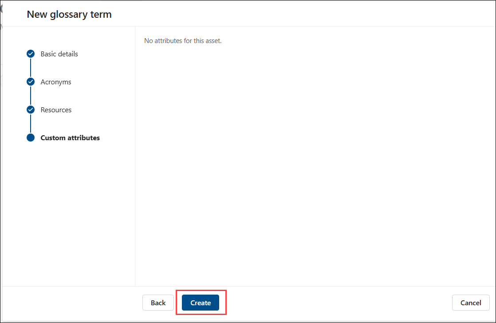

1. Verify that the **Successfully created** notification is displayed, confirming that the **Regulated Financial Record** glossary term was created successfully in the **Finance** governance domain.

   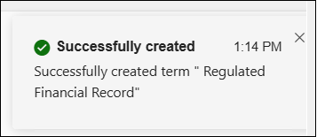

1. On the **Regulated Financial Record** glossary term page, review the glossary term details and verify that the **Status** is currently displayed as **Draft**, Verify that **ODL_User (1)** is listed as the **Owner** of the glossary term and that the glossary term belongs to the **Finance** governance domain.

1. Click **Publish (2)** to publish the **Regulated Financial Record** glossary term and make it available for use across the Unified Catalog.

   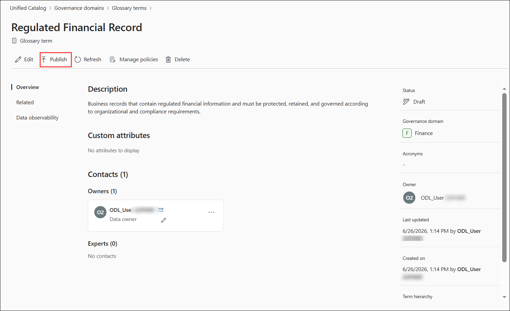

1. On the **Regulated Financial Record** glossary term page, verify that the **Status** is displayed as **Published**, confirming that the glossary term was successfully published.

   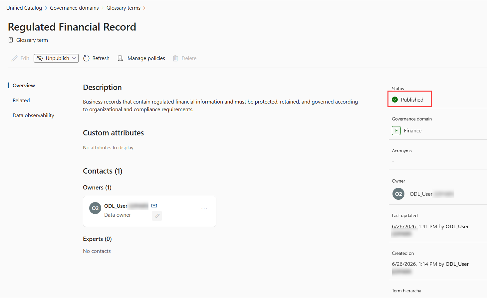

> [!Note]
> In Microsoft Learn, glossary terms are created in a governance domain and begin as draft terms. Publishing makes the term visible more broadly and supports consistent business vocabulary across the catalog.

## Task 6: Link glossary context to assets and review governance health

In this task, you will connect business context to scanned assets and review governance health signals for remediation planning.

1. Review the **Regulated Financial Record (1)** glossary term details page and verify that the glossary term was created successfully, Confirm that the glossary term is associated with the **Finance (2)** governance domain.

1. Verify that the **Status (3)** is displayed as **Published**, indicating that the glossary term is available for use in the Unified Catalog, Confirm that **ODL_User (4)** is listed as the **Owner** of the glossary term.

   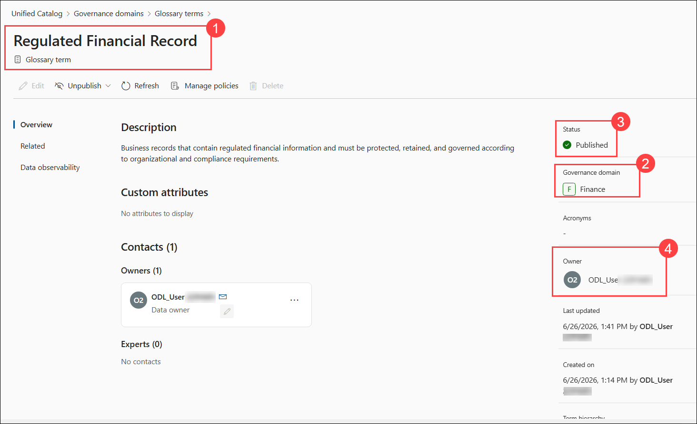

1. In **Unified Catalog (1)**, expand **Health management (2)** from the left navigation pane, Select **Controls (3)** to review the available data governance health controls and monitoring metrics, Review the **Controls** dashboard and verify the current summary, including the number of **Active controls**, **Not healthy**, **Fair**, **Healthy**, and **Expired** controls.

   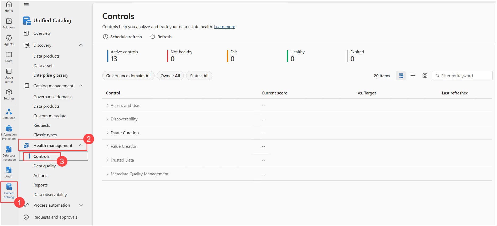

1. In **Unified Catalog (1)**, expand **Health management (2)** and select **Data quality (3)** to review data quality metrics and action items for governance domains, Review the **Finance** governance domain and verify the current data quality status for both **Data products** and **Data assets**.

   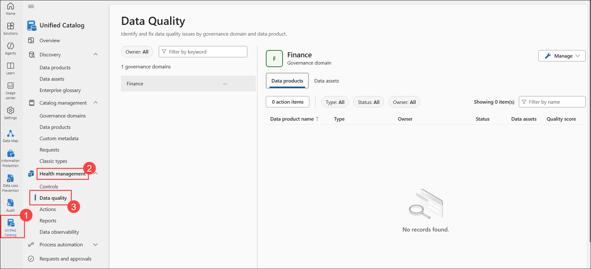

1. In **Unified Catalog (1)**, expand **Health management (2)** and select **Actions (3)** to review data governance findings and recommended remediation activities, Review the **Actions (preview)** dashboard and verify the current summary, including **Total action items**, **High severity**, **Medium severity**, and **Low severity** findings.

   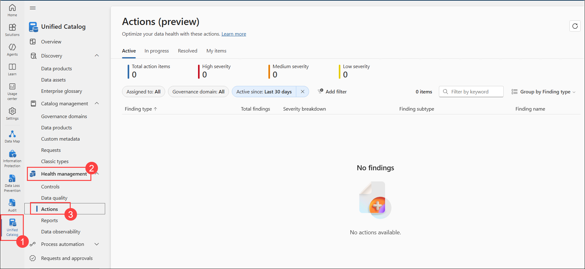

1. In **Unified Catalog (1)**, expand **Health management (2)** and select **Reports (3)** to review the available governance and catalog reporting options.

1. Review the **Reports** dashboard and verify that the available reports are listed, including:
   - **Classic assets**
   - **Classic catalog adoption**
   - **Classic classifications**
   - **Classic data stewardship**
   - **Classic glossary**
   - **Classic sensitivity labels**
   - **Data governance (preview)**
   - **DQ health report**

   Verify that the reports show an **Active** status, indicating that they are available for reporting and governance analysis.

   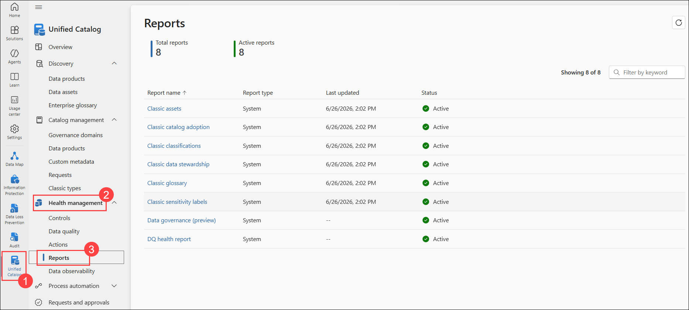

> [!Tip]
> If your environment does not permit editing the asset, capture evidence that the asset can still be found in Unified Catalog and explain which missing role would be needed to attach the glossary term.

<validation step="DSPM / governance progress"/>

## Summary

In this challenge, you used Microsoft Purview governance capabilities to move beyond raw discovery into stewardship. You reviewed Data Map metadata, inspected assets in Unified Catalog, created a collection hierarchy, assigned scoped governance roles, published a glossary term, linked business context to discovered data, and identified governance health improvements. These actions help the organization reduce ambiguity, improve discoverability, and create a stronger operating model for governed and trusted data use.
