# Exercise 07: Challenge 7 — Security Investigation & Threat Response with Microsoft Security Copilot

### Estimated Duration: 45 Minutes

## Scenario

Your response team has already implemented and reviewed key Microsoft Purview controls across labeling, DLP, insider risk, posture management, and governance. In this final challenge, you will use Microsoft Security Copilot as an investigation accelerator to assemble the incident story behind the recent data exposure event. Your goal is to validate that the Microsoft Purview source is available, use natural-language prompting to summarize DLP and Insider Risk findings, generate a KQL-based investigation path, and produce a concise incident report that clearly distinguishes evidence, conclusions, and limitations.

## Overview

In this challenge, you will open Microsoft Security Copilot, confirm that the Microsoft Purview plugin is enabled, investigate an existing DLP alert, summarize an Insider Risk case for a compliance audience, generate a KQL investigation query, and capture a final incident narrative. You will also assess at least one limitation in Copilot output so your final response reflects a realistic analyst workflow rather than blind trust in AI-generated results.

## Objectives

- Task 1: Open Microsoft Security Copilot and verify the Microsoft Purview plugin
- Task 2: Summarize a DLP alert with natural-language prompts
- Task 3: Create an Insider Risk case summary for compliance stakeholders
- Task 4: Generate and review a KQL investigation query
- Task 5: Draft an incident report and evaluate Copilot limitations

## Task 1: Open Microsoft Security Copilot and verify the Microsoft Purview plugin

In this task, you will sign in to the required portals and confirm that Security Copilot can use Microsoft Purview data.

1. On the lab VM, open Microsoft Edge.
2. Browse to the Microsoft Purview portal at 
`
https://purview.microsoft.com
`
3. Sign in with the following credentials:
   - Username: <inject key="AzureAdUserEmail"></inject>

      

   - Password: <inject key="AzureAdUserPassword"></inject>

      

4. When prompted, complete any first-run or multifactor prompts that are already pre-staged for the lab tenant.
5. In a separate browser tab, open the Azure portal at 
`
https://portal.azure.com
`
 and confirm that your subscription context is available for this deployment:
   - Subscription: <inject key="SubscriptionID"></inject>
   - Tenant: <inject key="TenantID"></inject>
   
3. Open a new browser tab and go to [Microsoft Security Copilot](https://securitycopilot.microsoft.com/).

4. If prompted, sign in again with:
   - Username: <inject key="AzureAdUserEmail"></inject>
   - Password: <inject key="AzureAdUserPassword"></inject>

1. On the **Workspace info** page, in the **Workspace name (1)** field, enter **Hackathon-Workspace <inject key="DeploymentID" enableCopy="false"></inject>** as the workspace name, Verify that **United States (2)** is selected as the **Data storage location**, Click **Continue (3)** to proceed with the Microsoft Security Copilot workspace setup.

   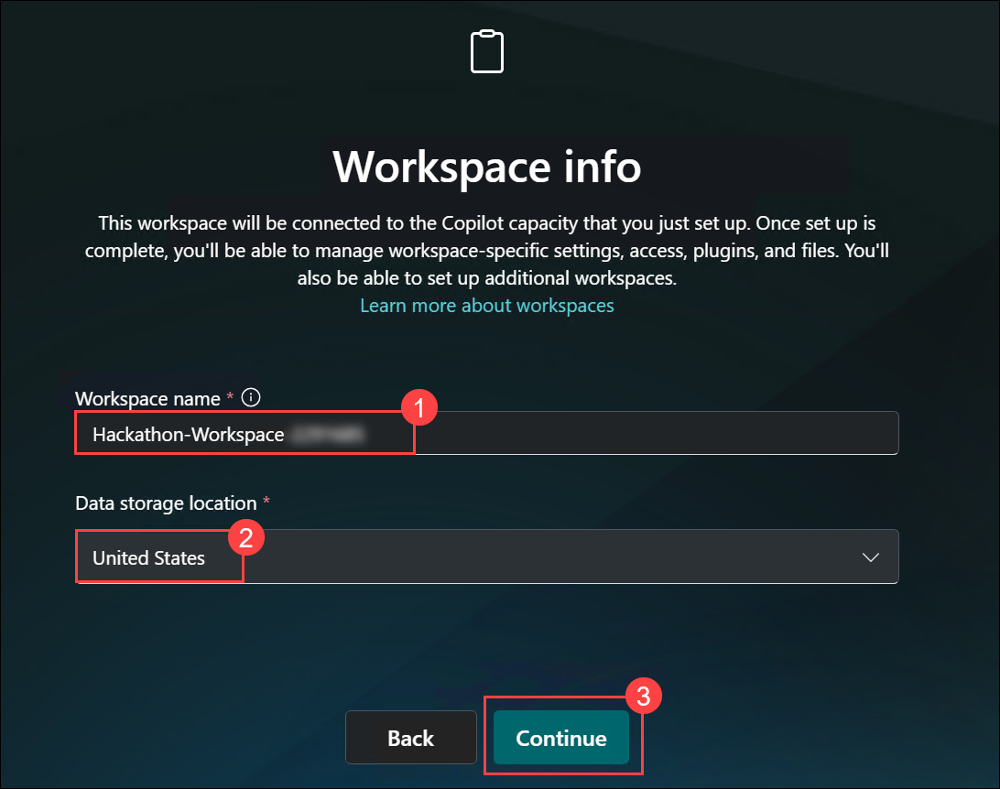

1. On the **Microsoft Security Copilot** welcome page, review the introduction and verify that the workspace setup page is displayed, Click **Get started** to begin setting up the Microsoft Security Copilot workspace and continue with the initial configuration process.

   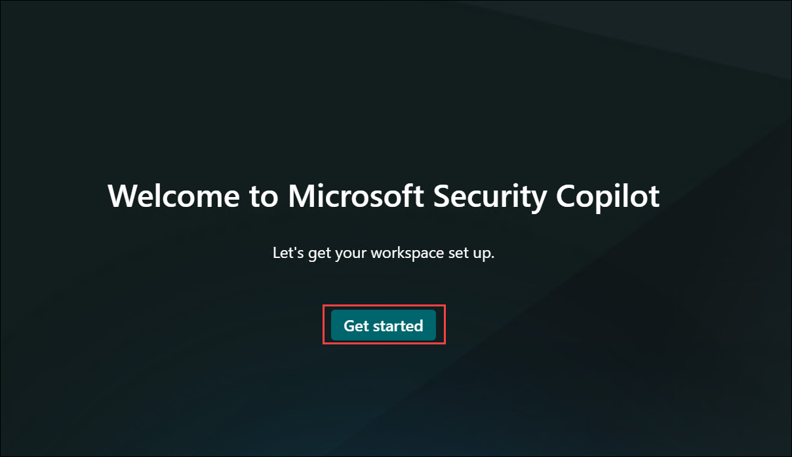

1. Verify that the **Azure Subscription (1)** and **Resource group (2)** fields are populated with the provided lab resources, In the **Capacity name (3)** field, enter **Hackathon-Workspace <inject key="DeploymentID" enableCopy="false"></inject>-Capacity**.

1. Verify that **Australia (4)** is selected as the **Prompt evaluation location**, Verify that **Australia East (5)** is selected as the **Capacity region**.

   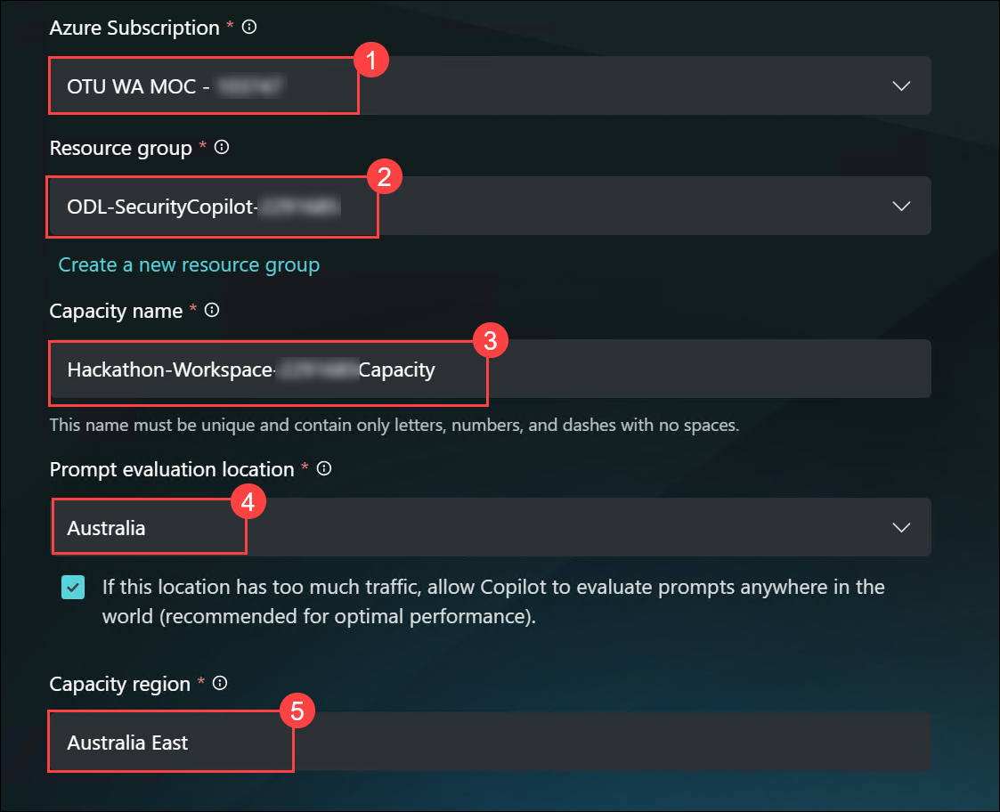

1. Review the **Setting up your security capacity** page and verify that the Microsoft Security Copilot capacity provisioning process has started successfully, Confirm that the message **"Setting up your security capacity..."** is displayed, indicating that the workspace and capacity configuration is in progress.

   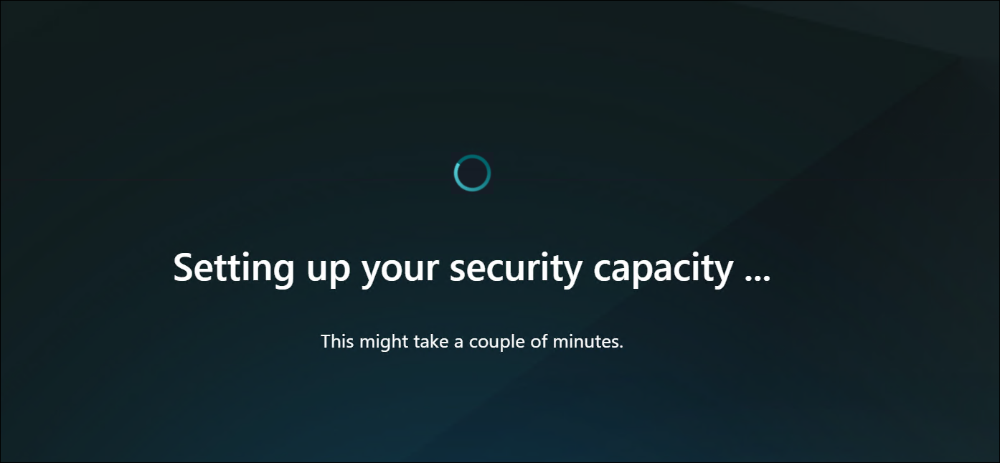

1. On the **Help improve Copilot** page, review the data sharing and privacy options for Microsoft Security Copilot, Leave the default settings enabled for the available data collection options, unless otherwise instructed by your organization.

1. Click **Continue** to accept the current settings and proceed with the Microsoft Security Copilot setup.

   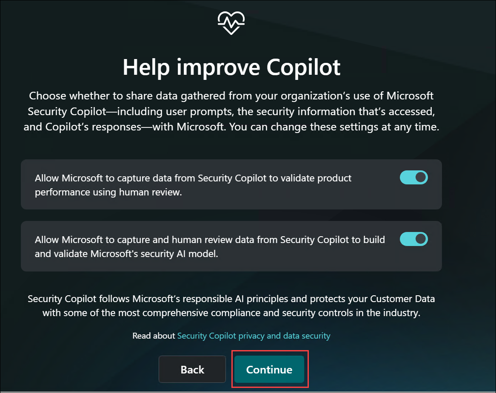

1. On the **Copilot's access and storage of Microsoft 365 service data** page, review the information about how Microsoft Security Copilot accesses, processes, and stores Microsoft 365 service data, Click **Continue** to proceed with the Microsoft Security Copilot setup and enable access to Microsoft 365 service data.

   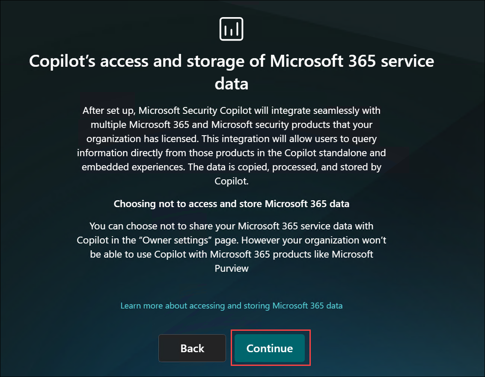

1. On the **Logging audit data in Microsoft Purview** page, review the information explaining how Microsoft Purview stores and processes Microsoft Security Copilot audit logs, Click **Continue** to proceed with the Microsoft Security Copilot setup and complete the Microsoft Purview audit logging configuration.

   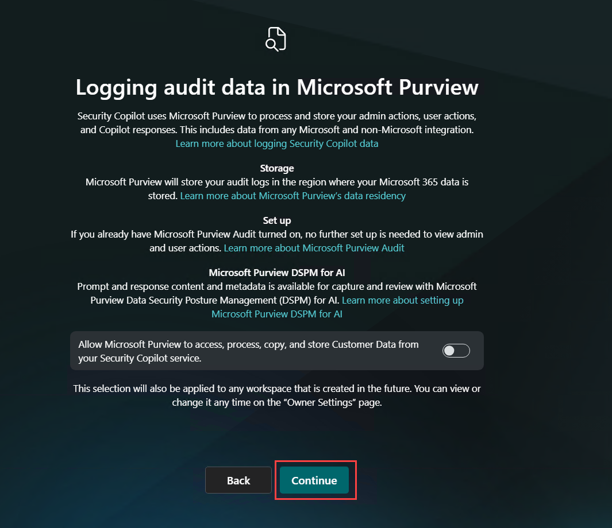

1. In the **Contributors** section, select **No one. Add them later (1)** to skip assigning contributors during the initial setup, Click **Continue (2)** to proceed with the Microsoft Security Copilot workspace configuration.

   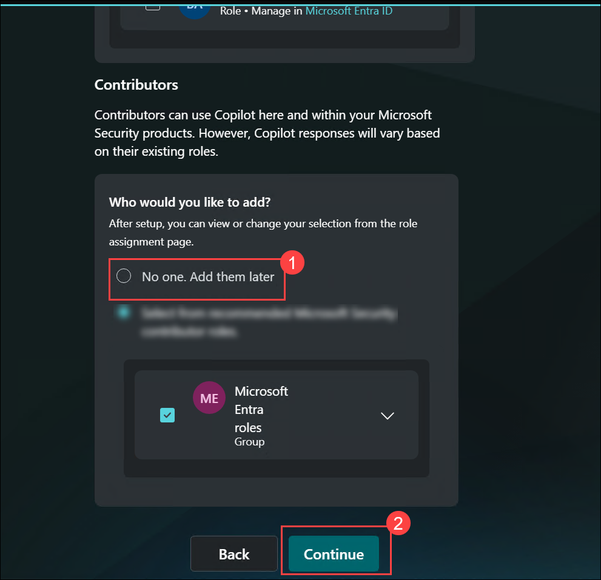

1. Verify that the **You're all set** page is displayed, confirming that the Microsoft Security Copilot workspace and security capacity were created successfully, Review the **Azure resource links** section and verify the configured **Capacity name**, **Subscription**, **Resource group**, and **Location** details, Click **Finish** to open the Microsoft Security Copilot experience and complete the setup process.

   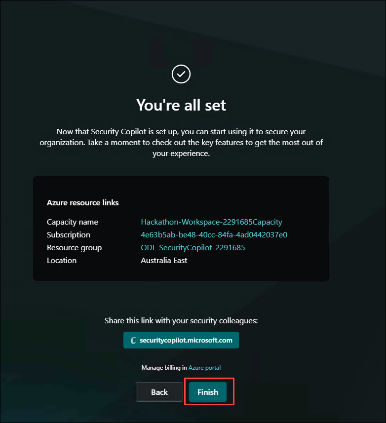

1. In the Microsoft Security Copilot prompt box, enter the following prompt:

    ```text
   Show me the Microsoft Purview capabilities available in this session and tell me which ones can help investigate DLP alerts and Insider Risk activity.
   ```

   Submit the prompt and review the response generated by Microsoft Security Copilot.

   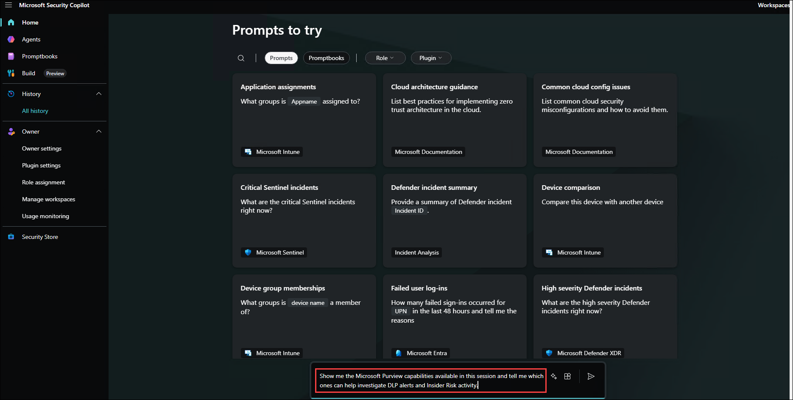

   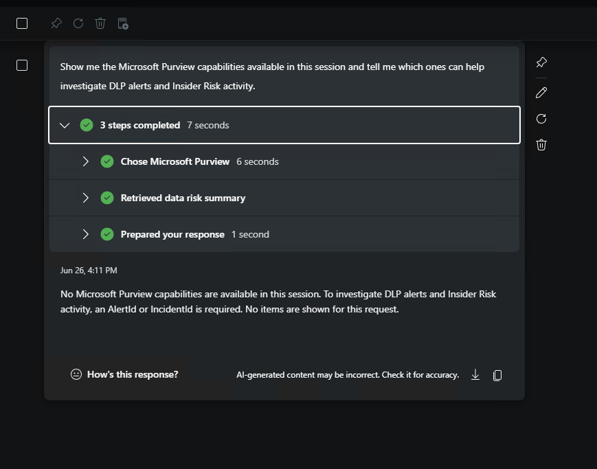

> [!Important]
> This challenge assumes Security Copilot readiness and Purview plugin availability were pre-staged for the tenant. If the Purview source is missing entirely, pause and notify the facilitator before continuing.

## Task 2: Summarize a DLP alert with natural-language prompts

In this task, you will use Copilot to triage a recent DLP alert and compare the AI summary with the underlying Purview evidence.

1. In the Microsoft Purview portal, click **Solutions (1)** from the left navigation pane to open the list of available compliance and governance solutions, select **Data Loss Prevention (2)** to open the Data Loss Prevention solution and review DLP policies, alerts, incidents, and sensitive data protection activities.

   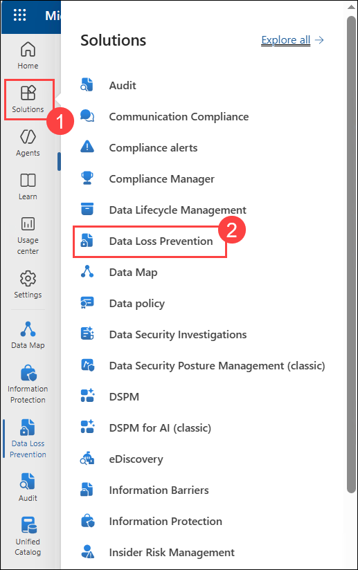
3. Open one recent DLP alert related to the seeded exposure scenario.
4. Record the alert name, severity, impacted user, and if available the alert or event identifier in your notes.
5. Review the **Events** and **Details** panes so you understand what activity triggered the alert.
6. Return to **Microsoft Security Copilot**.
7. Enter a prompt similar to the following, replacing bracketed values with the alert details you captured:

   ```text
   Summarize the Microsoft Purview DLP alert [alert name or alert ID]. Include the likely data involved, the triggering activity, affected user, severity, and recommended next investigation steps.
   ```

8. Review the response and compare it with the original DLP alert in Purview.
9. Run a follow-up prompt:

   ```text
   Explain this DLP alert in plain language for a compliance manager and identify the top three risks suggested by the evidence.
   ```

10. If the response references uncertain facts, missing fields, or assumptions, note those gaps in your evidence file.
11. In Purview, optionally create or copy a shareable event link if your role and the tenant configuration allow it.
12. Save the Copilot response and one screenshot of the DLP alert details to your evidence folder.

> [!Tip]
> Strong prompts include concrete identifiers such as the alert title, user, timeframe, or severity. If your first prompt is vague, refine it with specific details from the alert details page.

## Task 3: Create an Insider Risk case summary for compliance stakeholders

In this task, you will review an Insider Risk alert or case and use Copilot to produce a clear audience-appropriate summary.

1. In the **Microsoft Purview portal**, go to **Insider Risk Management**.
2. Open **Alerts** or **Cases**, depending on what has been pre-staged in the tenant.
3. If you start from an alert and a case has not yet been created, use **Actions** > **Confirm alerts & create case**.
4. Open the target case and review these areas when available:
   - **Alerts**
   - **User activity**
   - **Activity explorer**
   - **Case notes**
5. Record the risky user, policy or indicator context, main risky activities, and current case status.
6. Return to **Microsoft Security Copilot**.
7. Enter a prompt such as:

   ```text
   Summarize the Insider Risk case for a compliance audience. Focus on who is involved, what risky behavior was observed, what data may have been exposed, and what next steps the investigation team should take.
   ```

8. If the first response is too technical, refine it with a second prompt:

   ```text
   Rewrite the summary in executive-ready language with sections for Incident Overview, Evidence, Business Impact, and Recommended Actions.
   ```

9. Compare the Copilot summary against the actual case details in Purview.
10. Save the final summary text into your investigation notes.
11. Add a short analyst note identifying whether the Copilot summary was complete, partially complete, or required manual correction.

<validation step="Final Investigation Evidence"/>

## Task 4: Generate and review a KQL investigation query

In this task, you will ask Copilot to create a KQL query that can support follow-on hunting or audit review.

1. In **Microsoft Security Copilot**, enter the following prompt:

   ```text
   Generate a KQL query I can use to investigate related risky user activity for this incident. Include a brief explanation of what each filter is doing and focus on audit or data security events tied to the user and timeframe in this case.
   ```

2. Review the generated query carefully before using it.
3. Confirm whether the query references realistic tables, fields, users, and timestamps for your environment.
4. If your facilitator has provided access to a supported hunting or log experience, copy the query into that workspace and run it.
5. If live execution is not available in the hackathon environment, perform a desk review instead:
   - Check the logic of the filters.
   - Verify whether the query would need table or field adjustments.
   - Note what evidence the query is intended to return.
6. Ask a refinement prompt if needed, for example:

   ```text
   Adjust the KQL query so it is easier for an analyst to modify for another user or date range, and explain any assumptions you made.
   ```

7. Save the generated query and your review comments into the evidence folder.

> [!Note]
> Treat Copilot-generated KQL as a starting point. Validate table names, schema assumptions, and time filters before using the query operationally.

## Task 5: Draft an incident report and evaluate Copilot limitations

In this task, you will combine your findings into a structured incident response summary and explicitly document AI limitations.

1. Open a text editor or Word document on the lab VM.
2. Create a short report with the following headings:
   - Incident title
   - Executive summary
   - DLP findings
   - Insider Risk findings
   - KQL/audit investigation notes
   - Containment and remediation actions
   - Known limitations and analyst validation notes
3. Return to **Microsoft Security Copilot** and enter this prompt:

   ```text
   Create a structured incident report based on a Purview investigation involving a DLP alert and an Insider Risk case. Include executive summary, evidence observed, likely impact, remediation actions, and open questions that require analyst verification.
   ```

4. Use the response as a draft, but manually edit it so it matches the actual evidence you reviewed.
5. Add at least one limitation or reliability boundary that you observed, such as:
   - Copilot needed more specific identifiers to return a useful answer.
   - Copilot produced a summary that omitted important case context.
   - The generated KQL required manual correction before it could be trusted.
   - Plugin data availability or role scoping limited the depth of results.
6. Add a final conclusion stating whether Copilot accelerated the investigation, and where analyst review remained essential.
7. Save the report in your evidence folder with a recognizable name such as **Challenge7-Incident-Report.docx** or **Challenge7-Incident-Report.txt**.
8. Review the completed evidence set to confirm it includes:
   - Plugin verification screenshot
   - DLP alert summary
   - Insider Risk case summary
   - KQL query and review notes
   - Final incident report

<validation step="Final Investigation Evidence"/>

## Summary

In this challenge, you used Microsoft Security Copilot with Microsoft Purview data to accelerate investigation and response. You verified plugin availability, summarized a DLP alert, translated an Insider Risk case into stakeholder-ready language, generated a KQL investigation path, and compiled a final incident report. Most importantly, you validated Copilot output against source evidence and documented its limitations, demonstrating a realistic and defensible investigation workflow for regulated environments.
