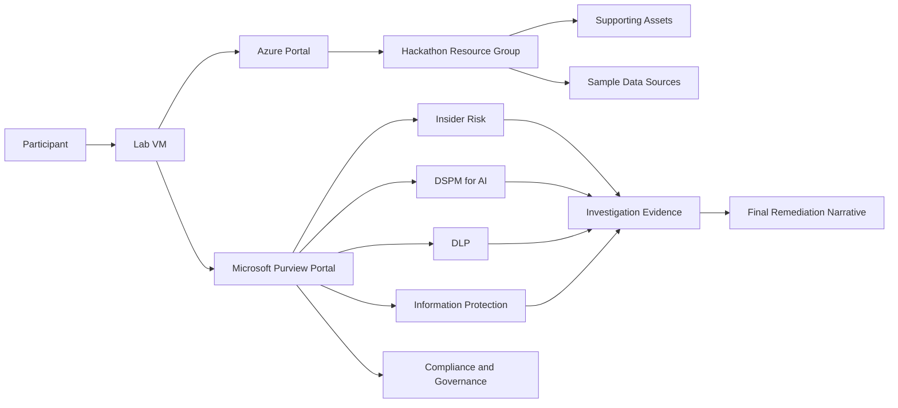
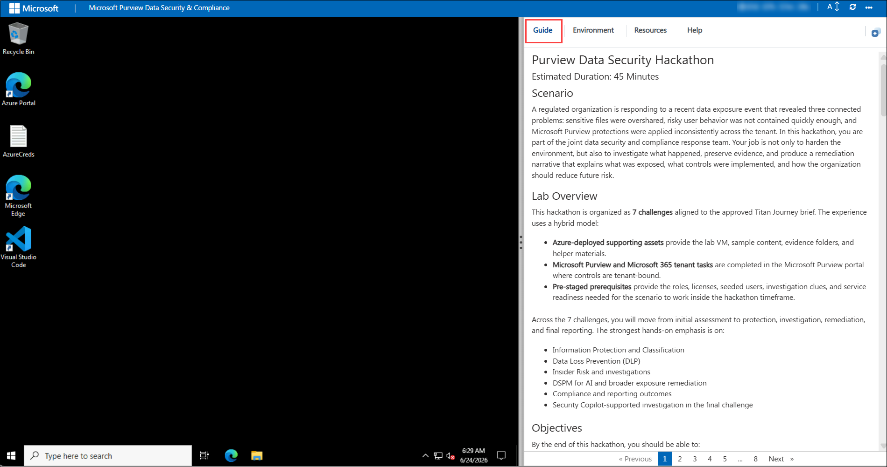
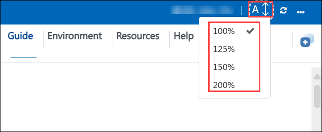
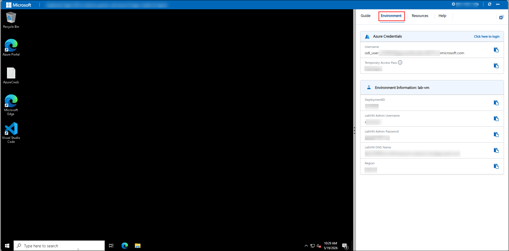
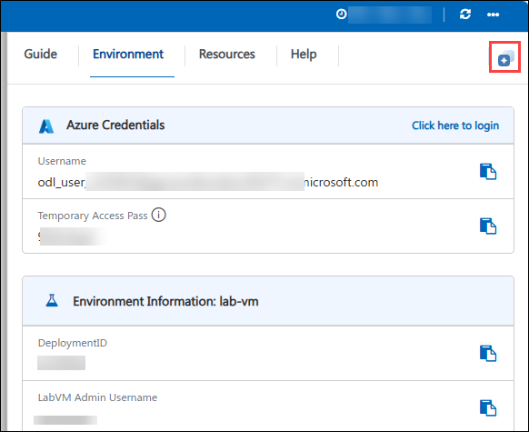
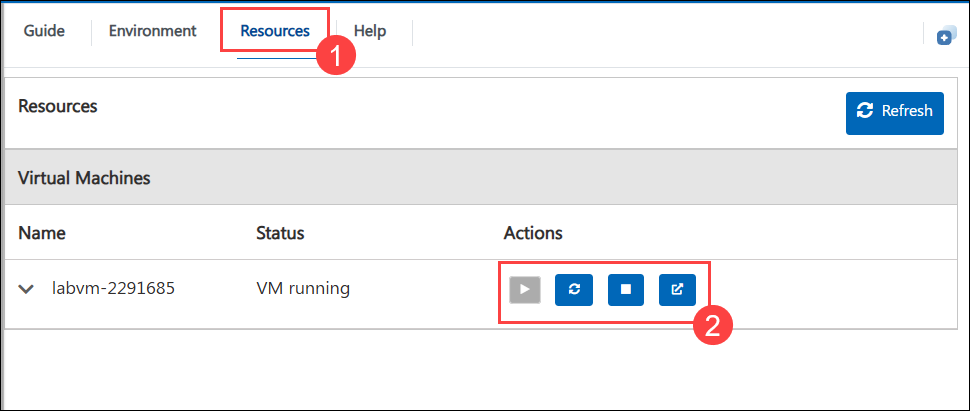
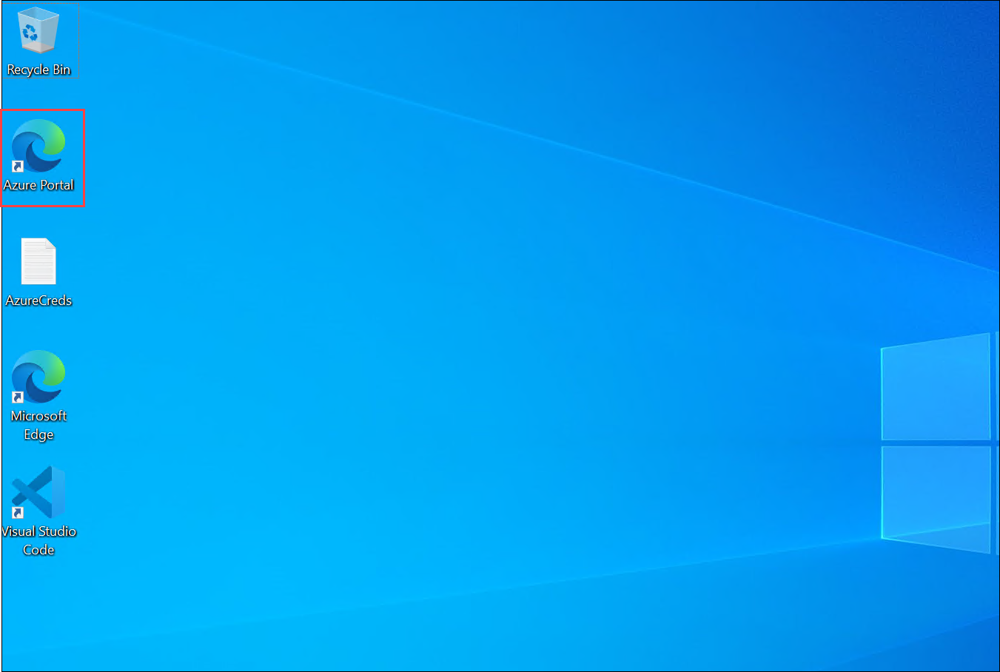
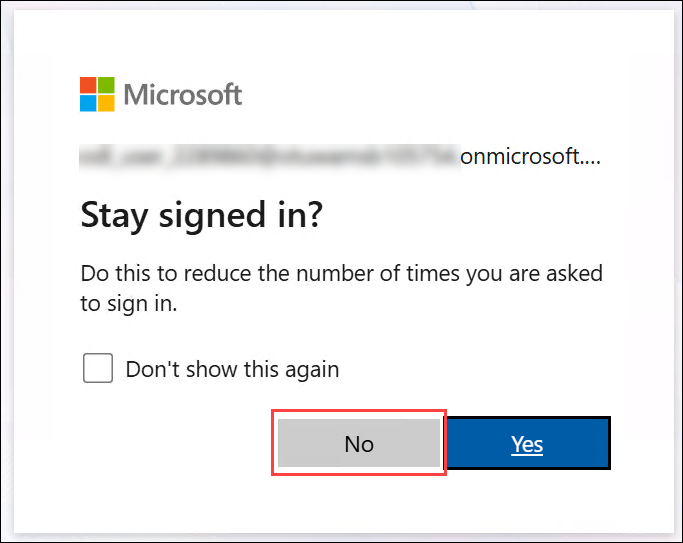
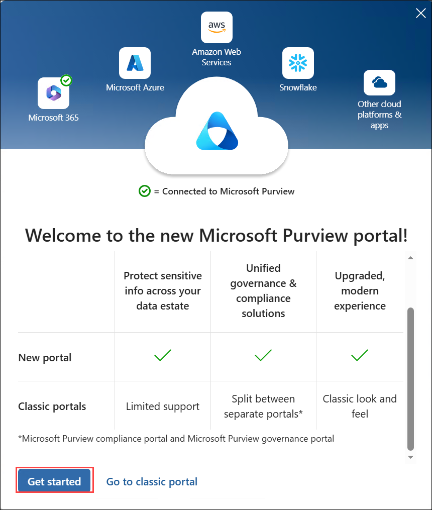

# Purview Data Security Hackathon

### Estimated Duration: 45 Minutes

## Scenario

A regulated organization is responding to a recent data exposure event that revealed three connected problems: sensitive files were overshared, risky user behavior was not contained quickly enough, and Microsoft Purview protections were applied inconsistently across the tenant. In this hackathon, you are part of the joint data security and compliance response team. Your job is not only to harden the environment, but also to investigate what happened, preserve evidence, and produce a remediation narrative that explains what was exposed, what controls were implemented, and how the organization should reduce future risk.

## Lab Overview

This hackathon is organized as **7 challenges** aligned to the approved Titan Journey brief. The experience uses a hybrid model:

- **Azure-deployed supporting assets** provide the lab VM, sample content, evidence folders, and helper materials.
- **Microsoft Purview and Microsoft 365 tenant tasks** are completed in the Microsoft Purview portal where controls are tenant-bound.
- **Pre-staged prerequisites** provide the roles, licenses, seeded users, investigation clues, and service readiness needed for the scenario to work inside the hackathon timeframe.

Across the 7 challenges, you will move from initial assessment to protection, investigation, remediation, and final reporting. The strongest hands-on emphasis is on:

- Information Protection and Classification
- Data Loss Prevention (DLP)
- Insider Risk and investigations
- DSPM for AI and broader exposure remediation
- Compliance and reporting outcomes
- Security Copilot-supported investigation in the final challenge

## Objectives

By the end of this hackathon, you should be able to:

- Understand the incident context and identify the highest-risk exposure areas.
- Navigate the Microsoft Purview portal and locate the solution areas used in the challenges.
- Distinguish between what is pre-staged in the tenant and what you must configure during the event.
- Capture screenshots, reports, findings, and case evidence as you progress.
- Complete the 7 challenge flow from control implementation through investigation and remediation storytelling.

## Architecture

The lab combines Azure-hosted support assets with tenant-based Microsoft Purview work.

## Getting Started with Lab
Once you're ready to dive in, your virtual machine and **Guide** will be right at your fingertips within your web browser.

   

## Lab Guide Zoom In/Zoom Out

To adjust the zoom level for the environment page, click the **A↕ : 100%** icon located next to the timer in the lab environment.

   

## Virtual Machine & Lab Guide
Your virtual machine is your workhorse throughout the workshop. The guide is your roadmap to success.

## Exploring Your Lab Resources
To get a better understanding of your lab resources and credentials, navigate to the **Environment** tab.

## Utilizing the Split Window Feature
For convenience, you can open the lab guide in a separate window by selecting the **Split Window** button from the top right corner.

## Managing Your Virtual Machine
Feel free to **start, restart, or stop (2)** your virtual machine as needed from the **Resources (1)** tab. Your experience is in your hands!

   

## Sign-in and Lab Access

1. On your virtual machine, click on the **Azure Portal** icon.

    
2. Open a browser and go to 
`
https://portal.azure.com
`
3. On the **Sign in to Microsoft Azure** tab you will see the login screen, in that enter the following email/username, and click on **Next (2)**.
   - Username: <inject key="AzureAdUserEmail"></inject>

      

   - Password: <inject key="AzureAdUserPassword"></inject>

      

1. If you see the pop-up **Stay Signed in?**, select **No**.

   

1. If a **Welcome to Microsoft Azure** popup window appears, select **Maybe Later** to skip the tour.

4. Confirm that your Azure subscription is available:
   - Subscription: <inject key="SubscriptionID"></inject>
   - Tenant: <inject key="TenantID"></inject>
5. In a new browser tab, open the Microsoft Purview portal at 
`
https://purview.microsoft.com
`
6. If a welcome screen appears, select **Get started** to enter the unified Microsoft Purview portal home page.

   
   
7. Record your deployment reference for screenshots, evidence notes, and any facilitator check-ins: **Deployment ID: <inject key="DeploymentID" enableCopy="false"></inject>**

> [!Tip]
> The Microsoft Purview portal is the primary workspace for this hackathon. Microsoft Learn documents that the unified portal home page exposes solution cards and a **View all solutions** entry point, and that solution-specific navigation appears in the left menu after you open a solution.

## What Is Pre-Staged for You

To keep the hackathon focused on decision-making and hands-on implementation rather than waiting on tenant provisioning, several prerequisites are prepared before participant time begins.

### Tenant and solution readiness

The following items are expected to be available when you begin:

- Required Microsoft Purview licensing and feature enablement for the scenario.
- Microsoft 365 and Purview role assignments for learner or facilitator accounts.
- Audit and activity pipelines needed for investigation tasks.
- Insider Risk prerequisites, scoped groups, and foundational settings.
- Seeded users, groups, and business personas for DLP and investigation scenarios.
- Sample sensitive files, overshared content, and policy-triggering artifacts.
- Optional pre-created alerts, evidence, or case clues where signal generation would otherwise be too slow.
- Security Copilot readiness and plugin availability for the final challenge where included.

### Azure supporting assets

Your deployment includes supporting infrastructure for the hackathon experience, such as:

- A lab VM for browser access, bookmarks, evidence capture, and helper scripts.
- A resource group containing supporting assets for the scenario.
- Optional sample data sources used to support governance or discovery-related tasks.
- Local folders or saved locations intended for exported evidence and screenshots.

> [!Important]
> Do not spend challenge time trying to build missing tenant prerequisites from scratch unless the instructions explicitly tell you to do so. If a required role, seeded alert, or signal is absent, note it as a scenario gap and continue with the closest available evidence.

## Evidence Capture Expectations

This is a response-oriented hackathon, so evidence matters just as much as configuration.

During each challenge, capture proof that supports what you changed, what you observed, and what conclusion you reached. Your evidence should include:

- Screenshots of major configuration pages and saved policies
- Reports, dashboards, or analytics views that show impact
- Alert details, case details, activity traces, or timeline views
- Notes about what was pre-staged versus what you configured yourself
- A running incident narrative explaining exposure, detection, and remediation

A strong submission shows both:

1. **Technical hardening evidence** - for example labels, DLP policies, risk settings, barrier policies, or posture improvements.
2. **Investigation evidence** - for example overshared content findings, Insider Risk details, audit evidence, case escalation, remediation decisions, and final recommendations.

> [!Note]
> Save evidence continuously rather than waiting until the end. Several Purview experiences are investigative by nature, so your intermediate screenshots and notes become part of the final response story.

## Recommended Working Approach for the 7 Challenges

Use the following approach throughout the hackathon.

### Challenge 1 - Establish the response baseline

Begin by reviewing the incident context, validating access to the required portals, and confirming that pre-staged readiness items are present. Use this challenge to identify the biggest protection and investigation gaps before making changes.

### Challenge 2 - Information Protection and Classification

Create or refine the sensitivity labeling model. Expect to work with label taxonomy, priority, policy publication, encryption for highly sensitive data, and at least one auto-labeling condition.

### Challenge 3 - Data Loss Prevention (DLP)

Expand protections across Microsoft 365 collaboration channels. Focus on Exchange, SharePoint, OneDrive, Teams, and endpoint controls where readiness allows. Review reports or policy evidence that show protective impact.

### Challenge 4 - Insider Risk Management and investigations

Investigate risky user behavior, review exfiltration-related signals, analyze an alert or timeline, and escalate into a formal investigation or case workflow.

### Challenge 5 - DSPM for AI and exposure remediation

Use data security posture insights to identify overshared or high-risk content, especially where AI access or broad exposure increases risk. Implement at least one remediation action and note the before-and-after outcome.

### Challenge 6 - Compliance and governance foundations

Validate the broader compliance controls that support durable response capability. Depending on the environment, this can include retention, records, eDiscovery, data map or catalog context, and control alignment needed for regulated operations.

### Challenge 7 - Final incident response with Security Copilot

Consolidate findings into a final incident and remediation narrative. Where enabled, use Security Copilot with Purview-relevant context to accelerate investigation summary, response reasoning, and next-step recommendations.

## How to Navigate Microsoft Purview During the Hackathon

Microsoft Learn states that the unified Microsoft Purview portal provides a single home page, solution cards, centralized settings, and solution-specific left navigation. As you work through the challenges, use this pattern:

1. Start at 
`
https://purview.microsoft.com
`
2. From the home page, open a solution card directly, or select **View all solutions**.
3. Use the **Data Security**, **Risk & Compliance**, or **Data Governance** areas to locate the service needed for the current challenge.
4. After opening a solution, use the left navigation to move between its **Home**, policies, reports, explorers, settings, and related pages.
5. Use global search at the top of the portal if you need to locate a specific user, navigation item, or resource quickly.

Typical solution areas used in this hackathon include:

- Information Protection
n- Data Loss Prevention
- Insider Risk Management
- Data Security Posture Management
- Information Barriers
- Audit, eDiscovery, Records Management, or related compliance areas
- Unified Catalog or Data Map references where governance tasks are in scope

## Components Explained

### Lab VM

The lab VM is your working station for this event. Use it for browser access, bookmarks, screenshots, evidence storage, and any helper scripts or exported files supplied with the lab.

### Azure supporting environment

The Azure deployment provides the supporting resource group and related assets that help bootstrap the hackathon. These assets support the lab experience but do not replace tenant-bound Purview configuration work.

### Microsoft Purview portal

This is the primary control plane for the challenge sequence. You will use it to access data security, compliance, and governance solution areas from a unified portal experience.

### Pre-seeded scenario data

The scenario depends on seeded users, content, alerts, or clues that represent the recent exposure event. These items are intentionally staged to make the investigation realistic within the time budget.

### Evidence outputs

Your screenshots, notes, exported details, and final incident summary are part of the required outcome. Treat evidence as a deliverable, not as optional documentation.

## Success Criteria

You are successful in this hackathon when you can demonstrate all of the following:

- The environment is more strongly protected than it was at the start.
- You can show evidence of what data was exposed or at risk.
- You can explain what controls detected or reduced the risk.
- You can connect technical findings to a practical remediation plan.
- You can support your conclusions with captured artifacts, screenshots, reports, or case details.

## Tips Before You Begin

- Read each challenge fully before making changes.
- Keep a running log of what you changed and why.
- Prefer evidence-backed conclusions over assumptions.
- If a signal is delayed or missing, use the nearest available pre-staged clue and document the limitation.
- Distinguish clearly between **configured during the hackathon**, **pre-staged by the environment**, and **observed as evidence**.

## After publishing

> [!Note] These steps run **after** you push the template to CloudLabs — they verify CloudLabs can actually serve this lab guide to candidates.

- **Verify docs-proxy access:** open Templates → your template → **Lab Guide Settings** in <https://admin.cloudlabs.ai> and confirm CloudLabs can reach this repo via the docs proxy. If the repo is private, configure GitHub access at the template level.
- **Verify inline questions and inline validations:** sign in to <https://admin.cloudlabs.ai>, open your template, and walk through one full lab run to confirm every `<question>` and `<validation step="..."/>` renders correctly. Fix any that don't resolve.
